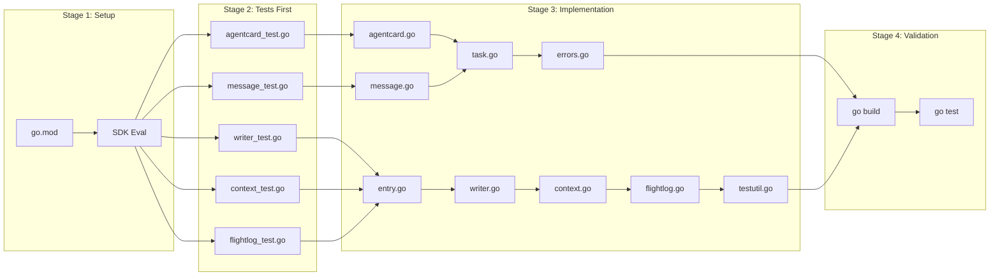
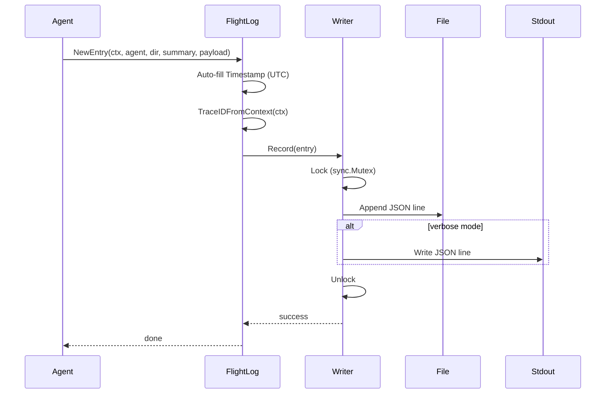

# Phase 1: Foundation – Tasks & Alignment Brief

**Spec**: [/docs/plans/001-minimal-skeleton/minimal-skeleton-spec.md](/docs/plans/001-minimal-skeleton/minimal-skeleton-spec.md)
**Plan**: [/docs/plans/001-minimal-skeleton/plan.md](/docs/plans/001-minimal-skeleton/plan.md)
**Date**: 2026-01-21
**Phase Slug**: phase-1-foundation

---

## Executive Briefing

### Purpose
This phase establishes the foundational infrastructure for Wingmate: the type definitions (A2A protocol types) and observability infrastructure (Flight Log). Without this foundation, no agent communication or debugging visibility is possible.

### What We're Building
Two core packages:
1. **pkg/types**: A2A protocol types (AgentCard, Message, Task, Errors) that define the wire format for agent communication
2. **internal/flightlog**: Thread-safe JSONL logging system with trace ID propagation for full observability

### User Value
Engineers gain immediate visibility into all agent conversations through human-readable logs. The standardized type system ensures protocol compliance with the A2A specification.

### Example
**Flight Log Entry**:
```json
{"ts":"2026-01-21T10:30:00Z","trace":"abc123","agent":"wingmate-001","dir":"in","summary":"Received ping request","payload":{"method":"ping"}}
```

---

## Objectives & Scope

### Objective
Implement the type definitions and observability infrastructure as specified in Plan Phase 1, enabling all subsequent phases to have a solid foundation for communication types and logging.

**Behavior Checklist**:
- [ ] A2A types compile and serialize correctly to JSON
- [ ] Agent Card served at correct well-known path format
- [ ] Flight Log writes append-only JSONL
- [ ] Verbose mode mirrors to stdout
- [ ] Trace IDs propagate via context

### Goals

- ✅ Create Go module structure with `go.mod`
- ✅ Evaluate `a2aproject/a2a-go` SDK for usable types
- ✅ Implement A2A AgentCard type with required fields
- ✅ Implement A2A Message/Part types with union handling
- ✅ Implement A2A Task/TaskResult types
- ✅ Implement JSON-RPC error types (1000+ codes)
- ✅ Implement thread-safe JSONL Flight Log writer
- ✅ Implement trace ID context propagation
- ✅ Implement `NewEntry()` constructor (per Critical Insight #3)
- ✅ Implement test helper `ReadLogEntries()` (per Critical Insight #2)

### Non-Goals

- ❌ HTTP server implementation (Phase 2)
- ❌ HTTP client implementation (Phase 2)
- ❌ Agent configuration loading (Phase 3)
- ❌ Actual agent logic (Phase 4/5)
- ❌ CLI flag parsing (Phase 6)
- ❌ Log rotation (post-MVP)
- ❌ TLS/authentication (post-MVP per DEV-001, DEV-002)

---

## Architecture Map

### Component Diagram

```mermaid
flowchart TD
    classDef pending fill:#9E9E9E,stroke:#757575,color:#fff
    classDef inprogress fill:#FF9800,stroke:#F57C00,color:#fff
    classDef completed fill:#4CAF50,stroke:#388E3C,color:#fff
    classDef blocked fill:#F44336,stroke:#D32F2F,color:#fff

    subgraph Setup["Setup"]
        T001["T001: Create go.mod"]:::pending
        T002["T002: SDK Evaluation"]:::pending
    end

    subgraph Types["pkg/types"]
        T003["T003: AgentCard test"]:::pending
        T004["T004: Message test"]:::pending
        T005["T005: AgentCard impl"]:::pending
        T006["T006: Message impl"]:::pending
        T007["T007: Task impl"]:::pending
        T008["T008: Errors impl"]:::pending
    end

    subgraph FlightLog["internal/flightlog"]
        T009["T009: Writer test"]:::pending
        T010["T010: Context test"]:::pending
        T011["T011: FlightLog test"]:::pending
        T012["T012: Entry impl"]:::pending
        T013["T013: Writer impl"]:::pending
        T014["T014: Context impl"]:::pending
        T015["T015: FlightLog impl"]:::pending
        T016["T016: TestUtil impl"]:::pending
    end

    subgraph Validation["Validation"]
        T017["T017: Build validation"]:::pending
        T018["T018: Test validation"]:::pending
    end

    T001 --> T002
    T002 --> T003
    T002 --> T004
    T003 --> T005
    T004 --> T006
    T005 --> T007
    T006 --> T007
    T007 --> T008

    T002 --> T009
    T009 --> T010
    T010 --> T011
    T011 --> T012
    T012 --> T013
    T013 --> T014
    T014 --> T015
    T015 --> T016

    T008 --> T017
    T016 --> T017
    T017 --> T018

    subgraph Files["Files"]
        F1["/wingmate/go.mod"]:::pending
        F2["/wingmate/docs/research/a2a-go-sdk-evaluation.md"]:::pending
        F3["/wingmate/pkg/types/agentcard_test.go"]:::pending
        F4["/wingmate/pkg/types/message_test.go"]:::pending
        F5["/wingmate/pkg/types/agentcard.go"]:::pending
        F6["/wingmate/pkg/types/message.go"]:::pending
        F7["/wingmate/pkg/types/task.go"]:::pending
        F8["/wingmate/pkg/types/errors.go"]:::pending
        F9["/wingmate/internal/flightlog/writer_test.go"]:::pending
        F10["/wingmate/internal/flightlog/context_test.go"]:::pending
        F11["/wingmate/internal/flightlog/flightlog_test.go"]:::pending
        F12["/wingmate/internal/flightlog/entry.go"]:::pending
        F13["/wingmate/internal/flightlog/writer.go"]:::pending
        F14["/wingmate/internal/flightlog/context.go"]:::pending
        F15["/wingmate/internal/flightlog/flightlog.go"]:::pending
        F16["/wingmate/internal/flightlog/testutil.go"]:::pending
    end

    T001 -.-> F1
    T002 -.-> F2
    T003 -.-> F3
    T004 -.-> F4
    T005 -.-> F5
    T006 -.-> F6
    T007 -.-> F7
    T008 -.-> F8
    T009 -.-> F9
    T010 -.-> F10
    T011 -.-> F11
    T012 -.-> F12
    T013 -.-> F13
    T014 -.-> F14
    T015 -.-> F15
    T016 -.-> F16
```

<!-- Status: grey=pending, orange=in-progress, green=completed, red=blocked -->
<!-- Updated by plan-6 during implementation -->



### Task-to-Component Mapping

<!-- Status: ⬜ Pending | 🟧 In Progress | ✅ Complete | 🔴 Blocked -->

| Task | Component(s) | Files | Status | Comment |
|------|-------------|-------|--------|---------|
| T001 | Go Module | go.mod | ⬜ Pending | Initialize Go module with correct path |
| T002 | SDK Research | docs/research/ | ⬜ Pending | Evaluate a2a-go SDK before writing types |
| T003 | Types Tests | pkg/types/ | ⬜ Pending | TDD: AgentCard JSON round-trip test |
| T004 | Types Tests | pkg/types/ | ⬜ Pending | TDD: Message Part union test |
| T005 | AgentCard Type | pkg/types/ | ⬜ Pending | Implement AgentCard struct |
| T006 | Message Type | pkg/types/ | ⬜ Pending | Implement Message/Part structs |
| T007 | Task Type | pkg/types/ | ⬜ Pending | Implement Task/TaskResult structs |
| T008 | Error Types | pkg/types/ | ⬜ Pending | JSON-RPC error codes (1000+) |
| T009 | FlightLog Tests | internal/flightlog/ | ⬜ Pending | TDD: Writer file I/O test |
| T010 | FlightLog Tests | internal/flightlog/ | ⬜ Pending | TDD: Context trace ID test |
| T011 | FlightLog Tests | internal/flightlog/ | ⬜ Pending | TDD: Verbose stdout test |
| T012 | Entry Struct | internal/flightlog/ | ⬜ Pending | Entry struct with NewEntry() |
| T013 | Writer | internal/flightlog/ | ⬜ Pending | Thread-safe JSONL writer |
| T014 | Context | internal/flightlog/ | ⬜ Pending | Trace ID context helpers |
| T015 | FlightLog | internal/flightlog/ | ⬜ Pending | Logger interface + implementation |
| T016 | TestUtil | internal/flightlog/ | ⬜ Pending | ReadLogEntries() helper |
| T017 | Build | All | ⬜ Pending | Verify all packages build |
| T018 | Tests | All | ⬜ Pending | Verify all tests pass |

---

## Tasks

| Status | ID | Task | CS | Type | Dependencies | Absolute Path(s) | Validation | Subtasks | Notes |
|--------|-----|------|-----|------|--------------|------------------|------------|----------|-------|
| [ ] | T001 | Create Go module with `go mod init github.com/wingmate/wingmate` | 1 | Setup | – | /Users/vaughanknight/GitHub/wingmate/go.mod | `go.mod` exists with correct module path | – | Per ADR-001 |
| [ ] | T002 | Evaluate `a2aproject/a2a-go` SDK: import, assess types, document findings | 2 | Research | T001 | /Users/vaughanknight/GitHub/wingmate/docs/research/a2a-go-sdk-evaluation.md | Evaluation doc exists with decision | – | Per Critical Insight #1 |
| [ ] | T003 | Write failing test: AgentCard JSON round-trip, required fields validation | 2 | Test | T002 | /Users/vaughanknight/GitHub/wingmate/pkg/types/agentcard_test.go | Test exists, fails initially | – | TDD |
| [ ] | T004 | Write failing test: Message Part union unmarshaling, nil vs empty | 2 | Test | T002 | /Users/vaughanknight/GitHub/wingmate/pkg/types/message_test.go | Test exists, fails initially | – | TDD |
| [ ] | T005 | Implement AgentCard struct with name, url, version, capabilities, skills | 2 | Core | T003 | /Users/vaughanknight/GitHub/wingmate/pkg/types/agentcard.go | T003 test passes | – | A2A compliant |
| [ ] | T006 | Implement Message, Part structs with `kind` discriminator | 2 | Core | T004 | /Users/vaughanknight/GitHub/wingmate/pkg/types/message.go | T004 test passes | – | Union types |
| [ ] | T007 | Implement Task, TaskResult, TaskState types | 2 | Core | T005, T006 | /Users/vaughanknight/GitHub/wingmate/pkg/types/task.go | Compiles, JSON serializes | – | – |
| [ ] | T008 | Implement JSONRPCError with codes 1000+ for app errors | 1 | Core | T007 | /Users/vaughanknight/GitHub/wingmate/pkg/types/errors.go | Compiles, codes correct | – | Not -32000 range |
| [ ] | T009 | Write failing test: Writer file creation, append, concurrent writes | 2 | Test | T002 | /Users/vaughanknight/GitHub/wingmate/internal/flightlog/writer_test.go | Test exists, fails initially | – | TDD, t.TempDir() |
| [ ] | T010 | Write failing test: TraceID extraction from context | 1 | Test | T002 | /Users/vaughanknight/GitHub/wingmate/internal/flightlog/context_test.go | Test exists, fails initially | – | TDD |
| [ ] | T011 | Write failing test: Verbose mode stdout mirroring | 2 | Test | T002 | /Users/vaughanknight/GitHub/wingmate/internal/flightlog/flightlog_test.go | Test exists, fails initially | – | TDD, Per ADR-002 |
| [ ] | T012 | Implement Entry struct with Direction enum and NewEntry() constructor | 2 | Core | T009, T010, T011 | /Users/vaughanknight/GitHub/wingmate/internal/flightlog/entry.go | NewEntry() auto-fills ts/trace | – | Per Critical Insight #3 |
| [ ] | T013 | Implement thread-safe JSONL Writer with sync.Mutex | 2 | Core | T012 | /Users/vaughanknight/GitHub/wingmate/internal/flightlog/writer.go | T009 test passes | – | Append-only |
| [ ] | T014 | Implement TraceIDFromContext, WithTraceID context helpers | 1 | Core | T012 | /Users/vaughanknight/GitHub/wingmate/internal/flightlog/context.go | T010 test passes | – | – |
| [ ] | T015 | Implement Logger interface and FlightLog struct with verbose option | 2 | Core | T013, T014 | /Users/vaughanknight/GitHub/wingmate/internal/flightlog/flightlog.go | T011 test passes | – | Per ADR-002 |
| [ ] | T016 | Implement ReadLogEntries(t, path) test helper | 1 | Test | T015 | /Users/vaughanknight/GitHub/wingmate/internal/flightlog/testutil.go | Helper works with t.TempDir() | – | Per Critical Insight #2 |
| [ ] | T017 | Validate: `go build ./pkg/... ./internal/flightlog/...` | 1 | Validation | T008, T016 | /Users/vaughanknight/GitHub/wingmate/ | Build succeeds with 0 errors | – | – |
| [ ] | T018 | Validate: `go test -v ./pkg/... ./internal/flightlog/...` | 1 | Validation | T017 | /Users/vaughanknight/GitHub/wingmate/ | All tests pass (0 failures) | – | – |

---

## Alignment Brief

### Prior Phases Review

**N/A** - This is Phase 1, no prior phases to review.

### Critical Findings Affecting This Phase

From Plan § Critical Insights Discussion:

| Finding | Constraint/Requirement | Addressed By |
|---------|----------------------|--------------|
| Critical Insight #1: SDK Evaluation | Must evaluate `a2aproject/a2a-go` before writing custom types | T002 |
| Critical Insight #2: FlightLog "Never Mock" | Use real file I/O with `t.TempDir()`, create `ReadLogEntries()` helper | T016 |
| Critical Insight #3: time.Time Zero-Value | Use `NewEntry()` constructor to auto-fill Timestamp and TraceID | T012 |

### ADR Decision Constraints

**ADR-001: Language Choice (Go)**
- Decision: Use Go for single-binary distribution
- Constraints affecting Phase 1:
  - All code must be written in Go
  - Must use Go 1.21+ for module compatibility
  - Standard library preferred over external dependencies
  - Project follows standard Go layout (cmd/, internal/, pkg/)
- Addressed by: All tasks (T001-T018)

**ADR-002: Flight Log Storage (JSONL + stdout)**
- Decision: Use JSONL file with optional stdout mirroring via --verbose
- Constraints affecting Phase 1:
  - Must write to JSONL file by default
  - Entry format must match idioms.md specification
  - No external dependencies for storage
- Addressed by: T009-T016

### Invariants & Guardrails

- **Thread Safety**: FlightLog writer MUST be safe for concurrent writes (sync.Mutex)
- **UTC Timestamps**: All timestamps MUST be UTC (time.Now().UTC())
- **JSONL Format**: One JSON object per line, no pretty-printing
- **Error Codes**: Application errors use 1000+ (NOT -32000 reserved range)

### Inputs to Read

| File | Purpose |
|------|---------|
| /Users/vaughanknight/GitHub/wingmate/docs/plans/001-minimal-skeleton/plan.md | Phase 1 task details |
| /Users/vaughanknight/GitHub/wingmate/docs/project-rules/idioms.md | Flight Log entry format |
| /Users/vaughanknight/GitHub/wingmate/docs/adr/001-language-choice.md | Go constraints |
| /Users/vaughanknight/GitHub/wingmate/docs/adr/002-flight-log-storage.md | JSONL format |
| https://github.com/a2aproject/a2a-go | SDK evaluation |

### Visual Alignment Aids

#### Flow Diagram: Phase 1 Build Order



#### Sequence Diagram: Flight Log Write Flow



### Test Plan (Full TDD per Spec)

| Test | File | Purpose | Fixtures | Expected |
|------|------|---------|----------|----------|
| TestAgentCard_JSONRoundTrip | agentcard_test.go | Verify serialization preserves all fields | Sample AgentCard JSON | Marshal → Unmarshal equals original |
| TestAgentCard_RequiredFields | agentcard_test.go | Validate required fields are present | Minimal AgentCard | Error if name/url/version missing |
| TestMessage_PartUnion | message_test.go | Verify `kind` discriminator works | Text/Data/File parts | Correct type after unmarshal |
| TestMessage_NilVsEmpty | message_test.go | Distinguish nil parts from empty array | null vs [] | Different behavior |
| TestWriter_Create | writer_test.go | File created if not exists | t.TempDir() | File exists after write |
| TestWriter_Append | writer_test.go | Entries appended, not overwritten | t.TempDir() | Multiple entries in file |
| TestWriter_Concurrent | writer_test.go | Safe under concurrent writes | t.TempDir(), goroutines | No data corruption |
| TestContext_TraceID | context_test.go | TraceID survives context round-trip | Context with trace | Same trace ID returned |
| TestContext_NoTraceID | context_test.go | Missing trace returns empty/generated | Empty context | Empty or generated ID |
| TestFlightLog_Verbose | flightlog_test.go | Verbose mode writes to stdout | Buffer capture | Entry appears in buffer |
| TestFlightLog_FileOnly | flightlog_test.go | Non-verbose writes file only | t.TempDir() | File has entry, stdout empty |

### Step-by-Step Implementation Outline

1. **T001**: Run `go mod init github.com/wingmate/wingmate` in project root
2. **T002**: Import a2a-go, explore types, document decision in evaluation.md
3. **T003-T004**: Write failing tests for pkg/types (TDD red phase)
4. **T005-T008**: Implement types to make tests pass (TDD green phase)
5. **T009-T011**: Write failing tests for internal/flightlog (TDD red phase)
6. **T012-T016**: Implement flightlog to make tests pass (TDD green phase)
7. **T017**: Run `go build` to verify compilation
8. **T018**: Run `go test -v` to verify all tests pass

### Commands to Run

```bash
# Environment setup
cd /Users/vaughanknight/GitHub/wingmate

# Initialize module (T001)
go mod init github.com/wingmate/wingmate

# SDK evaluation (T002)
go get github.com/a2aproject/a2a-go

# Build validation (T017)
go build ./pkg/... ./internal/flightlog/...

# Test validation (T018)
go test -v ./pkg/... ./internal/flightlog/...

# Lint check
go vet ./pkg/... ./internal/flightlog/...
```

### Risks/Unknowns

| Risk | Severity | Mitigation |
|------|----------|------------|
| a2a-go SDK incomplete/different types | Medium | Protocol is JSON-RPC; implement custom types if needed |
| Go time.Time JSON format issues | Low | Use RFC3339 format explicitly |
| Concurrent write race conditions | Medium | Use sync.Mutex in Writer; test with `-race` flag |

### Ready Check

- [x] ADR constraints mapped to tasks (ADR-001: all tasks; ADR-002: T009-T016)
- [x] Critical Insights addressed (T002, T012, T016)
- [x] TDD test order defined (tests before implementation)
- [x] All file paths are absolute
- [x] Validation commands documented
- [ ] **AWAITING GO/NO-GO**

---

## Phase Footnote Stubs

_Footnotes will be added by plan-6 during implementation to track deviations and decisions._

| ID | Task | Description | Resolution |
|----|------|-------------|------------|
| | | | |

---

## Evidence Artifacts

**Execution Log**: `/Users/vaughanknight/GitHub/wingmate/docs/plans/001-minimal-skeleton/tasks/phase-1-foundation/execution.log.md`

**Supporting Files**:
- SDK evaluation: `/Users/vaughanknight/GitHub/wingmate/docs/research/a2a-go-sdk-evaluation.md`
- Test output: Captured in execution log

---

## Discoveries & Learnings

_Populated during implementation by plan-6. Log anything of interest to your future self._

| Date | Task | Type | Discovery | Resolution | References |
|------|------|------|-----------|------------|------------|
| | | | | | |

**Types**: `gotcha` | `research-needed` | `unexpected-behavior` | `workaround` | `decision` | `debt` | `insight`

**What to log**:
- Things that didn't work as expected
- External research that was required
- Implementation troubles and how they were resolved
- Gotchas and edge cases discovered
- Decisions made during implementation
- Technical debt introduced (and why)
- Insights that future phases should know about

_See also: `execution.log.md` for detailed narrative._

---

## Directory Layout

```
docs/plans/001-minimal-skeleton/
├── minimal-skeleton-spec.md
├── plan.md
└── tasks/
    └── phase-1-foundation/
        ├── tasks.md              # This file
        └── execution.log.md      # Created by /plan-6
```
