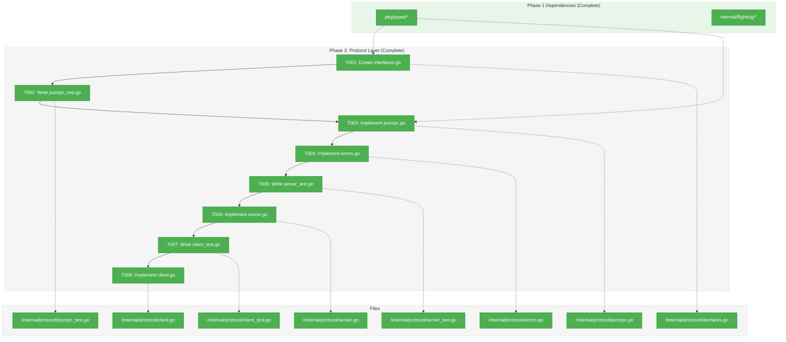
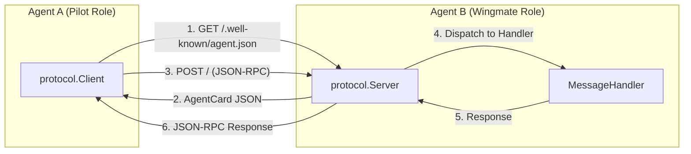
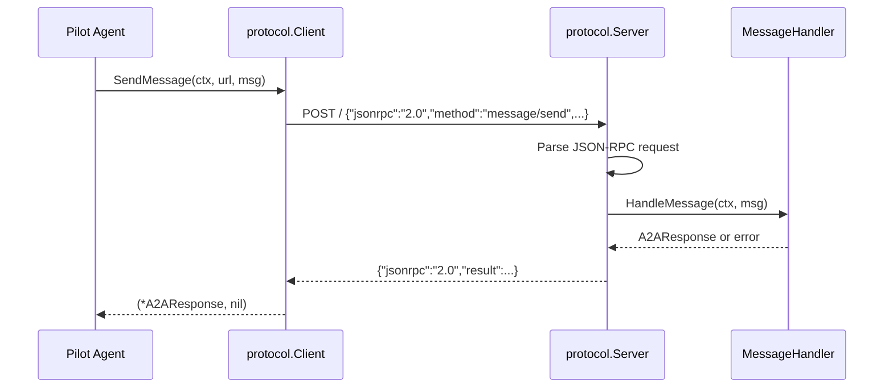
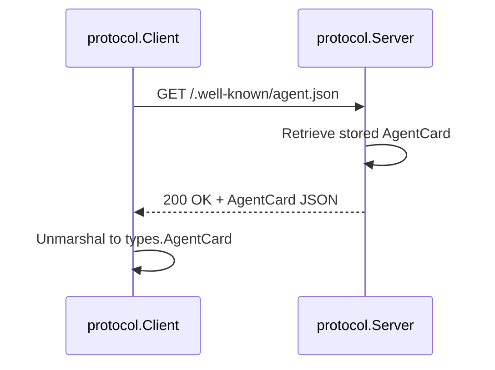

# Phase 2: Protocol Layer – Tasks & Alignment Brief

**Spec**: [/docs/plans/001-minimal-skeleton/minimal-skeleton-spec.md](/docs/plans/001-minimal-skeleton/minimal-skeleton-spec.md)
**Plan**: [/docs/plans/001-minimal-skeleton/plan.md](/docs/plans/001-minimal-skeleton/plan.md)
**Date**: 2026-01-21
**Phase Slug**: phase-2-protocol-layer

---

## Executive Briefing

### Purpose

This phase implements the A2A JSON-RPC protocol layer that enables agents to communicate over HTTP. Without this layer, agents cannot discover each other via Agent Cards or exchange messages - it's the communication backbone of the entire system.

### What We're Building

An `internal/protocol` package providing:
- **HTTP Server** with JSON-RPC 2.0 dispatcher for handling incoming requests
- **HTTP Client** with connection pooling for making outbound requests
- **Agent Card endpoint** at `/.well-known/agent.json` for capability discovery
- **Protocol interfaces** (`Server`, `Client`, `MessageHandler`) for clean abstraction

### User Value

This layer allows any two Wingmate agents to:
1. Discover each other's capabilities by fetching Agent Cards
2. Send and receive A2A messages using standardized JSON-RPC
3. Handle errors consistently with proper error codes

### Example

**Agent Card Discovery**:
```
GET http://agent-b:9001/.well-known/agent.json
→ {"name": "agent-b", "version": "0.1.0", "capabilities": {...}, "skills": [...]}
```

**Message Exchange**:
```
POST http://agent-b:9001/
← {"jsonrpc": "2.0", "id": 1, "method": "message/send", "params": {...}}
→ {"jsonrpc": "2.0", "id": 1, "result": {...}}
```

---

## Objectives & Scope

### Objective

Implement the A2A JSON-RPC protocol layer as specified in the plan, providing HTTP server/client infrastructure that Phase 3 (Unified Agent) will use for actual agent communication.

### Goals

- ✅ Define `Server`, `Client`, and `MessageHandler` interfaces
- ✅ Implement JSON-RPC 2.0 request/response serialization
- ✅ Create HTTP server with POST `/` endpoint for JSON-RPC
- ✅ Serve Agent Card at `GET /.well-known/agent.json`
- ✅ Implement HTTP client with context-aware requests
- ✅ Handle all JSON-RPC error codes correctly (-32700 to -32603)
- ✅ Support graceful server shutdown

### Non-Goals

- ❌ Actual message handling logic (Phase 3 - agent handlers)
- ❌ TLS/HTTPS support (DEV-001: deferred to post-MVP)
- ❌ Authentication/authorization (DEV-002: deferred to post-MVP)
- ❌ Server-Sent Events (SSE) streaming (not needed for MVP ping/pong)
- ❌ Connection retry logic (simple fail-fast for MVP)
- ❌ Rate limiting or request throttling
- ❌ Request logging to Flight Log (Phase 3 agent responsibility)

---

## Architecture Map

### Component Diagram

<!-- Status: grey=pending, orange=in-progress, green=completed, red=blocked -->
<!-- Updated by plan-6 during implementation -->



### Task-to-Component Mapping

<!-- Status: ⬜ Pending | 🟧 In Progress | ✅ Complete | 🔴 Blocked -->

| Task | Component(s) | Files | Status | Comment |
|------|-------------|-------|--------|---------|
| T001 | Interfaces | /internal/protocol/interfaces.go | ✅ Complete | Server, Client, MessageHandler, ReadyNotifier |
| T002 | JSON-RPC Tests | /internal/protocol/jsonrpc_test.go | ✅ Complete | Request/Response marshal, constructors |
| T003 | JSON-RPC Types | /internal/protocol/jsonrpc.go | ✅ Complete | Request, Response, ErrorObject types |
| T004 | Protocol Errors | /internal/protocol/errors.go | ✅ Complete | -32xxx codes, sentinel errors, helpers |
| T005 | Server Tests | /internal/protocol/server_test.go | ✅ Complete | Valid JSON-RPC, errors, Agent Card, shutdown |
| T006 | HTTP Server | /internal/protocol/server.go | ✅ Complete | A2AServer with graceful shutdown |
| T007 | Client Tests | /internal/protocol/client_test.go | ✅ Complete | SendMessage, GetAgentCard, errors, timeout |
| T008 | HTTP Client | /internal/protocol/client.go | ✅ Complete | Connection pooling, context-aware |

---

## Tasks

| Status | ID | Task | CS | Type | Dependencies | Absolute Path(s) | Validation | Subtasks | Notes |
|--------|------|------|-----|------|--------------|------------------|------------|----------|-------|
| [x] | T001 | Create protocol interfaces (Server, Client, MessageHandler) | 2 | Setup | – | /Users/vaughanknight/GitHub/wingmate/internal/protocol/interfaces.go | Interfaces compile, methods match plan spec | – | Foundation for all protocol work |
| [x] | T002 | Write failing tests for JSON-RPC request/response serialization | 2 | Test | T001 | /Users/vaughanknight/GitHub/wingmate/internal/protocol/jsonrpc_test.go | Tests fail with expected messages | – | TDD red phase |
| [x] | T003 | Implement JSON-RPC request/response types | 2 | Core | T002 | /Users/vaughanknight/GitHub/wingmate/internal/protocol/jsonrpc.go | All T002 tests pass | – | Uses pkg/types where applicable |
| [x] | T004 | Implement protocol error types and helpers | 2 | Core | T003 | /Users/vaughanknight/GitHub/wingmate/internal/protocol/errors.go | Error codes match JSON-RPC spec | – | -32700 to -32603 range |
| [x] | T005 | Write failing tests for HTTP server (JSON-RPC POST, Agent Card GET, errors) | 3 | Test | T004 | /Users/vaughanknight/GitHub/wingmate/internal/protocol/server_test.go | Tests fail with expected messages | – | TDD red phase |
| [x] | T006 | Implement HTTP server with JSON-RPC dispatcher | 3 | Core | T005 | /Users/vaughanknight/GitHub/wingmate/internal/protocol/server.go | All T005 tests pass, graceful shutdown works | – | WaitGroup for in-flight requests |
| [x] | T007 | Write failing tests for HTTP client (SendMessage, GetAgentCard, errors) | 2 | Test | T006 | /Users/vaughanknight/GitHub/wingmate/internal/protocol/client_test.go | Tests fail with expected messages | – | TDD red phase, mock HTTP |
| [x] | T008 | Implement HTTP client with connection pooling | 2 | Core | T007 | /Users/vaughanknight/GitHub/wingmate/internal/protocol/client.go | All T007 tests pass, 10 idle conns | – | Context-aware timeouts |

---

## Alignment Brief

### Prior Phase Review: Phase 1 Foundation

#### A. Deliverables Created

**pkg/types** (A2A Protocol Types):
| File | Path | Key Exports |
|------|------|-------------|
| agentcard.go | `/Users/vaughanknight/GitHub/wingmate/pkg/types/agentcard.go` | `AgentCard`, `Capabilities`, `Skill`, `Authentication`, `AgentCardWellKnownPath` |
| message.go | `/Users/vaughanknight/GitHub/wingmate/pkg/types/message.go` | `Message`, `Part`, `A2ARequest`, `A2AResponse`, `MessageSendParams`, `MessageSendResult` |
| task.go | `/Users/vaughanknight/GitHub/wingmate/pkg/types/task.go` | `TaskState`, `Task`, `TaskResult`, `IsTerminal()`, `IsSuccess()` |
| errors.go | `/Users/vaughanknight/GitHub/wingmate/pkg/types/errors.go` | `JSONRPCError`, error constructors (1000+ range) |

**internal/flightlog** (Observability):
| File | Path | Key Exports |
|------|------|-------------|
| entry.go | `/Users/vaughanknight/GitHub/wingmate/internal/flightlog/entry.go` | `Entry`, `Direction`, `Role`, `NewEntry()`, `NewEntryWithRole()` |
| writer.go | `/Users/vaughanknight/GitHub/wingmate/internal/flightlog/writer.go` | `Writer`, `NewWriter()`, `Write()`, `Close()`, `Sync()` |
| context.go | `/Users/vaughanknight/GitHub/wingmate/internal/flightlog/context.go` | `WithTraceID()`, `TraceIDFromContext()`, `GenerateTraceID()`, `EnsureTraceID()` |
| flightlog.go | `/Users/vaughanknight/GitHub/wingmate/internal/flightlog/flightlog.go` | `Logger`, `FlightLog`, `New()`, `Record()`, `WithVerbose()`, `WithStdout()` |
| testutil.go | `/Users/vaughanknight/GitHub/wingmate/internal/flightlog/testutil.go` | `ReadLogEntries()`, `AssertEntryExists()` |

#### B. Lessons Learned

1. **SDK Incompatibility**: `a2aproject/a2a-go` requires Go 1.24.4; we target Go 1.21+ → custom types
2. **Go Not Installed**: Files created manually; validation (T017-T018) pending Go installation
3. **Constructor Pattern Works**: `NewEntry()` effectively handles time.Time zero-value gotcha

#### C. Technical Discoveries

| Discovery | Impact | Resolution |
|-----------|--------|------------|
| Go SDK requires Go 1.24.4 | Cannot use SDK | Custom types with SDK as reference |
| time.Time omitempty never omits | Serialization issue | Constructor auto-fills timestamp |
| nil vs empty slice JSON differs | Protocol compliance | Use `[]Part{}` not nil |

#### D. Dependencies Exported for Phase 2

**Types Phase 2 will use**:
```go
import "github.com/wingmate/wingmate/pkg/types"

// Agent Card for discovery endpoint
types.AgentCard{Name: "...", URL: "...", ...}
types.AgentCardWellKnownPath  // "/.well-known/agent.json"

// JSON-RPC structures
types.A2ARequest{JSONRPC: "2.0", ID: ..., Method: "...", Params: ...}
types.A2AResponse{JSONRPC: "2.0", ID: ..., Result: ..., Error: ...}
types.JSONRPCError{Code: ..., Message: "...", Data: ...}
```

#### E. Incomplete Items

- T017/T018: `go build` and `go test` validation pending Go installation
- **Impact on Phase 2**: Can proceed, but must validate Phase 1 when Go available

#### F. Test Infrastructure Available

- `flightlog.ReadLogEntries(t, path)` - Parse JSONL for testing
- `flightlog.AssertEntryExists(t, entries, ...)` - Convenience assertion
- `t.TempDir()` pattern for isolated file testing

#### G. Patterns Established

1. **Functional Options**: `WithVerbose()`, `WithStdout()` for configuration
2. **Constructor Functions**: `NewEntry()`, `New()` enforce invariants
3. **Context Propagation**: `WithTraceID()`, `TraceIDFromContext()`
4. **Discriminated Union**: `Part.Kind` field for polymorphism

---

### Critical Findings Affecting This Phase

| Finding | Impact on Phase 2 | Tasks Addressing |
|---------|-------------------|------------------|
| Agent Card path is `/.well-known/agent.json` | Server must use exact path | T005, T006 |
| Application error codes must be 1000+ | Protocol errors use -32xxx range only | T004 |
| JSON-RPC 2.0 spec compliance | Must include `jsonrpc: "2.0"` field | T002, T003 |

---

### ADR Decision Constraints

**ADR-003: Unified Peer Architecture**
- Decision: Every instance is both client AND server
- Constraint: Protocol layer must support bidirectional use
- Addressed by: T001 (interfaces support both), T006 (server), T008 (client)

---

### Invariants & Guardrails

| Constraint | Source | Enforcement |
|------------|--------|-------------|
| JSON-RPC version must be "2.0" | A2A Spec | T002 test validates |
| Error codes -32700 to -32603 reserved | JSON-RPC Spec | T004 constants |
| Agent Card path exact match | A2A Spec | T005 test validates |
| Context timeout propagation | Go idiom | T007, T008 tests |

---

### Visual Alignment Aids

#### System Flow Diagram



#### Sequence Diagram: Message Exchange



#### Sequence Diagram: Agent Card Discovery



---

### Test Plan

**Approach**: TDD with targeted HTTP transport mocks

| Test | File | Purpose | Fixtures |
|------|------|---------|----------|
| `TestJSONRPC_RequestMarshal` | jsonrpc_test.go | Verify request serialization | Sample request structs |
| `TestJSONRPC_ResponseMarshal` | jsonrpc_test.go | Verify response serialization | Sample response structs |
| `TestJSONRPC_ErrorMarshal` | jsonrpc_test.go | Verify error response format | Error cases |
| `TestServer_ValidJSONRPC` | server_test.go | POST / with valid JSON-RPC | Test handler |
| `TestServer_ParseError` | server_test.go | Invalid JSON returns -32700 | Malformed JSON |
| `TestServer_MethodNotFound` | server_test.go | Unknown method returns -32601 | Unknown method |
| `TestServer_AgentCard` | server_test.go | GET /.well-known/agent.json | Sample AgentCard |
| `TestServer_GracefulShutdown` | server_test.go | Shutdown completes in-flight | Slow handler |
| `TestClient_SendMessage` | client_test.go | Successful message exchange | Mock server |
| `TestClient_GetAgentCard` | client_test.go | Fetch and parse AgentCard | Mock server |
| `TestClient_ConnectionRefused` | client_test.go | Error on unreachable | No server |
| `TestClient_Timeout` | client_test.go | Context timeout respected | Slow mock |

**Mock Policy**:
- Mock HTTP transport for client tests (avoid network in unit tests)
- Use `httptest.Server` for server integration tests
- Real HTTP for actual server handler tests

---

### Implementation Outline

| Step | Task | Implementation Notes |
|------|------|---------------------|
| 1 | T001: interfaces.go | Define `Server`, `Client`, `MessageHandler` interfaces |
| 2 | T002: jsonrpc_test.go | Write failing tests for Request/Response marshal |
| 3 | T003: jsonrpc.go | Implement types to pass T002 tests |
| 4 | T004: errors.go | Add sentinel errors, NewXXXError helpers |
| 5 | T005: server_test.go | Write failing tests for HTTP handlers |
| 6 | T006: server.go | Implement `A2AServer` struct |
| 7 | T007: client_test.go | Write failing tests for client methods |
| 8 | T008: client.go | Implement `A2AClient` struct |

---

### Commands to Run

```bash
# Environment setup (when Go is available)
cd /Users/vaughanknight/GitHub/wingmate

# Validate Phase 1 first (pending)
go build ./pkg/... ./internal/flightlog/...
go test -v ./pkg/... ./internal/flightlog/...

# Phase 2 build and test
go build ./internal/protocol/...
go test -v ./internal/protocol/...

# Lint
go vet ./internal/protocol/...

# Full test suite
go test -v ./...
```

---

### Risks & Unknowns

| Risk | Severity | Mitigation |
|------|----------|------------|
| Go not installed | Medium | Defer validation; code should be syntactically correct |
| HTTP test flakiness | Low | Use `httptest` for deterministic tests |
| Timeout handling complexity | Low | Use standard `context.Context` patterns |

---

### Ready Check

- [x] Phase 1 review completed with subagent
- [x] Dependencies from Phase 1 documented
- [x] ADR-003 constraints mapped to tasks (interfaces support bidirectional)
- [x] Test plan follows TDD with mock policy
- [x] All tasks have absolute paths
- [ ] **Awaiting GO/NO-GO from user**

---

## Phase Footnote Stubs

_Footnotes will be added by plan-6 during implementation when deviations or discoveries occur._

| ID | Task | Note | Reference |
|----|------|------|-----------|
| | | | |

---

## Evidence Artifacts

**Execution Log Location**: `/Users/vaughanknight/GitHub/wingmate/docs/plans/001-minimal-skeleton/tasks/phase-2-protocol-layer/execution.log.md`

**Supporting Files**:
- Test output logs (if captured)
- Build artifacts in `bin/` (not committed)

---

## Discoveries & Learnings

_Populated during implementation by plan-6. Log anything of interest to your future self._

| Date | Task | Type | Discovery | Resolution | References |
|------|------|------|-----------|------------|------------|
| | | | | | |

**Types**: `gotcha` | `research-needed` | `unexpected-behavior` | `workaround` | `decision` | `debt` | `insight`

**What to log**:
- Things that didn't work as expected
- External research that was required
- Implementation troubles and how they were resolved
- Gotchas and edge cases discovered
- Decisions made during implementation
- Technical debt introduced (and why)
- Insights that future phases should know about

_See also: `execution.log.md` for detailed narrative._

---

## Directory Layout

```
docs/plans/001-minimal-skeleton/
├── minimal-skeleton-spec.md
├── plan.md
├── adr-003-impact-analysis.md
└── tasks/
    ├── phase-1-foundation/
    │   ├── tasks.md
    │   └── execution.log.md
    └── phase-2-protocol-layer/
        ├── tasks.md              # This file
        └── execution.log.md      # Created by plan-6
```
