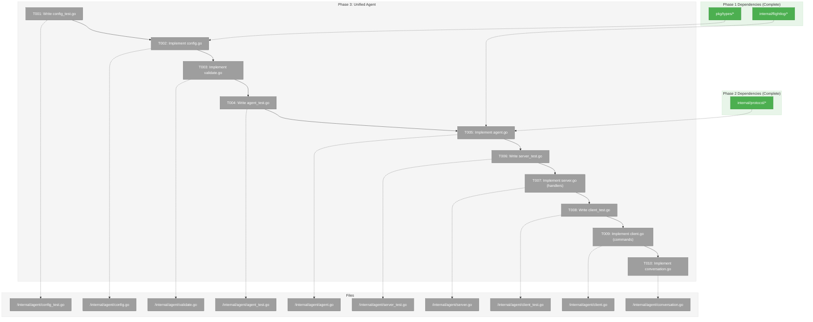
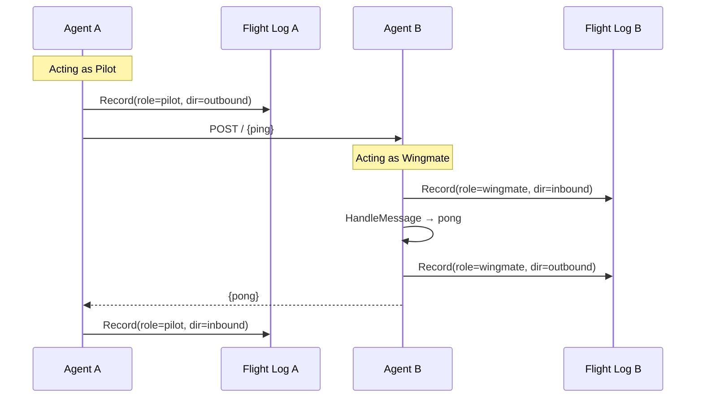
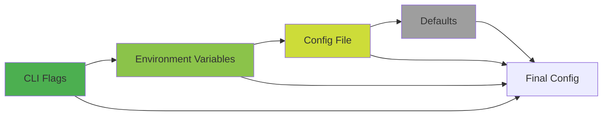

# Phase 3: Unified Agent – Tasks & Alignment Brief

**Spec**: [/docs/plans/001-minimal-skeleton/minimal-skeleton-spec.md](/docs/plans/001-minimal-skeleton/minimal-skeleton-spec.md)
**Plan**: [/docs/plans/001-minimal-skeleton/plan.md](/docs/plans/001-minimal-skeleton/plan.md)
**Date**: 2026-01-21
**Phase Slug**: phase-3-unified-agent

---

## Executive Briefing

### Purpose

This phase implements the unified Agent struct - the core of Wingmate. Per ADR-003, every agent instance is a **full peer** that can both initiate conversations (pilot role) and respond to conversations (wingmate role). This replaces the original separate Wingmate/Pilot phases with a single unified architecture.

### What We're Building

An `internal/agent` package providing:
- **Agent struct** - Unified peer with both client and server capabilities
- **Configuration loading** - JSON file, environment variables, CLI precedence
- **Skill handlers** - Starting with `ping` (responds with pong)
- **Conversation management** - Flight Log recording with correct role attribution
- **Peer discovery** - Fetch and cache remote Agent Cards

### User Value

After this phase:
1. A single `wingmate` binary can start an agent that listens for incoming messages
2. The same binary can send messages to other agents
3. All communication is logged to Flight Log with role attribution
4. Agents advertise capabilities via Agent Cards

### Example

**Agent A starts and listens**:
```bash
./wingmate --port 9000 --name agent-a
# Listening on http://localhost:9000
# Agent Card at http://localhost:9000/.well-known/agent.json
```

**Agent B sends ping**:
```bash
./wingmate ping http://localhost:9000 --name agent-b
# Sent: ping → agent-a
# Received: pong ← agent-a
```

**Flight Log entries show roles**:
```json
{"agent":"agent-b","peer":"agent-a","role":"pilot","dir":"outbound",...}
{"agent":"agent-a","peer":"agent-b","role":"wingmate","dir":"inbound",...}
```

---

## Objectives & Scope

### Objective

Implement the unified Agent architecture as specified in ADR-003, providing a single binary that can act as both pilot (initiator) and wingmate (responder) in any conversation.

### Goals

- [ ] Define Agent configuration schema (no Mode field per ADR-003)
- [ ] Implement config loading with CLI > env > file > defaults precedence
- [ ] Create Agent struct with embedded server and client
- [ ] Implement `ping` skill handler
- [ ] Record all messages to Flight Log with correct Role
- [ ] Support WaitUntilReady for race-condition-free testing
- [ ] Implement graceful shutdown

### Non-Goals

- ❌ Multiple skills beyond ping/pong (future iteration)
- ❌ Streaming responses (capability declared but not implemented)
- ❌ Authentication (DEV-002: deferred)
- ❌ Peer persistence across restarts
- ❌ Connection retry logic
- ❌ Rate limiting

---

## Architecture Map

### Component Diagram

<!-- Status: grey=pending, orange=in-progress, green=completed, red=blocked -->
<!-- Updated by plan-6 during implementation -->



### Task-to-Component Mapping

<!-- Status: ⬜ Pending | 🟧 In Progress | ✅ Complete | 🔴 Blocked -->

| Task | Component(s) | Files | Status | Comment |
|------|-------------|-------|--------|---------|
| T001 | Config Tests | /internal/agent/config_test.go | ✅ Complete | File load, env override, defaults, validation |
| T002 | Config | /internal/agent/config.go | ✅ Complete | Config struct, LoadConfig, WithEnv, WithDefaults |
| T003 | Validation | /internal/agent/validate.go | ✅ Complete | Name required, Port 0-65535, peer URLs |
| T004 | Agent Tests | /internal/agent/agent_test.go | ✅ Complete | New, Start, WaitUntilReady, Shutdown |
| T005 | Agent Core | /internal/agent/agent.go | ✅ Complete | Agent struct with server+client, HandleMessage |
| T006 | Server Tests | /internal/agent/server_test.go | ✅ Complete | Ping handler, Flight Log as wingmate |
| T007 | Server Handlers | /internal/agent/server.go | ✅ Complete | isPing, pongResponse, mustMarshal |
| T008 | Client Tests | /internal/agent/client_test.go | ✅ Complete | Ping, GetPeerCard, errors, timeout |
| T009 | Client Commands | /internal/agent/client.go | ✅ Complete | Ping, SendMessage, GetPeerCard |
| T010 | Conversation | /internal/agent/conversation.go | ✅ Complete | Conversation struct, role tracking |

---

## Tasks

| Status | ID | Task | CS | Type | Dependencies | Absolute Path(s) | Validation | Subtasks | Notes |
|--------|------|------|-----|------|--------------|------------------|------------|----------|-------|
| [x] | T001 | Write failing tests for config loading (file, env, defaults) | 2 | Test | – | /Users/vaughanknight/GitHub/wingmate/internal/agent/config_test.go | Tests fail with expected messages | – | TDD red phase |
| [x] | T002 | Implement Config struct and loading logic | 2 | Core | T001 | /Users/vaughanknight/GitHub/wingmate/internal/agent/config.go | All T001 tests pass | – | No Mode field per ADR-003 |
| [x] | T003 | Implement config validation rules | 1 | Core | T002 | /Users/vaughanknight/GitHub/wingmate/internal/agent/validate.go | Name required, Port valid | – | Validation errors clear |
| [x] | T004 | Write failing tests for Agent (init, ready, shutdown) | 3 | Test | T003 | /Users/vaughanknight/GitHub/wingmate/internal/agent/agent_test.go | Tests fail with expected messages | – | TDD red phase |
| [x] | T005 | Implement Agent struct with server+client | 3 | Core | T004 | /Users/vaughanknight/GitHub/wingmate/internal/agent/agent.go | All T004 tests pass | – | Embeds protocol.Server, Client |
| [x] | T006 | Write failing tests for server handlers (ping, Flight Log) | 2 | Test | T005 | /Users/vaughanknight/GitHub/wingmate/internal/agent/server_test.go | Tests fail with expected messages | – | TDD red phase |
| [x] | T007 | Implement HandleMessage with ping skill | 2 | Core | T006 | /Users/vaughanknight/GitHub/wingmate/internal/agent/server.go | All T006 tests pass | – | Logs as wingmate role |
| [x] | T008 | Write failing tests for client commands (Ping, errors) | 2 | Test | T007 | /Users/vaughanknight/GitHub/wingmate/internal/agent/client_test.go | Tests fail with expected messages | – | TDD red phase |
| [x] | T009 | Implement client Ping and GetPeerCard methods | 2 | Core | T008 | /Users/vaughanknight/GitHub/wingmate/internal/agent/client.go | All T008 tests pass | – | Logs as pilot role |
| [x] | T010 | Implement conversation management helpers | 1 | Core | T009 | /Users/vaughanknight/GitHub/wingmate/internal/agent/conversation.go | Role tracking works | – | Trace ID propagation |

---

## Alignment Brief

### Prior Phase Review: Phase 2 Protocol Layer

#### A. Deliverables Created

**internal/protocol** (HTTP Communication):
| File | Path | Key Exports |
|------|------|-------------|
| interfaces.go | `/Users/vaughanknight/GitHub/wingmate/internal/protocol/interfaces.go` | `MessageHandler`, `Server`, `Client`, `ReadyNotifier` |
| jsonrpc.go | `/Users/vaughanknight/GitHub/wingmate/internal/protocol/jsonrpc.go` | `Request`, `Response`, `ErrorObject`, `NewRequest`, `NewSuccessResponse`, `NewErrorResponse` |
| jsonrpc_test.go | `/Users/vaughanknight/GitHub/wingmate/internal/protocol/jsonrpc_test.go` | Serialization tests |
| errors.go | `/Users/vaughanknight/GitHub/wingmate/internal/protocol/errors.go` | `CodeParseError`, `CodeMethodNotFound`, etc., `ProtocolError`, sentinel errors |
| server.go | `/Users/vaughanknight/GitHub/wingmate/internal/protocol/server.go` | `A2AServer` with graceful shutdown, WaitGroup |
| server_test.go | `/Users/vaughanknight/GitHub/wingmate/internal/protocol/server_test.go` | HTTP handler tests |
| client.go | `/Users/vaughanknight/GitHub/wingmate/internal/protocol/client.go` | `A2AClient` with connection pooling |
| client_test.go | `/Users/vaughanknight/GitHub/wingmate/internal/protocol/client_test.go` | Client method tests |

#### B. Key Interface Contracts

**MessageHandler** (Agent must implement):
```go
type MessageHandler interface {
    HandleMessage(ctx context.Context, msg *types.Message) (*types.A2AResponse, error)
}
```

**Server** (Agent embeds):
```go
type Server interface {
    SetHandler(handler MessageHandler)
    SetAgentCard(card *types.AgentCard)
    ListenAndServe(ctx context.Context, addr string) error
    Addr() string
    Shutdown(ctx context.Context) error
}
```

**Client** (Agent embeds):
```go
type Client interface {
    SendMessage(ctx context.Context, url string, msg *types.Message) (*types.A2AResponse, error)
    GetAgentCard(ctx context.Context, url string) (*types.AgentCard, error)
    Close() error
}
```

**ReadyNotifier** (Agent supports):
```go
type ReadyNotifier interface {
    Ready() <-chan struct{}
}
```

#### C. Technical Discoveries

| Discovery | Impact | Resolution |
|-----------|--------|------------|
| A2AServer has `Ready()` channel | Prevents race conditions | WaitUntilReady can delegate |
| Connection pooling at 10 idle conns | Efficient peer communication | Use shared client |
| ProtocolError wraps with Op, URL | Good debugging info | Propagate to user |
| ErrorObject implements `error` | Can return from handler | Use for JSON-RPC errors |

#### D. Dependencies Exported for Phase 3

```go
import "github.com/wingmate/wingmate/internal/protocol"

// Create server and client
server := protocol.NewA2AServer()
client := protocol.NewA2AClient()

// Server operations
server.SetHandler(agentHandler)    // Agent implements MessageHandler
server.SetAgentCard(card)          // From config
go server.ListenAndServe(ctx, addr)
<-server.Ready()                   // Wait for ready
server.Addr()                      // Get actual address
server.Shutdown(ctx)               // Graceful shutdown

// Client operations
client.SendMessage(ctx, peerURL, msg)
client.GetAgentCard(ctx, peerURL)
client.Close()

// Error handling
protocol.CodeMethodNotFound        // -32601
protocol.ErrConnectionRefused      // sentinel
protocol.NewProtocolError(op, url, err)
```

#### E. Patterns Established

1. **WaitGroup for in-flight**: Server tracks requests, waits on shutdown
2. **Ready channel pattern**: Close channel when server listening
3. **Atomic request IDs**: Client auto-increments
4. **Context propagation**: All methods respect ctx.Done()
5. **Error wrapping**: ProtocolError adds operation context

---

### Critical Findings Affecting This Phase

| Finding | Impact on Phase 3 | Tasks Addressing |
|---------|-------------------|------------------|
| MessageHandler interface | Agent must implement HandleMessage | T005, T007 |
| ReadyNotifier pattern | Agent.WaitUntilReady delegates to server | T004, T005 |
| Role is per-conversation | Same agent can be pilot or wingmate | T007, T009, T010 |
| Flight Log has Role field | Must set correctly based on direction | T007, T009 |

---

### ADR Decision Constraints

**ADR-003: Unified Peer Architecture**
- Decision: Every instance is both client AND server
- Constraint: No `Mode` field in config
- Addressed by: T002 (config has no Mode), T005 (agent has both)

**ADR-003: Role Per Conversation**
- Decision: "pilot" and "wingmate" are conversation roles, not instance modes
- Constraint: Role must be set per Flight Log entry
- Addressed by: T007 (wingmate on inbound), T009 (pilot on outbound)

---

### Invariants & Guardrails

| Constraint | Source | Enforcement |
|------------|--------|-------------|
| No Mode field in Config | ADR-003 | T001 test validates |
| Role = pilot when initiating | ADR-003 | T008 test validates |
| Role = wingmate when responding | ADR-003 | T006 test validates |
| Name is required | Config spec | T001, T003 tests |
| Port must be valid (0-65535) | TCP spec | T003 validation |

---

### Visual Alignment Aids

#### Agent Structure Diagram

```mermaid
classDiagram
    class Agent {
        -config *Config
        -server protocol.Server
        -client protocol.Client
        -flightLog *flightlog.FlightLog
        -card *types.AgentCard
        -ready chan struct{}
        -knownPeers map[string]*AgentCard
        +Start(ctx) error
        +WaitUntilReady(timeout) error
        +Shutdown(ctx) error
        +Ping(ctx, peerURL) error
        +SendMessage(ctx, peerURL, msg) Response
        +HandleMessage(ctx, msg) Response
    }

    class Config {
        +Name string
        +Port int
        +Peers []string
        +LogFile string
        +Verbose bool
        +Capabilities []string
    }

    Agent --> Config : uses
    Agent --> "protocol.Server" : embeds
    Agent --> "protocol.Client" : embeds
    Agent --> "flightlog.FlightLog" : logs to
```

#### Message Flow with Roles



#### Config Precedence



---

### Test Plan

**Approach**: TDD with integration tests using real protocol.Server

| Test | File | Purpose | Fixtures |
|------|------|---------|----------|
| `TestConfig_LoadFromFile` | config_test.go | Load valid JSON config | temp JSON file |
| `TestConfig_EnvOverride` | config_test.go | Env vars take precedence | env + file |
| `TestConfig_Defaults` | config_test.go | Missing values get defaults | minimal config |
| `TestConfig_Validation` | config_test.go | Invalid configs rejected | bad configs |
| `TestAgent_New` | agent_test.go | Constructor sets up server+client | config |
| `TestAgent_Start` | agent_test.go | Server starts, ready fires | config |
| `TestAgent_WaitUntilReady` | agent_test.go | Blocks until ready, times out | config |
| `TestAgent_Shutdown` | agent_test.go | Graceful shutdown completes | running agent |
| `TestAgent_HandleMessage_Ping` | server_test.go | Ping returns pong | ping message |
| `TestAgent_HandleMessage_Unknown` | server_test.go | Unknown returns error | bad message |
| `TestAgent_HandleMessage_FlightLog` | server_test.go | Entry recorded as wingmate | ping + log file |
| `TestAgent_Ping` | client_test.go | Sends ping, gets pong | two agents |
| `TestAgent_Ping_FlightLog` | client_test.go | Entry recorded as pilot | ping + log file |
| `TestAgent_Ping_ConnectionRefused` | client_test.go | Clear error message | no server |
| `TestAgent_GetPeerCard` | client_test.go | Fetches Agent Card | two agents |

**Integration Strategy**:
- Use real protocol.Server for handler tests
- Start two agents for ping/pong tests
- Use `t.TempDir()` for Flight Log files
- WaitUntilReady prevents race conditions

---

### Implementation Outline

| Step | Task | Implementation Notes |
|------|------|---------------------|
| 1 | T001: config_test.go | Test file load, env override, defaults, validation |
| 2 | T002: config.go | Config struct, LoadConfig, LoadEnv, Merge |
| 3 | T003: validate.go | Validate() with clear error messages |
| 4 | T004: agent_test.go | Test New, Start, WaitUntilReady, Shutdown |
| 5 | T005: agent.go | Agent struct, lifecycle methods |
| 6 | T006: server_test.go | Test HandleMessage, ping, Flight Log |
| 7 | T007: server.go | HandleMessage, isPing, pongResponse |
| 8 | T008: client_test.go | Test Ping, GetPeerCard, error cases |
| 9 | T009: client.go | Ping, GetPeerCard, SendMessage wrapper |
| 10 | T010: conversation.go | newConversation, logMessage helpers |

---

### Config Schema

```go
type Config struct {
    Name         string   `json:"name"`                   // Required
    Port         int      `json:"port"`                   // Default: 9000
    Peers        []string `json:"peers,omitempty"`        // Known peer URLs
    LogFile      string   `json:"logFile"`                // Default: ./flight.jsonl
    Verbose      bool     `json:"verbose"`                // Default: false
    Capabilities []string `json:"capabilities,omitempty"` // Advertised skills
}
```

**Environment Variables**:
- `WINGMATE_NAME`
- `WINGMATE_PORT`
- `WINGMATE_PEERS` (comma-separated)
- `WINGMATE_LOG`
- `WINGMATE_VERBOSE`

---

### Ping Message Format

**Request** (pilot sends):
```json
{
  "role": "user",
  "parts": [
    {"kind": "text", "text": "ping"}
  ]
}
```

**Response** (wingmate responds):
```json
{
  "jsonrpc": "2.0",
  "id": 1,
  "result": {
    "role": "assistant",
    "parts": [
      {"kind": "text", "text": "pong"}
    ]
  }
}
```

---

### Commands to Run

```bash
# Environment setup (when Go is available)
cd /Users/vaughanknight/GitHub/wingmate

# Phase 3 build and test
go build ./internal/agent/...
go test -v ./internal/agent/...

# Full test suite
go test -v ./...

# Lint
go vet ./internal/agent/...
```

---

### Risks & Unknowns

| Risk | Severity | Mitigation |
|------|----------|------------|
| Go not installed | Medium | Defer validation; code syntactically correct |
| Config parsing complexity | Low | Standard encoding/json, os.Getenv |
| Integration test complexity | Medium | WaitUntilReady + t.TempDir patterns |
| Flight Log thread safety | Low | flightlog.Writer already thread-safe |

---

### Ready Check

- [x] Phase 2 review completed
- [x] Dependencies from Phase 2 documented
- [x] ADR-003 constraints mapped to tasks
- [x] Test plan follows TDD
- [x] All tasks have absolute paths
- [ ] **Awaiting GO/NO-GO from user**

---

## Phase Footnote Stubs

_Footnotes will be added by plan-6 during implementation when deviations or discoveries occur._

| ID | Task | Note | Reference |
|----|------|------|-----------|
| | | | |

---

## Evidence Artifacts

**Execution Log Location**: `/Users/vaughanknight/GitHub/wingmate/docs/plans/001-minimal-skeleton/tasks/phase-3-unified-agent/execution.log.md`

**Supporting Files**:
- Test output logs (if captured)
- Build artifacts in `bin/` (not committed)

---

## Discoveries & Learnings

_Populated during implementation by plan-6._

| Date | Task | Type | Discovery | Resolution | References |
|------|------|------|-----------|------------|------------|
| | | | | | |

**Types**: `gotcha` | `research-needed` | `unexpected-behavior` | `workaround` | `decision` | `debt` | `insight`

---

## Directory Layout

```
docs/plans/001-minimal-skeleton/
├── minimal-skeleton-spec.md
├── plan.md
├── adr-003-impact-analysis.md
└── tasks/
    ├── phase-1-foundation/
    │   ├── tasks.md
    │   └── execution.log.md
    ├── phase-2-protocol-layer/
    │   ├── tasks.md
    │   └── execution.log.md
    └── phase-3-unified-agent/
        ├── tasks.md              # This file
        └── execution.log.md      # Created by plan-6
```
