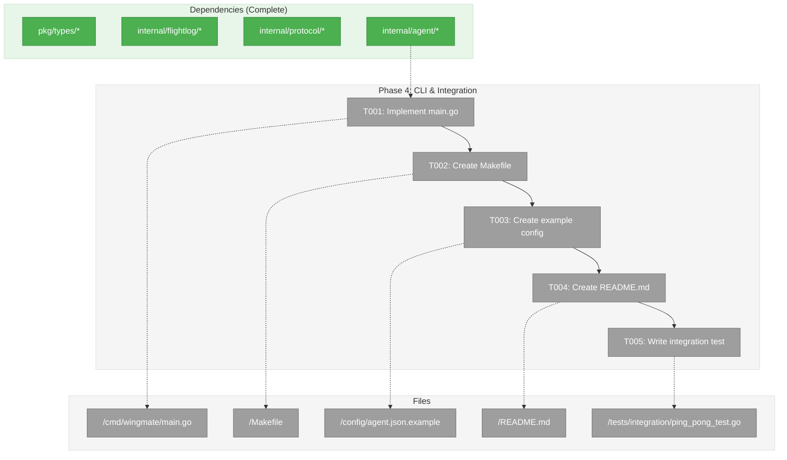

# Phase 4: CLI & Integration – Tasks & Alignment Brief

**Spec**: [/docs/plans/001-minimal-skeleton/minimal-skeleton-spec.md](/docs/plans/001-minimal-skeleton/minimal-skeleton-spec.md)
**Plan**: [/docs/plans/001-minimal-skeleton/plan.md](/docs/plans/001-minimal-skeleton/plan.md)
**Date**: 2026-01-21
**Phase Slug**: phase-4-cli-integration

---

## Executive Briefing

### Purpose

This phase wires everything together with a CLI entry point, build system, and integration tests. After this phase, users can build the `wingmate` binary from source and run it to start an agent or send commands to peers.

### What We're Building

- **cmd/wingmate/main.go** - CLI entry point with flag parsing
- **Makefile** - Build, test, lint, cross-compile targets
- **config/agent.json.example** - Example configuration file
- **README.md** - Project documentation
- **tests/integration/ping_pong_test.go** - End-to-end integration test

### User Value

After this phase:
1. `make build` produces a working binary
2. `./wingmate --port 9000` starts an agent
3. `./wingmate ping http://localhost:9001` sends a ping
4. `make build-all` produces binaries for all platforms

### Example

```bash
# Build
make build

# Start agent on port 9000
./bin/wingmate --port 9000 --name agent-a

# In another terminal, ping it
./bin/wingmate ping http://localhost:9000 --name agent-b

# Output:
# Sent: ping → agent-a
# Received: pong ← agent-a
```

---

## Objectives & Scope

### Objective

Create the CLI entry point, build system, and integration tests to produce a working `wingmate` binary.

### Goals

- [ ] Implement `cmd/wingmate/main.go` with flag parsing
- [ ] Create `Makefile` with build, test, lint, clean, build-all targets
- [ ] Create `config/agent.json.example` with documented options
- [ ] Create `README.md` with quick-start guide
- [ ] Write integration test for ping/pong between two agents

### Non-Goals

- ❌ Installer scripts
- ❌ Docker images
- ❌ CI/CD configuration
- ❌ Package manager distributions
- ❌ Web UI

---

## Architecture Map

### Component Diagram

<!-- Status: grey=pending, orange=in-progress, green=completed, red=blocked -->
<!-- Updated by plan-6 during implementation -->



### Task-to-Component Mapping

<!-- Status: ⬜ Pending | 🟧 In Progress | ✅ Complete | 🔴 Blocked -->

| Task | Component(s) | Files | Status | Comment |
|------|-------------|-------|--------|---------|
| T001 | CLI Entry Point | /cmd/wingmate/main.go | ✅ Complete | Flag parsing, commands |
| T002 | Build System | /Makefile | ✅ Complete | build, test, lint, build-all |
| T003 | Example Config | /config/agent.json.example | ✅ Complete | Documented options |
| T004 | Documentation | /README.md | ✅ Complete | Quick-start guide |
| T005 | Integration Test | /tests/integration/ping_pong_test.go | ✅ Complete | Two-agent ping/pong |

---

## Tasks

| Status | ID | Task | CS | Type | Dependencies | Absolute Path(s) | Validation | Subtasks | Notes |
|--------|------|------|-----|------|--------------|------------------|------------|----------|-------|
| [x] | T001 | Implement cmd/wingmate/main.go | 3 | Core | – | /Users/vaughanknight/GitHub/wingmate/cmd/wingmate/main.go | `go build ./cmd/wingmate` succeeds | – | Start command, ping command |
| [x] | T002 | Create Makefile | 1 | Build | T001 | /Users/vaughanknight/GitHub/wingmate/Makefile | `make build` produces binary | – | Cross-compile targets |
| [x] | T003 | Create config/agent.json.example | 1 | Config | T002 | /Users/vaughanknight/GitHub/wingmate/config/agent.json.example | Valid JSON | – | Document all options |
| [x] | T004 | Create README.md | 1 | Docs | T003 | /Users/vaughanknight/GitHub/wingmate/README.md | Contains quick-start | – | No emojis |
| [x] | T005 | Write integration test for ping/pong | 2 | Test | T004 | /Users/vaughanknight/GitHub/wingmate/tests/integration/ping_pong_test.go | Test passes | – | WaitUntilReady pattern |

---

## Alignment Brief

### Prior Phase Review: Phase 3 Unified Agent

#### A. Deliverables Created

**internal/agent** (Unified Agent):
| File | Path | Key Exports |
|------|------|-------------|
| config.go | `/Users/vaughanknight/GitHub/wingmate/internal/agent/config.go` | `Config`, `LoadConfig`, `NewConfig`, `WithEnv`, `WithDefaults` |
| validate.go | `/Users/vaughanknight/GitHub/wingmate/internal/agent/validate.go` | `Validate`, `ValidationError` |
| agent.go | `/Users/vaughanknight/GitHub/wingmate/internal/agent/agent.go` | `Agent`, `New`, `Start`, `Shutdown`, `WaitUntilReady`, `HandleMessage` |
| server.go | `/Users/vaughanknight/GitHub/wingmate/internal/agent/server.go` | `isPing`, `pongResponse`, `mustMarshal` |
| client.go | `/Users/vaughanknight/GitHub/wingmate/internal/agent/client.go` | `Ping`, `SendMessage`, `GetPeerCard` |
| conversation.go | `/Users/vaughanknight/GitHub/wingmate/internal/agent/conversation.go` | `Conversation`, `NewPilotConversation`, `NewWingmateConversation` |

#### B. Key APIs for CLI

```go
import "github.com/wingmate/wingmate/internal/agent"

// Load config with precedence: CLI > env > file > defaults
cfg := agent.NewConfig()
if configPath != "" {
    loaded, _ := agent.LoadConfig(configPath)
    cfg = loaded.WithEnv().WithDefaults()
}
// Apply CLI flags
cfg = cfg.Merge(flagConfig)
cfg.MustValidate()

// Create and start agent
a, _ := agent.New(cfg)
go a.Start(ctx)
a.WaitUntilReady(timeout)

// Send ping command
err := a.Ping(ctx, peerURL)
```

#### C. Configuration Schema

```go
type Config struct {
    Name         string   `json:"name"`          // Required
    Port         int      `json:"port"`          // Default: 9000
    Peers        []string `json:"peers"`         // Optional
    LogFile      string   `json:"logFile"`       // Default: ./flight.jsonl
    Verbose      bool     `json:"verbose"`       // Default: false
    Capabilities []string `json:"capabilities"`  // Optional
}
```

#### D. Environment Variables

- `WINGMATE_NAME`
- `WINGMATE_PORT`
- `WINGMATE_PEERS`
- `WINGMATE_LOG`
- `WINGMATE_VERBOSE`

---

### CLI Design

#### Usage

```
Usage: wingmate [options] [command]

Options:
  --name      Agent name (required for server mode)
  --port      Listen port (default: 9000)
  --peers     Comma-separated list of peer URLs
  --log       Flight log path (default: ./flight.jsonl)
  --verbose   Mirror logs to stdout
  --config    Config file path (default: ./config/agent.json)
  --help      Show help

Commands:
  (none)              Start agent server
  ping <peer-url>     Send ping to a peer
  status <peer-url>   Fetch peer's Agent Card

Examples:
  wingmate --port 9000 --name my-agent
  wingmate ping http://localhost:9001 --name sender
  wingmate status http://localhost:9001
```

#### Exit Codes

- `0` - Success
- `1` - Configuration error
- `2` - Network/peer error
- `3` - Internal error

---

### Test Plan

**Approach**: Integration test with two real agents

| Test | File | Purpose | Fixtures |
|------|------|---------|----------|
| `TestIntegration_PingPong` | ping_pong_test.go | Full ping/pong between agents | t.TempDir |
| `TestIntegration_PingPong_FlightLog` | ping_pong_test.go | Verify Flight Log entries | t.TempDir |
| `TestIntegration_AgentCard` | ping_pong_test.go | Fetch Agent Card via HTTP | t.TempDir |

**Integration Test Pattern**:
```go
func TestIntegration_PingPong(t *testing.T) {
    // Start Agent A
    agentA := agent.New(configA)
    go agentA.Start(ctx)
    agentA.WaitUntilReady(5*time.Second)  // CRITICAL
    defer agentA.Shutdown(ctx)

    // Start Agent B
    agentB := agent.New(configB)

    // Agent B pings Agent A
    err := agentB.Ping(ctx, agentA.URL())
    require.NoError(t, err)

    // Verify Flight Logs
    entriesA := flightlog.ReadLogEntries(t, configA.LogFile)
    flightlog.AssertEntryExists(t, entriesA, "agent-a", flightlog.Inbound, "")
}
```

---

### Implementation Outline

| Step | Task | Implementation Notes |
|------|------|---------------------|
| 1 | T001: main.go | Parse flags, load config, run command |
| 2 | T002: Makefile | Standard Go project targets |
| 3 | T003: config example | All options documented in comments |
| 4 | T004: README | Prerequisites, build, quick-start |
| 5 | T005: integration test | Two agents, WaitUntilReady, log verification |

---

### Commands to Run

```bash
# Build
make build

# Test
make test

# Integration test
go test -v ./tests/integration/...

# Cross-compile
make build-all

# Lint
make lint

# Clean
make clean
```

---

### Risks & Unknowns

| Risk | Severity | Mitigation |
|------|----------|------------|
| Go not installed | Medium | Defer validation |
| Flag parsing complexity | Low | Use standard flag package |
| Integration test flakiness | Low | WaitUntilReady pattern |

---

### Ready Check

- [x] Phase 3 complete
- [x] Agent API documented
- [x] CLI design specified
- [x] Test plan follows integration pattern
- [x] All tasks have absolute paths
- [ ] **Awaiting GO/NO-GO from user**

---

## Phase Footnote Stubs

_Footnotes will be added by plan-6 during implementation when deviations or discoveries occur._

| ID | Task | Note | Reference |
|----|------|------|-----------|
| | | | |

---

## Evidence Artifacts

**Execution Log Location**: `/Users/vaughanknight/GitHub/wingmate/docs/plans/001-minimal-skeleton/tasks/phase-4-cli-integration/execution.log.md`

---

## Directory Layout

```
docs/plans/001-minimal-skeleton/
├── minimal-skeleton-spec.md
├── plan.md
├── adr-003-impact-analysis.md
└── tasks/
    ├── phase-1-foundation/
    ├── phase-2-protocol-layer/
    ├── phase-3-unified-agent/
    └── phase-4-cli-integration/
        ├── tasks.md              # This file
        └── execution.log.md      # Created by plan-6
```
