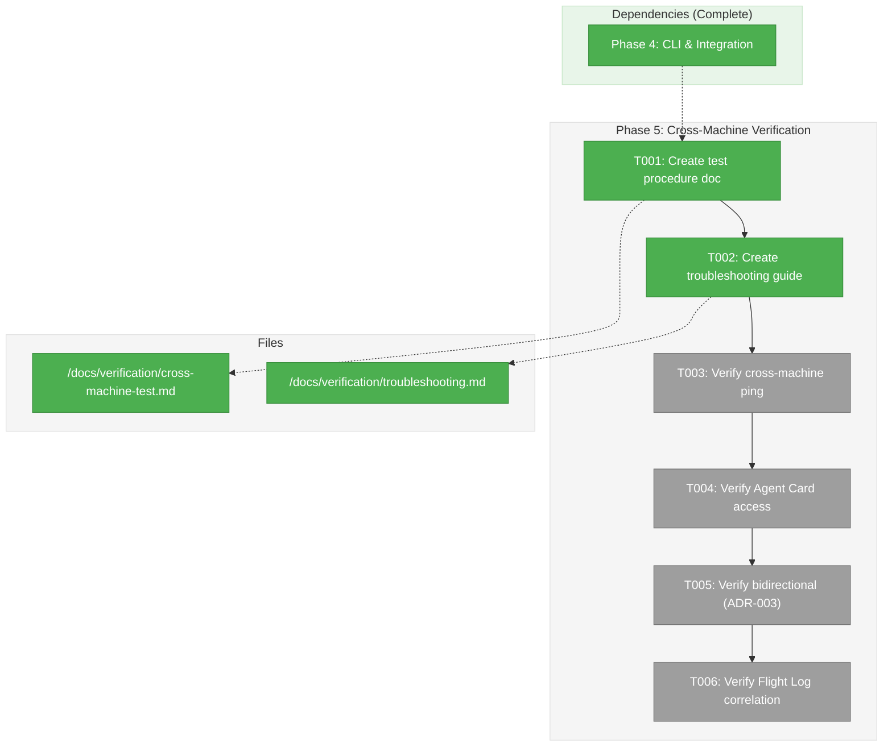

# Phase 5: Cross-Machine Verification – Tasks & Alignment Brief

**Spec**: [/docs/plans/001-minimal-skeleton/minimal-skeleton-spec.md](/docs/plans/001-minimal-skeleton/minimal-skeleton-spec.md)
**Plan**: [/docs/plans/001-minimal-skeleton/plan.md](/docs/plans/001-minimal-skeleton/plan.md)
**Date**: 2026-01-21
**Phase Slug**: phase-5-cross-machine

---

## Executive Briefing

### Purpose

This phase verifies that Wingmate communication works across physical network boundaries. It documents the verification procedures, creates a troubleshooting guide, and validates the unified peer model from ADR-003.

### What We're Building

- **docs/verification/cross-machine-test.md** - Test procedure documentation
- **docs/verification/troubleshooting.md** - Troubleshooting guide
- **Manual test execution** - Verify cross-machine communication

### User Value

After this phase:
1. Users have verified cross-network communication works
2. Documentation exists for replicating the verification
3. Troubleshooting guide covers common issues
4. ADR-003 unified peer model is validated (bidirectional communication)

### Example

```bash
# On Machine A (IP: 192.168.1.100)
./bin/wingmate --name machine-a --port 9001 --verbose

# On Machine B (different machine)
./bin/wingmate ping http://192.168.1.100:9001 --name machine-b
# Output: Received pong!

# Bidirectional test - Machine A pings Machine B
./bin/wingmate ping http://192.168.1.101:9002 --name machine-a
# Output: Received pong!
```

---

## Objectives & Scope

### Objective

Verify cross-machine communication and document the verification procedure.

### Goals

- [x] Create cross-machine test procedure documentation
- [x] Create troubleshooting guide for common issues
- [ ] Verify ping/pong works across network (manual)
- [ ] Verify Agent Card is accessible from remote machine (manual)
- [ ] Verify bidirectional communication (ADR-003 validation) (manual)
- [ ] Verify Flight Log entries have matching trace IDs and correct roles (manual)

### Non-Goals

- TLS/HTTPS setup (deferred per DEV-001)
- Authentication (deferred per DEV-002)
- Automated cross-machine testing (would require CI infrastructure)
- Docker-based verification (manual verification only)

---

## Architecture Map

### Component Diagram



### Task-to-Component Mapping

<!-- Status: ⬜ Pending | 🟧 In Progress | ✅ Complete | 🔴 Blocked -->

| Task | Component(s) | Files | Status | Comment |
|------|-------------|-------|--------|---------|
| T001 | Documentation | /docs/verification/cross-machine-test.md | ✅ Complete | Test procedure |
| T002 | Documentation | /docs/verification/troubleshooting.md | ✅ Complete | Common issues |
| T003 | Manual Test | – | ⬜ Pending | Ping from Machine B |
| T004 | Manual Test | – | ⬜ Pending | curl Agent Card |
| T005 | Manual Test | – | ⬜ Pending | ADR-003 validation |
| T006 | Manual Test | – | ⬜ Pending | Compare Flight Logs |

---

## Tasks

| Status | ID | Task | CS | Type | Dependencies | Absolute Path(s) | Validation | Subtasks | Notes |
|--------|------|------|-----|------|--------------|------------------|------------|----------|-------|
| [x] | T001 | Create cross-machine test procedure | 1 | Docs | – | /Users/vaughanknight/GitHub/wingmate/docs/verification/cross-machine-test.md | Doc exists | – | Step-by-step guide |
| [x] | T002 | Create troubleshooting guide | 1 | Docs | T001 | /Users/vaughanknight/GitHub/wingmate/docs/verification/troubleshooting.md | Doc exists | – | Common scenarios |
| [ ] | T003 | Verify cross-machine ping/pong | 2 | Test | T002 | – | Pong received | – | Manual test |
| [ ] | T004 | Verify Agent Card remote access | 1 | Test | T003 | – | JSON returned | – | curl command |
| [ ] | T005 | Verify bidirectional communication | 2 | Test | T004 | – | Both directions work | – | ADR-003 validation |
| [ ] | T006 | Verify Flight Log correlation | 1 | Test | T005 | – | Trace IDs match, roles correct | – | Check both logs |

---

## Alignment Brief

### Prior Phase Review: Phase 4 CLI & Integration

#### A. Deliverables Created

| File | Path | Key Exports |
|------|------|-------------|
| main.go | `/Users/vaughanknight/GitHub/wingmate/cmd/wingmate/main.go` | CLI entry point |
| Makefile | `/Users/vaughanknight/GitHub/wingmate/Makefile` | build, build-all, test targets |
| agent.json.example | `/Users/vaughanknight/GitHub/wingmate/config/agent.json.example` | Config template |
| README.md | `/Users/vaughanknight/GitHub/wingmate/README.md` | Quick-start guide |
| ping_pong_test.go | `/Users/vaughanknight/GitHub/wingmate/tests/integration/ping_pong_test.go` | Integration tests |

#### B. CLI Commands for Cross-Machine Testing

```bash
# Start agent (server mode)
./bin/wingmate --name <name> --port <port> [--verbose]

# Send ping
./bin/wingmate ping <peer-url> --name <name>

# Get status (Agent Card)
./bin/wingmate status <peer-url>
```

#### C. Exit Codes

- `0` - Success
- `1` - Configuration error
- `2` - Network/peer error
- `3` - Internal error

---

### Test Plan

**Approach**: Manual verification on two separate machines

| Test | Description | Expected Result |
|------|-------------|-----------------|
| Cross-machine ping | Machine B pings Machine A | "Received pong!" |
| Agent Card access | curl from Machine B | Valid JSON |
| Bidirectional | Machine A pings Machine B | "Received pong!" |
| Flight Log roles | Check role field | pilot for initiator, wingmate for responder |
| Trace correlation | Compare trace IDs | Matching trace IDs |

**Prerequisites**:
- Two machines on same network (or with network access)
- Port 9001/9002 open in firewall
- Binary built for target platform

---

### Implementation Outline

| Step | Task | Implementation Notes |
|------|------|---------------------|
| 1 | T001: Test procedure doc | Document exact commands for both machines |
| 2 | T002: Troubleshooting guide | Cover firewall, DNS, port conflicts |
| 3 | T003-T006: Manual tests | Execute tests, document results |

---

### Commands to Run

```bash
# Build for target platforms
make build-all

# Transfer binary to remote machine (example)
scp bin/wingmate-linux-amd64 user@machineB:/home/user/wingmate

# On Machine A (start agent)
./bin/wingmate --name machine-a --port 9001 --verbose

# On Machine B (ping Machine A)
./bin/wingmate ping http://192.168.1.100:9001 --name machine-b --verbose

# On Machine B (get Agent Card)
curl http://192.168.1.100:9001/.well-known/agent.json

# Check Flight Logs
cat flight.jsonl | jq .
```

---

### Risks & Unknowns

| Risk | Severity | Mitigation |
|------|----------|------------|
| Firewall blocking | High | Document port requirements |
| Network not available | Medium | Can use localhost for validation |
| DNS resolution | Low | Use IP addresses |

---

### Ready Check

- [x] Phase 4 complete
- [x] CLI documented
- [x] Binary builds successfully
- [x] Test procedure defined
- [ ] **Awaiting GO/NO-GO from user**

---

## Phase Footnote Stubs

_Footnotes will be added by plan-6 during implementation when deviations or discoveries occur._

| ID | Task | Note | Reference |
|----|------|------|-----------|
| | | | |

---

## Evidence Artifacts

**Execution Log Location**: `/Users/vaughanknight/GitHub/wingmate/docs/plans/001-minimal-skeleton/tasks/phase-5-cross-machine/execution.log.md`

---

## Directory Layout

```
docs/plans/001-minimal-skeleton/
├── minimal-skeleton-spec.md
├── plan.md
├── adr-003-impact-analysis.md
└── tasks/
    ├── phase-1-foundation/
    ├── phase-2-protocol-layer/
    ├── phase-3-unified-agent/
    ├── phase-4-cli-integration/
    └── phase-5-cross-machine/
        ├── tasks.md              # This file
        └── execution.log.md      # Created by plan-6
```
