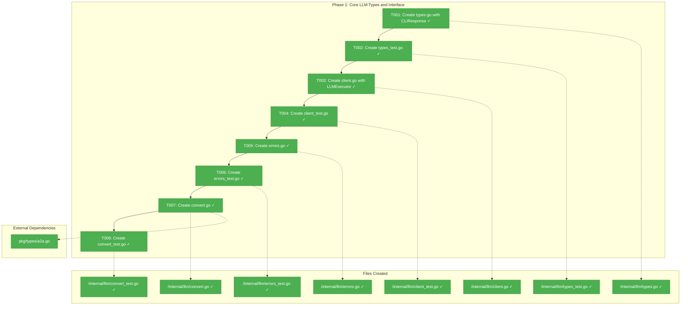
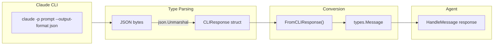
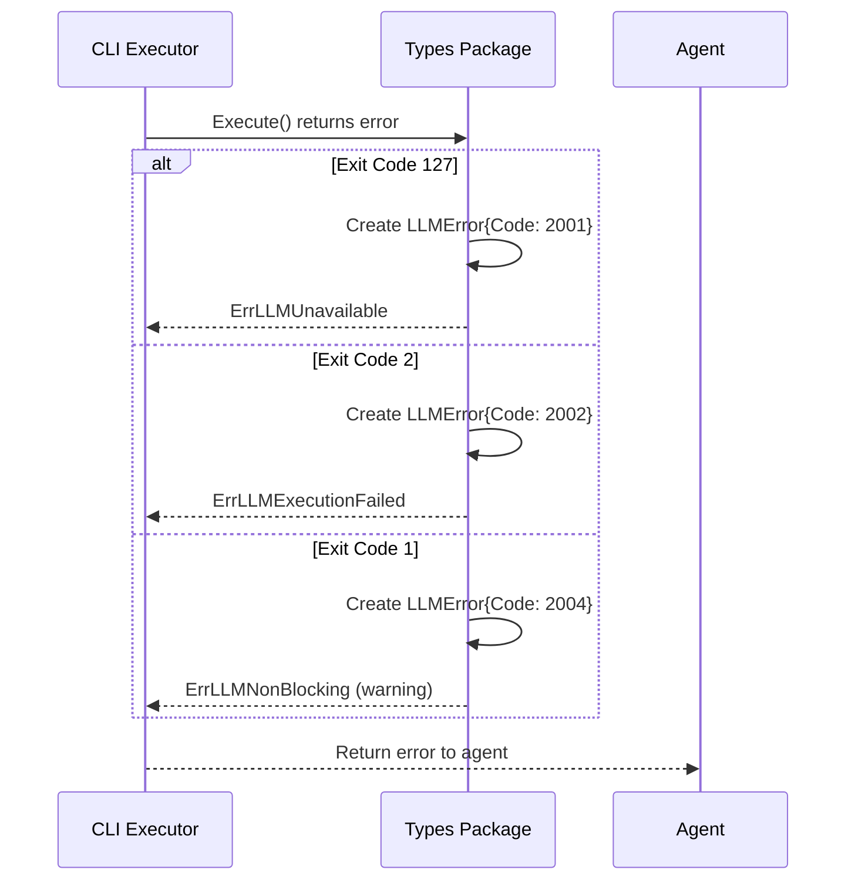

# Phase 1: Core LLM Types and Interface — Tasks + Alignment Brief

**Plan**: [claude-api-integration-plan.md](../../claude-api-integration-plan.md)
**Spec**: [claude-api-integration-spec.md](../../claude-api-integration-spec.md)
**Phase**: 1 of 5
**Created**: 2026-01-21
**Status**: ✅ Complete

---

## Executive Briefing

### Purpose
This phase establishes the foundation for Claude CLI integration by creating the `internal/llm/` package with type definitions, interfaces, and error handling. Without this foundation, subsequent phases cannot implement the CLI executor or integrate with the agent.

### What We're Building
A new Go package (`internal/llm/`) containing:
- `CLIResponse` struct that matches Claude CLI's JSON output format
- `LLMExecutor` interface enabling mock implementations for testing
- Error codes (2001-2006) for CLI-specific failure scenarios
- Conversion function to transform CLI responses into A2A message format

### User Value
Engineers gain a clean, testable abstraction for LLM interactions. The interface-based design enables:
- Unit testing without requiring Claude CLI installed
- Future support for additional CLI providers (GitHub Copilot, etc.)
- Consistent error handling across all LLM operations

### Example
**CLI Output** (from `claude -p "Hello" --output-format json`):
```json
{
  "result": "Hello! How can I help you today?",
  "session_id": "550e8400-e29b-41d4-a716-446655440000",
  "usage": {"input_tokens": 5, "output_tokens": 12}
}
```
**Parsed Go Struct**:
```go
response := &CLIResponse{
    Result:    "Hello! How can I help you today?",
    SessionID: "550e8400-e29b-41d4-a716-446655440000",
    Usage:     Usage{InputTokens: 5, OutputTokens: 12},
}
```

---

## Objectives & Scope

### Objective
Create the `internal/llm/` package with types, interfaces, and error definitions that form the contract for CLI-based LLM integration. This phase delivers the foundational types that Phase 2 (CLI Executor) and Phase 4 (Agent Integration) depend upon.

### Goals

- Create `CLIResponse` and `Usage` types matching Claude CLI JSON output
- Define `LLMExecutor` interface with `Execute()` and `IsInstalled()` methods
- Establish error codes 2001-2006 for CLI failure scenarios
- Implement `FromCLIResponse()` conversion to A2A message format
- Achieve 80%+ test coverage with TDD approach
- All types support JSON marshaling/unmarshaling

### Non-Goals

- CLI execution logic (Phase 2)
- Session management (Phase 4)
- Configuration loading (Phase 3)
- Agent integration (Phase 4)
- HTTP client or API calls (not using API approach)
- Streaming support (out of scope per spec)
- Multiple provider implementations (interface only, single mock for testing)

---

## Architecture Map

### Component Diagram
<!-- Status: grey=pending, orange=in-progress, green=completed, red=blocked -->
<!-- Updated by plan-6 during implementation -->



### Task-to-Component Mapping

<!-- Status: Pending | In Progress | Complete | Blocked -->

| Task | Component(s) | Files | Status | Comment |
|------|-------------|-------|--------|---------|
| T001 | CLIResponse, Usage, Metadata types | /internal/llm/types.go | ✅ Complete | Core data structures for CLI JSON parsing |
| T002 | Types test suite | /internal/llm/types_test.go | ✅ Complete | JSON marshal/unmarshal tests |
| T003 | LLMExecutor interface | /internal/llm/client.go | ✅ Complete | Contract for CLI execution |
| T004 | Interface test suite | /internal/llm/client_test.go | ✅ Complete | Mock implementation test |
| T005 | LLMError type, error codes | /internal/llm/errors.go | ✅ Complete | Error codes 2001-2006 |
| T006 | Errors test suite | /internal/llm/errors_test.go | ✅ Complete | Error construction tests |
| T007 | FromCLIResponse converter | /internal/llm/convert.go | ✅ Complete | CLI response to A2A message |
| T008 | Converter test suite | /internal/llm/convert_test.go | ✅ Complete | Conversion tests |

---

## Tasks

| Status | ID | Task | CS | Type | Dependencies | Absolute Path(s) | Validation | Subtasks | Notes |
|:------:|:---|:-----|:--:|:-----|:-------------|:-----------------|:-----------|:---------|:------|
| [x] | T001 | Create `types.go` with `CLIResponse`, `Usage`, `Metadata` structs matching CLI JSON output | 1 | Core | – | /Users/vaughanknight/GitHub/wingmate/internal/llm/types.go | Structs compile, JSON tags correct | – | Plan task 1.1 |
| [x] | T002 | Create `types_test.go` with JSON marshal/unmarshal tests for all types | 1 | Test | T001 | /Users/vaughanknight/GitHub/wingmate/internal/llm/types_test.go | Tests pass, cover edge cases | – | TDD: write test, then fix types |
| [x] | T003 | Create `client.go` with `LLMExecutor` interface defining `Execute()` and `IsInstalled()` | 1 | Core | T002 | /Users/vaughanknight/GitHub/wingmate/internal/llm/client.go | Interface compiles, mockable | – | Plan task 1.2 |
| [x] | T004 | Create `client_test.go` with mock implementation verifying interface contract | 1 | Test | T003 | /Users/vaughanknight/GitHub/wingmate/internal/llm/client_test.go | Mock satisfies interface, tests pass | – | Proves interface is implementable |
| [x] | T005 | Create `errors.go` with `LLMError` type and codes 2001-2006 | 1 | Core | T004 | /Users/vaughanknight/GitHub/wingmate/internal/llm/errors.go | Error codes defined, Error() method works | – | Plan task 1.3 |
| [x] | T006 | Create `errors_test.go` testing error construction and Error() output | 1 | Test | T005 | /Users/vaughanknight/GitHub/wingmate/internal/llm/errors_test.go | All error codes tested | – | Test error messages are clear |
| [x] | T007 | Create `convert.go` with `FromCLIResponse()` converting to A2A message | 2 | Core | T006 | /Users/vaughanknight/GitHub/wingmate/internal/llm/convert.go | Conversion preserves text content | – | Plan task 1.4; uses pkg/types |
| [x] | T008 | Create `convert_test.go` testing CLI→A2A conversion with edge cases | 1 | Test | T007 | /Users/vaughanknight/GitHub/wingmate/internal/llm/convert_test.go | Tests pass, edge cases covered | – | Empty result, missing fields |

**Legend**: CS = Complexity Score (1-5)

---

## Alignment Brief

### Prior Phase Review

This is Phase 1 — no prior phases to review.

### Critical Findings Affecting This Phase

From CLI Research (`research-cli-integration.md`):

1. **CLI JSON Response Format**: The CLI returns a specific JSON structure with `result`, `session_id`, `usage`, and `metadata` fields. Types must match exactly.
   - **Constrains**: T001 struct definitions
   - **Addressed by**: T001, T002

2. **Exit Codes**: CLI uses exit codes 0, 1, 2, 127 for different error scenarios. Error codes must map appropriately.
   - **Constrains**: T005 error code definitions
   - **Addressed by**: T005, T006

### ADR Decision Constraints

- **ADR-001 (Language Choice Go)**: Use standard library only (`encoding/json`, `context`). No external dependencies.
  - **Constrains**: All type definitions and JSON handling
  - **Addressed by**: T001, T002

- **ADR-003 (Unified Peer Architecture)**: LLM integration must not introduce mode-specific handling.
  - **Constrains**: Interface design must be agent-agnostic
  - **Addressed by**: T003

### Invariants & Guardrails

1. **No external dependencies**: Only Go standard library
2. **JSON compatibility**: All types must marshal/unmarshal correctly
3. **Interface mockability**: LLMExecutor must be easily mockable for tests
4. **Error clarity**: Error messages must be actionable for users

### Inputs to Read

| File | Purpose |
|------|---------|
| `/Users/vaughanknight/GitHub/wingmate/pkg/types/a2a.go` | A2A message types for conversion |
| `/Users/vaughanknight/GitHub/wingmate/internal/protocol/errors.go` | Existing error patterns |
| `/Users/vaughanknight/GitHub/wingmate/docs/plans/002-claude-api-integration/research-cli-integration.md` | CLI JSON format reference |

### Visual Alignment Aids

#### Flow Diagram: Type Usage Flow



#### Sequence Diagram: Error Handling Flow



### Test Plan (Full TDD)

**Testing Approach**: Full TDD (RED-GREEN-REFACTOR)
**Mock Usage**: Targeted mocks for interface verification only

| Test Name | File | Purpose | Fixtures | Expected Output |
|-----------|------|---------|----------|-----------------|
| `TestCLIResponse_UnmarshalJSON` | types_test.go | Verify JSON parsing | CLI JSON sample | Populated struct |
| `TestCLIResponse_UnmarshalJSON_Empty` | types_test.go | Handle empty result | `{"result":""}` | Empty Result field |
| `TestCLIResponse_UnmarshalJSON_MissingFields` | types_test.go | Handle partial JSON | `{"result":"hi"}` | Zero values for missing |
| `TestUsage_MarshalJSON` | types_test.go | Verify round-trip | Usage struct | Matching JSON |
| `TestMockExecutor_SatisfiesInterface` | client_test.go | Prove mockability | Mock struct | Compiles and runs |
| `TestMockExecutor_Execute` | client_test.go | Mock returns response | Mock with canned response | Response matches |
| `TestMockExecutor_IsInstalled` | client_test.go | Mock returns bool | Mock with true/false | Correct bool |
| `TestLLMError_Error` | errors_test.go | Error string format | Error with code/message | Formatted string |
| `TestLLMError_Codes` | errors_test.go | All codes defined | Each code constant | Non-zero, unique |
| `TestFromCLIResponse_Basic` | convert_test.go | Basic conversion | CLIResponse with text | A2A Message with text |
| `TestFromCLIResponse_EmptyResult` | convert_test.go | Handle empty | CLIResponse with "" | Empty message content |
| `TestFromCLIResponse_PreservesSessionID` | convert_test.go | Session ID passed | CLIResponse with session | Session in metadata |

### Step-by-Step Implementation Outline

1. **T001**: Create `/internal/llm/types.go`
   - Define `Usage` struct with `InputTokens`, `OutputTokens` int fields
   - Define `Metadata` struct with `Model` string field
   - Define `CLIResponse` struct with `Result`, `SessionID`, `Usage`, `Metadata` fields
   - Add JSON tags matching CLI output (`result`, `session_id`, `usage`, `metadata`)

2. **T002**: Create `/internal/llm/types_test.go`
   - Write test for JSON unmarshal with full CLI response
   - Write test for empty result handling
   - Write test for missing fields (partial JSON)
   - Write test for round-trip marshal/unmarshal

3. **T003**: Create `/internal/llm/client.go`
   - Define `LLMExecutor` interface with:
     - `Execute(ctx context.Context, prompt string, sessionID string) (*CLIResponse, error)`
     - `IsInstalled() bool`

4. **T004**: Create `/internal/llm/client_test.go`
   - Create `MockExecutor` struct implementing `LLMExecutor`
   - Write test proving mock satisfies interface
   - Write test for Execute returning canned response
   - Write test for IsInstalled returning configured value

5. **T005**: Create `/internal/llm/errors.go`
   - Define error code constants:
     - `CodeLLMUnavailable = 2001` (CLI not installed)
     - `CodeLLMExecutionFailed = 2002` (blocking error)
     - `CodeLLMTimeout = 2003` (timeout)
     - `CodeLLMNonBlocking = 2004` (warning)
     - `CodeLLMSessionNotFound = 2005` (session expired)
     - `CodeLLMInvalidResponse = 2006` (JSON parse failed)
   - Define `LLMError` struct with `Code`, `Message`, `Err` fields
   - Implement `Error() string` method
   - Implement `Unwrap() error` method

6. **T006**: Create `/internal/llm/errors_test.go`
   - Write test for each error code constant (non-zero, unique)
   - Write test for Error() output format
   - Write test for Unwrap() returning wrapped error

7. **T007**: Create `/internal/llm/convert.go`
   - Import `github.com/wingmate/wingmate/pkg/types`
   - Define `FromCLIResponse(resp *CLIResponse) (*types.Message, error)`
   - Create Message with Role="assistant", text part from Result
   - Handle nil input

8. **T008**: Create `/internal/llm/convert_test.go`
   - Write test for basic conversion
   - Write test for empty result
   - Write test for nil input
   - Write test verifying session ID preservation in response

### Commands to Run

```bash
# Create package directory
mkdir -p /Users/vaughanknight/GitHub/wingmate/internal/llm

# Run tests (will fail initially - TDD)
go test -v ./internal/llm/...

# Run tests with coverage
go test -coverprofile=coverage.out ./internal/llm/...
go tool cover -func=coverage.out | grep total

# Verify package compiles
go build ./internal/llm/...

# Run vet
go vet ./internal/llm/...

# Format code
go fmt ./internal/llm/...
```

### Risks & Unknowns

| Risk | Severity | Mitigation |
|------|----------|------------|
| CLI JSON format may vary between versions | Medium | Test with actual CLI output; document minimum version |
| A2A Message type may not accommodate all metadata | Low | Check types.Message structure; extend if needed |
| Error codes may conflict with existing codes | Low | Checked: 2001-2006 are unused in pkg/types/errors.go |

### Ready Check

- [x] Plan phase identified and tasks extracted
- [x] Critical findings reviewed and applied
- [x] ADR constraints mapped to tasks (ADR-001, ADR-003 noted)
- [x] Test plan defined with TDD approach
- [x] Mermaid diagrams created for flow and sequence
- [x] All absolute paths specified
- [x] Validation criteria defined for each task
- [ ] **Awaiting GO to proceed with implementation**

---

## Phase Footnote Stubs

| ID | Phase | Status | File:Line | Evidence |
|:---|:------|:-------|:----------|:---------|
| — | — | — | — | — |

*Footnotes will be populated during implementation via plan-6a.*

---

## Evidence Artifacts

| Artifact | Location | Created |
|:---------|:---------|:--------|
| Execution Log | `./execution.log.md` | (pending) |
| Test Coverage | (link to coverage report) | (pending) |

---

## Discoveries & Learnings

_Populated during implementation by plan-6. Log anything of interest to your future self._

| Date | Task | Type | Discovery | Resolution | References |
|:-----|:-----|:-----|:----------|:-----------|:-----------|
| — | — | — | — | — | — |

**Types**: `gotcha` | `research-needed` | `unexpected-behavior` | `workaround` | `decision` | `debt` | `insight`

**What to log**:
- Things that didn't work as expected
- External research that was required
- Implementation troubles and how they were resolved
- Gotchas and edge cases discovered
- Decisions made during implementation
- Technical debt introduced (and why)
- Insights that future phases should know about

_See also: `execution.log.md` for detailed narrative._

---

## Directory Layout

```
docs/plans/002-claude-api-integration/
├── claude-api-integration-spec.md
├── claude-api-integration-plan.md
├── research-dossier.md
├── research-cli-integration.md
└── tasks/
    └── phase-1-core-llm-types-and-interface/
        ├── tasks.md              # This file
        └── execution.log.md      # Created by /plan-6
```
