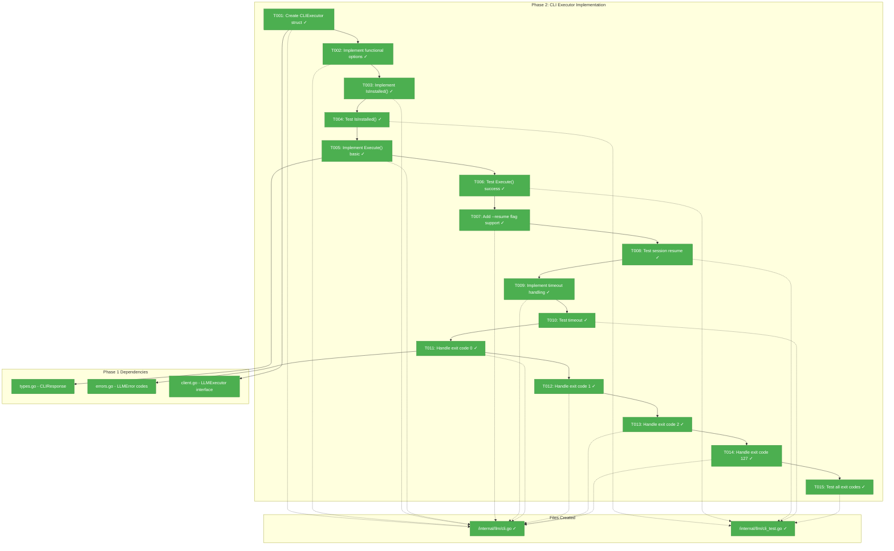
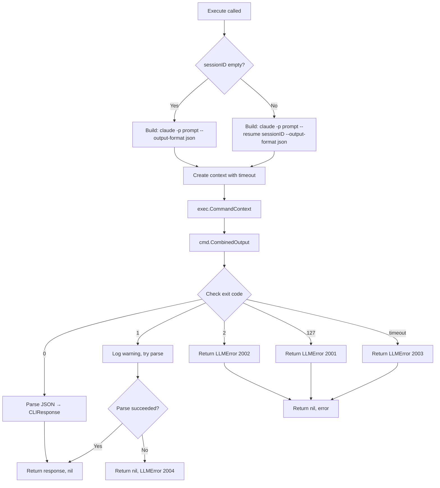
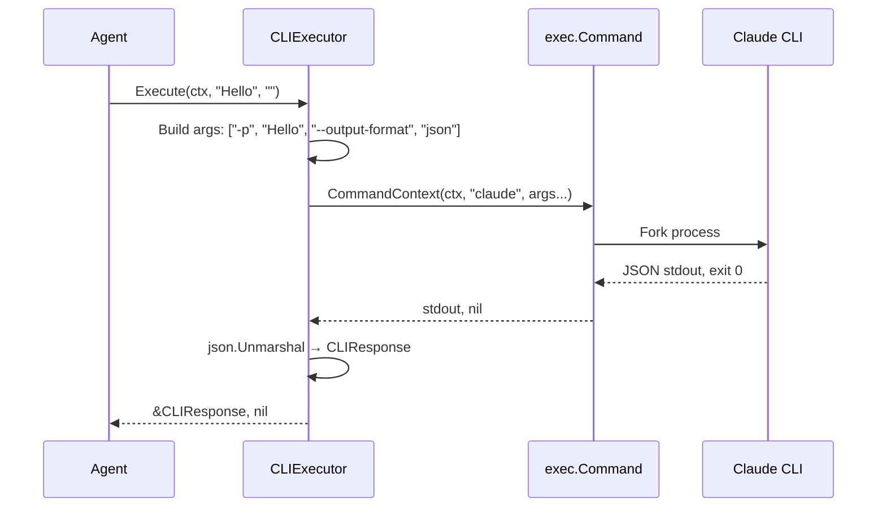

# Phase 2: CLI Executor Implementation — Tasks + Alignment Brief

**Plan**: [claude-api-integration-plan.md](../../claude-api-integration-plan.md)
**Spec**: [claude-api-integration-spec.md](../../claude-api-integration-spec.md)
**Phase**: 2 of 5
**Created**: 2026-01-21
**Status**: ✅ Complete

---

## Executive Briefing

### Purpose
This phase implements the `CLIExecutor` that invokes the Claude CLI binary as a subprocess. This is the core engine that transforms prompts into Claude responses by executing `claude -p "prompt" --output-format json` and parsing the results.

### What We're Building
A `CLIExecutor` struct that:
- Locates the `claude` binary in PATH (or uses configured path)
- Builds command-line arguments with proper flags (`-p`, `--output-format json`, `--resume`)
- Executes the CLI with timeout via `context.Context`
- Parses JSON output into `CLIResponse` structs
- Maps exit codes to appropriate `LLMError` types

### User Value
Engineers get reliable Claude integration that:
- Works without API keys (CLI handles its own auth)
- Supports session continuity via `--resume` flag
- Provides clear errors when CLI is missing or fails
- Respects configurable timeouts for long-running requests

### Example
```go
executor := NewCLIExecutor(WithTimeout(120 * time.Second))

// First message (no session)
resp, err := executor.Execute(ctx, "What is 2+2?", "")
// CLI runs: claude -p "What is 2+2?" --output-format json
// resp.Result = "2+2 equals 4."
// resp.SessionID = "abc-123"

// Follow-up (with session)
resp2, err := executor.Execute(ctx, "And 3+3?", "abc-123")
// CLI runs: claude -p "And 3+3?" --resume "abc-123" --output-format json
// resp2.Result = "3+3 equals 6."
```

---

## Objectives & Scope

### Objective
Implement the `CLIExecutor` struct that satisfies the `LLMExecutor` interface from Phase 1, enabling actual Claude CLI invocation with proper error handling and session support.

### Goals

- Implement `CLIExecutor` struct with configurable CLI path, timeout, and model
- Implement `IsInstalled()` using `exec.LookPath`
- Implement `Execute()` building correct command line with flags
- Support session resume via `--resume` flag when sessionID provided
- Handle all exit codes (0, 1, 2, 127) with appropriate errors
- Implement timeout using `context.Context` with deadline
- Parse JSON output into `CLIResponse` from Phase 1
- Achieve 90%+ test coverage with mocked `exec.Command`

### Non-Goals

- Session ID storage/management (Phase 4)
- Agent integration (Phase 4)
- Configuration loading from environment (Phase 3)
- Flight Log integration (Phase 4)
- Model selection via config (Phase 3 provides config; this phase accepts model parameter)
- Streaming support (out of scope per spec)
- Retry logic (future enhancement)

---

## Architecture Map

### Component Diagram
<!-- Status: grey=pending, orange=in-progress, green=completed, red=blocked -->
<!-- Updated by plan-6 during implementation -->



### Task-to-Component Mapping

<!-- Status: ⬜ Pending | 🟧 In Progress | ✅ Complete | 🔴 Blocked -->

| Task | Component(s) | Files | Status | Comment |
|------|-------------|-------|--------|---------|
| T001 | CLIExecutor struct | /internal/llm/cli.go | ✅ Complete | Struct with cliPath, timeout, model fields |
| T002 | Functional options | /internal/llm/cli.go | ✅ Complete | WithTimeout(), WithCLIPath(), WithModel() |
| T003 | IsInstalled() | /internal/llm/cli.go | ✅ Complete | Uses exec.LookPath |
| T004 | IsInstalled tests | /internal/llm/cli_test.go | ✅ Complete | Mock exec.LookPath |
| T005 | Execute() basic | /internal/llm/cli.go | ✅ Complete | Build and run command |
| T006 | Execute tests | /internal/llm/cli_test.go | ✅ Complete | Mock exec.Command |
| T007 | --resume flag | /internal/llm/cli.go | ✅ Complete | Add when sessionID provided |
| T008 | Resume tests | /internal/llm/cli_test.go | ✅ Complete | Verify flag in command |
| T009 | Timeout handling | /internal/llm/cli.go | ✅ Complete | context.WithTimeout |
| T010 | Timeout tests | /internal/llm/cli_test.go | ✅ Complete | Mock slow command |
| T011 | Exit code 0 | /internal/llm/cli.go | ✅ Complete | Parse JSON, return response |
| T012 | Exit code 1 | /internal/llm/cli.go | ✅ Complete | Return LLMError 2004 |
| T013 | Exit code 2 | /internal/llm/cli.go | ✅ Complete | Return LLMError 2002 |
| T014 | Exit code 127 | /internal/llm/cli.go | ✅ Complete | Return LLMError 2001 |
| T015 | Exit code tests | /internal/llm/cli_test.go | ✅ Complete | All exit codes tested |

---

## Tasks

| Status | ID | Task | CS | Type | Dependencies | Absolute Path(s) | Validation | Subtasks | Notes |
|:------:|:---|:-----|:--:|:-----|:-------------|:-----------------|:-----------|:---------|:------|
| [x] | T001 | Create `CLIExecutor` struct with cliPath, timeout, model fields | 1 | Core | Phase 1 | /Users/vaughanknight/GitHub/wingmate/internal/llm/cli.go | Struct compiles, implements LLMExecutor | – | Plan task 2.1 |
| [x] | T002 | Add functional options: `WithTimeout()`, `WithCLIPath()`, `WithModel()` | 1 | Core | T001 | /Users/vaughanknight/GitHub/wingmate/internal/llm/cli.go | Options modify executor config | – | Follow existing patterns |
| [x] | T003 | Implement `IsInstalled()` using `exec.LookPath("claude")` | 1 | Core | T002 | /Users/vaughanknight/GitHub/wingmate/internal/llm/cli.go | Returns true if claude in PATH | – | Plan task 2.2 |
| [x] | T004 | Write tests for `IsInstalled()` with mock LookPath | 1 | Test | T003 | /Users/vaughanknight/GitHub/wingmate/internal/llm/cli_test.go | Tests pass for found/not found | – | Use test helper for mock |
| [x] | T005 | Implement `Execute()` building command: `claude -p "prompt" --output-format json` | 2 | Core | T004 | /Users/vaughanknight/GitHub/wingmate/internal/llm/cli.go | Command built correctly | – | Plan task 2.3 |
| [x] | T006 | Write tests for `Execute()` with mock exec.Command returning success JSON | 2 | Test | T005 | /Users/vaughanknight/GitHub/wingmate/internal/llm/cli_test.go | Tests pass, JSON parsed | – | Mock command pattern |
| [x] | T007 | Add `--resume "session-id"` flag when sessionID parameter is non-empty | 1 | Core | T006 | /Users/vaughanknight/GitHub/wingmate/internal/llm/cli.go | Resume flag added conditionally | – | Plan task 2.4 |
| [x] | T008 | Write tests verifying `--resume` flag included when sessionID provided | 1 | Test | T007 | /Users/vaughanknight/GitHub/wingmate/internal/llm/cli_test.go | Tests verify flag presence/absence | – | Check command args |
| [x] | T009 | Implement timeout using `context.WithTimeout` wrapping command execution | 2 | Core | T008 | /Users/vaughanknight/GitHub/wingmate/internal/llm/cli.go | Context deadline respected | – | Plan task 2.5 |
| [x] | T010 | Write tests for timeout: mock slow command, verify context cancellation | 2 | Test | T009 | /Users/vaughanknight/GitHub/wingmate/internal/llm/cli_test.go | Test times out, returns error 2003 | – | Use context deadline |
| [x] | T011 | Handle exit code 0: parse JSON stdout into CLIResponse | 1 | Core | T010 | /Users/vaughanknight/GitHub/wingmate/internal/llm/cli.go | Success returns parsed response | – | Plan task 2.6 |
| [x] | T012 | Handle exit code 1: return LLMError 2004 (non-blocking) | 1 | Core | T011 | /Users/vaughanknight/GitHub/wingmate/internal/llm/cli.go | Returns error 2004 | – | Plan task 2.7 |
| [x] | T013 | Handle exit code 2: return `LLMError{Code: 2002}` with stderr | 1 | Core | T012 | /Users/vaughanknight/GitHub/wingmate/internal/llm/cli.go | Returns blocking error | – | Plan task 2.8 |
| [x] | T014 | Handle exit code 127: return `LLMError{Code: 2001}` "CLI not installed" | 1 | Core | T013 | /Users/vaughanknight/GitHub/wingmate/internal/llm/cli.go | Returns unavailable error | – | Plan task 2.9 |
| [x] | T015 | Write comprehensive tests for all exit codes (0, 1, 2, 127) | 2 | Test | T014 | /Users/vaughanknight/GitHub/wingmate/internal/llm/cli_test.go | All exit codes tested | – | Table-driven tests |

**Legend**: CS = Complexity Score (1-5)

---

## Alignment Brief

### Prior Phase Review

**Phase 1 Deliverables** (required for this phase):

| Deliverable | File | Purpose |
|-------------|------|---------|
| `CLIResponse` struct | `/internal/llm/types.go` | JSON parsing target |
| `Usage` struct | `/internal/llm/types.go` | Token counts |
| `LLMExecutor` interface | `/internal/llm/client.go` | Interface to implement |
| `LLMError` type | `/internal/llm/errors.go` | Error construction |
| Error codes 2001-2006 | `/internal/llm/errors.go` | Exit code mapping |

**Phase 1 Patterns to Follow**:
- JSON tags on structs for parsing
- Error construction with Code and Message
- Interface-based design for testability

### Critical Findings Affecting This Phase

From CLI Research (`research-cli-integration.md`):

1. **CLI Invocation Syntax**: Must use `-p` for non-interactive mode
   - **Constrains**: T005 command building
   - **Addressed by**: T005, T006

2. **JSON Output Flag**: `--output-format json` is required for structured responses
   - **Constrains**: T005 command building
   - **Addressed by**: T005, T006

3. **Session Resume**: `--resume "session-id"` continues specific session
   - **Constrains**: T007 flag logic
   - **Addressed by**: T007, T008

4. **Exit Code Semantics**:
   - 0 = success
   - 1 = non-blocking error (warning)
   - 2 = blocking error
   - 127 = command not found
   - **Constrains**: T011-T014 error handling
   - **Addressed by**: T011-T015

### ADR Decision Constraints

- **ADR-001 (Language Choice Go)**: Use `os/exec` standard library only. No external command execution libraries.
  - **Constrains**: T005 command execution approach
  - **Addressed by**: T005

### Invariants & Guardrails

1. **No external dependencies**: Only Go standard library (`os/exec`, `context`, `encoding/json`)
2. **Timeout enforcement**: All executions must respect context deadline
3. **Exit code accuracy**: Each exit code maps to exactly one error type
4. **Stderr capture**: Capture stderr for error messages but don't expose to peers
5. **No prompt logging**: Don't log user prompts (privacy)

### Inputs to Read

| File | Purpose |
|------|---------|
| `/Users/vaughanknight/GitHub/wingmate/internal/llm/types.go` | CLIResponse for parsing |
| `/Users/vaughanknight/GitHub/wingmate/internal/llm/errors.go` | Error codes and types |
| `/Users/vaughanknight/GitHub/wingmate/internal/llm/client.go` | Interface to implement |

### Visual Alignment Aids

#### Flow Diagram: Execute() Method Flow



#### Sequence Diagram: CLI Execution



### Test Plan (Full TDD)

**Testing Approach**: Full TDD (RED-GREEN-REFACTOR)
**Mock Usage**: Mock `exec.Command` via test helper pattern

| Test Name | File | Purpose | Fixtures | Expected Output |
|-----------|------|---------|----------|-----------------|
| `TestCLIExecutor_IsInstalled_Found` | cli_test.go | CLI in PATH | Mock LookPath success | true |
| `TestCLIExecutor_IsInstalled_NotFound` | cli_test.go | CLI not in PATH | Mock LookPath error | false |
| `TestCLIExecutor_Execute_Success` | cli_test.go | Normal execution | Mock returning JSON | Parsed CLIResponse |
| `TestCLIExecutor_Execute_BuildsCorrectCommand` | cli_test.go | Verify args | Mock capturing args | Correct flags |
| `TestCLIExecutor_Execute_WithSession` | cli_test.go | Resume flag | Mock capturing args | --resume present |
| `TestCLIExecutor_Execute_WithoutSession` | cli_test.go | No resume | Mock capturing args | --resume absent |
| `TestCLIExecutor_Execute_Timeout` | cli_test.go | Context deadline | Mock slow command | Error 2003 |
| `TestCLIExecutor_Execute_ExitCode0` | cli_test.go | Success | Mock exit 0 | Response, nil |
| `TestCLIExecutor_Execute_ExitCode1` | cli_test.go | Warning | Mock exit 1 | Partial or error |
| `TestCLIExecutor_Execute_ExitCode2` | cli_test.go | Blocking | Mock exit 2 | Error 2002 |
| `TestCLIExecutor_Execute_ExitCode127` | cli_test.go | Not found | Mock exit 127 | Error 2001 |
| `TestCLIExecutor_Options` | cli_test.go | Functional opts | Various options | Config applied |

**Mock Command Pattern**:
```go
// Test helper for mocking exec.Command
var execCommand = exec.Command

func TestCLIExecutor_Execute_Success(t *testing.T) {
    // Save and restore
    oldExecCommand := execCommand
    defer func() { execCommand = oldExecCommand }()

    // Mock
    execCommand = func(name string, args ...string) *exec.Cmd {
        cs := []string{"-test.run=TestHelperProcess", "--", name}
        cs = append(cs, args...)
        cmd := exec.Command(os.Args[0], cs...)
        cmd.Env = []string{"GO_WANT_HELPER_PROCESS=1"}
        return cmd
    }

    // Test...
}

func TestHelperProcess(t *testing.T) {
    if os.Getenv("GO_WANT_HELPER_PROCESS") != "1" {
        return
    }
    // Output mock response
    fmt.Println(`{"result":"Hello","session_id":"abc"}`)
    os.Exit(0)
}
```

### Step-by-Step Implementation Outline

1. **T001**: Create `CLIExecutor` struct
   - Fields: `cliPath string`, `timeout time.Duration`, `model string`
   - Ensure struct satisfies `LLMExecutor` interface

2. **T002**: Add functional options
   - `type Option func(*CLIExecutor)`
   - `WithTimeout(d time.Duration) Option`
   - `WithCLIPath(path string) Option`
   - `WithModel(model string) Option`
   - `NewCLIExecutor(opts ...Option) *CLIExecutor`

3. **T003**: Implement `IsInstalled()`
   - Use `exec.LookPath("claude")` or custom path
   - Return true if found, false otherwise

4. **T004**: Test `IsInstalled()`
   - Mock scenario: claude found
   - Mock scenario: claude not found

5. **T005**: Implement `Execute()` basic
   - Build args: `[]string{"-p", prompt, "--output-format", "json"}`
   - Create `exec.CommandContext(ctx, cliPath, args...)`
   - Run and capture output

6. **T006**: Test `Execute()` success
   - Mock returning valid JSON
   - Verify parsing works

7. **T007**: Add `--resume` flag
   - If sessionID != "", append `"--resume", sessionID` to args

8. **T008**: Test session resume
   - Verify args include --resume when sessionID provided
   - Verify args exclude --resume when sessionID empty

9. **T009**: Implement timeout
   - Wrap execution context with timeout if configured
   - Check for context.DeadlineExceeded error

10. **T010**: Test timeout
    - Mock slow command exceeding timeout
    - Verify error 2003 returned

11. **T011-T014**: Handle exit codes
    - Check `cmd.ProcessState.ExitCode()` or error type
    - Map to appropriate LLMError

15. **T015**: Comprehensive exit code tests
    - Table-driven test covering 0, 1, 2, 127

### Commands to Run

```bash
# Run tests (will fail initially - TDD)
go test -v ./internal/llm/... -run CLI

# Run tests with coverage
go test -coverprofile=coverage.out ./internal/llm/...
go tool cover -func=coverage.out | grep total

# Verify package compiles
go build ./internal/llm/...

# Run vet
go vet ./internal/llm/...

# Check for race conditions
go test -race ./internal/llm/...
```

### Risks & Unknowns

| Risk | Severity | Mitigation |
|------|----------|------------|
| Mock exec.Command is complex | Medium | Use established test helper pattern |
| Exit code detection varies by OS | Low | Test on target platforms; use ProcessState |
| Timeout may not kill subprocess | Medium | Use CommandContext which handles SIGKILL |
| JSON parse may fail on partial output | Low | Graceful handling in exit code 1 path |

### Ready Check

- [x] Phase 1 deliverables identified
- [x] Critical findings reviewed and applied
- [x] ADR constraints mapped (ADR-001 noted)
- [x] Test plan defined with TDD approach
- [x] Mermaid diagrams created
- [x] All absolute paths specified
- [x] Validation criteria defined
- [ ] **Awaiting GO to proceed with implementation**

---

## Phase Footnote Stubs

| ID | Phase | Status | File:Line | Evidence |
|:---|:------|:-------|:----------|:---------|
| — | — | — | — | — |

*Footnotes will be populated during implementation via plan-6a.*

---

## Evidence Artifacts

| Artifact | Location | Created |
|:---------|:---------|:--------|
| Execution Log | `./execution.log.md` | (pending) |
| Test Coverage | (link to coverage report) | (pending) |

---

## Discoveries & Learnings

_Populated during implementation by plan-6. Log anything of interest to your future self._

| Date | Task | Type | Discovery | Resolution | References |
|:-----|:-----|:-----|:----------|:-----------|:-----------|
| — | — | — | — | — | — |

**Types**: `gotcha` | `research-needed` | `unexpected-behavior` | `workaround` | `decision` | `debt` | `insight`

_See also: `execution.log.md` for detailed narrative._

---

## Directory Layout

```
docs/plans/002-claude-api-integration/
├── claude-api-integration-spec.md
├── claude-api-integration-plan.md
├── research-dossier.md
├── research-cli-integration.md
└── tasks/
    ├── phase-1-core-llm-types-and-interface/
    │   ├── tasks.md
    │   └── execution.log.md
    └── phase-2-cli-executor-implementation/
        ├── tasks.md              # This file
        └── execution.log.md      # Created by /plan-6
```
