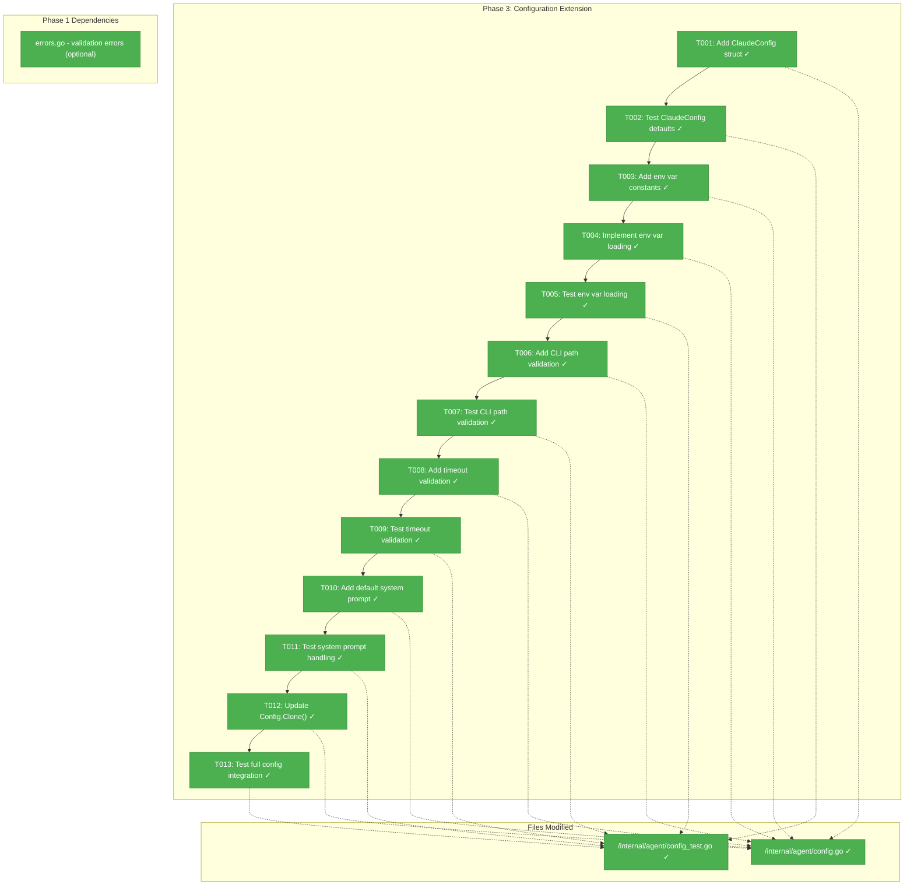
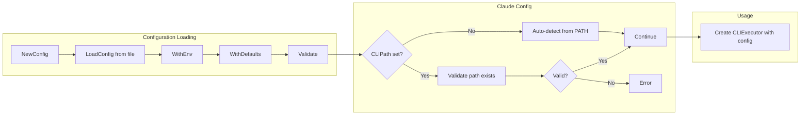
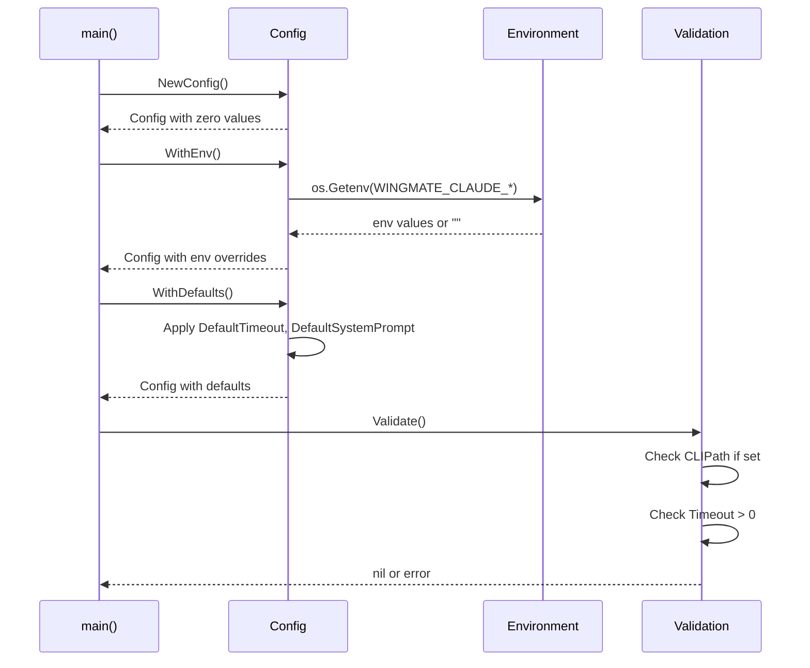

# Phase 3: Configuration Extension — Tasks + Alignment Brief

**Plan**: [claude-api-integration-plan.md](../../claude-api-integration-plan.md)
**Spec**: [claude-api-integration-spec.md](../../claude-api-integration-spec.md)
**Phase**: 3 of 5
**Created**: 2026-01-21
**Status**: ✅ Complete

---

## Executive Briefing

### Purpose
This phase extends the agent configuration system to support Claude CLI settings. Without configuration, users cannot customize CLI path, timeout, model selection, or system prompts. This phase bridges the CLI executor (Phase 2) with user-configurable behavior.

### What We're Building
A `ClaudeConfig` struct embedded in the agent `Config` that:
- Specifies custom CLI binary path (or auto-detect from PATH)
- Sets execution timeout (default: 120 seconds)
- Allows model selection (sonnet, opus, haiku)
- Provides system prompt customization for debugging context

All settings are configurable via environment variables following the existing `WINGMATE_*` pattern.

### User Value
Engineers can:
- Use a custom Claude CLI installation path
- Extend timeout for complex analysis requests
- Select different Claude models for cost/capability tradeoffs
- Customize the system prompt for their specific debugging context

### Example
**Environment Configuration**:
```bash
export WINGMATE_CLAUDE_CLI_PATH="/usr/local/bin/claude"
export WINGMATE_CLAUDE_MODEL="opus"
export WINGMATE_CLAUDE_TIMEOUT="180s"
export WINGMATE_CLAUDE_SYSTEM_PROMPT="You are a Kubernetes debugging assistant."
```

**In Code**:
```go
cfg := agent.NewConfig().WithEnv().WithDefaults()
// cfg.Claude.CLIPath = "/usr/local/bin/claude"
// cfg.Claude.Model = "opus"
// cfg.Claude.Timeout = 180 * time.Second
// cfg.Claude.SystemPrompt = "You are a Kubernetes debugging assistant."
```

---

## Objectives & Scope

### Objective
Extend the agent configuration system to support Claude CLI settings, enabling users to customize CLI behavior via environment variables and JSON configuration files.

### Goals

- ✅ Add `ClaudeConfig` struct with `CLIPath`, `Model`, `Timeout`, `SystemPrompt` fields
- ✅ Support environment variables: `WINGMATE_CLAUDE_CLI_PATH`, `WINGMATE_CLAUDE_MODEL`, `WINGMATE_CLAUDE_TIMEOUT`, `WINGMATE_CLAUDE_SYSTEM_PROMPT`
- ✅ Validate CLI path exists (if explicitly set) or defer to PATH lookup
- ✅ Validate timeout is positive
- ✅ Provide sensible defaults (120s timeout, auto-detect CLI, empty system prompt uses default)
- ✅ Integrate with existing `Config.WithEnv()` and `Config.WithDefaults()` patterns
- ✅ All configuration tests pass with 80%+ coverage

### Non-Goals

- ❌ API key management (CLI handles its own auth — no `WINGMATE_CLAUDE_API_KEY`)
- ❌ Max tokens configuration (CLI controls this internally)
- ❌ Rate limiting configuration (out of scope)
- ❌ CLI executor instantiation (Phase 4 uses config to create executor)
- ❌ Agent integration (Phase 4)
- ❌ Flight Log integration (Phase 4)
- ❌ Multiple provider configs (only Claude CLI for now)

---

## Architecture Map

### Component Diagram
<!-- Status: grey=pending, orange=in-progress, green=completed, red=blocked -->
<!-- Updated by plan-6 during implementation -->



### Task-to-Component Mapping

<!-- Status: ⬜ Pending | 🟧 In Progress | ✅ Complete | 🔴 Blocked -->

| Task | Component(s) | Files | Status | Comment |
|------|-------------|-------|--------|---------|
| T001 | ClaudeConfig struct | /internal/agent/config.go | ✅ Complete | Four fields: CLIPath, Model, Timeout, SystemPrompt |
| T002 | ClaudeConfig tests | /internal/agent/config_test.go | ✅ Complete | Test default values |
| T003 | Env var constants | /internal/agent/config.go | ✅ Complete | EnvClaudeCLIPath, etc. |
| T004 | WithEnv() extension | /internal/agent/config.go | ✅ Complete | Load from environment |
| T005 | Env loading tests | /internal/agent/config_test.go | ✅ Complete | Test each env var |
| T006 | CLI path validation | /internal/agent/validate.go | ✅ Complete | Validate path exists if set |
| T007 | Path validation tests | /internal/agent/config_test.go | ✅ Complete | Valid/invalid paths |
| T008 | Timeout validation | /internal/agent/validate.go | ✅ Complete | Timeout >= 0 |
| T009 | Timeout tests | /internal/agent/config_test.go | ✅ Complete | Positive/zero/negative |
| T010 | Default system prompt | /internal/agent/config.go | ✅ Complete | DefaultClaudeSystemPrompt constant |
| T011 | System prompt tests | /internal/agent/config_test.go | ✅ Complete | Default and override |
| T012 | Clone() update | /internal/agent/config.go | ✅ Complete | Deep copy ClaudeConfig |
| T013 | Integration tests | /internal/agent/config_test.go | ✅ Complete | Full config lifecycle |

---

## Tasks

| Status | ID | Task | CS | Type | Dependencies | Absolute Path(s) | Validation | Subtasks | Notes |
|:------:|:---|:-----|:--:|:-----|:-------------|:-----------------|:-----------|:---------|:------|
| [x] | T001 | Add `ClaudeConfig` struct with `CLIPath`, `Model`, `Timeout`, `SystemPrompt` fields to `Config` | 1 | Core | Phase 1 | /Users/vaughanknight/GitHub/wingmate/internal/agent/config.go | Struct compiles, JSON tags correct | – | Plan task 3.1 |
| [x] | T002 | Write tests for `ClaudeConfig` default values and JSON marshaling | 1 | Test | T001 | /Users/vaughanknight/GitHub/wingmate/internal/agent/config_test.go | Tests pass, defaults verified | – | TDD: verify defaults |
| [x] | T003 | Add environment variable constants: `EnvClaudeCLIPath`, `EnvClaudeModel`, `EnvClaudeTimeout`, `EnvClaudeSystemPrompt` | 1 | Core | T002 | /Users/vaughanknight/GitHub/wingmate/internal/agent/config.go | Constants defined | – | Follow existing pattern |
| [x] | T004 | Extend `Config.WithEnv()` to load Claude-specific environment variables | 2 | Core | T003 | /Users/vaughanknight/GitHub/wingmate/internal/agent/config.go | Env vars override config | – | Plan task 3.2 |
| [x] | T005 | Write tests for environment variable loading (each variable separately and combined) | 2 | Test | T004 | /Users/vaughanknight/GitHub/wingmate/internal/agent/config_test.go | All env vars tested | – | Use t.Setenv() |
| [x] | T006 | Add CLI path validation: if set, verify path exists or is findable | 1 | Core | T005 | /Users/vaughanknight/GitHub/wingmate/internal/agent/validate.go | Invalid path returns error | – | Plan task 3.3 |
| [x] | T007 | Write tests for CLI path validation (valid path, invalid path, empty path) | 1 | Test | T006 | /Users/vaughanknight/GitHub/wingmate/internal/agent/config_test.go | Tests cover all cases | – | Use temp file for valid |
| [x] | T008 | Add timeout validation: timeout must be >= 0 | 1 | Core | T007 | /Users/vaughanknight/GitHub/wingmate/internal/agent/validate.go | Negative rejected | – | Plan task 3.5 |
| [x] | T009 | Write tests for timeout validation (positive, zero, negative, default) | 1 | Test | T008 | /Users/vaughanknight/GitHub/wingmate/internal/agent/config_test.go | All cases tested | – | Table-driven |
| [x] | T010 | Add `DefaultClaudeSystemPrompt` constant and apply in `WithDefaults()` | 1 | Core | T009 | /Users/vaughanknight/GitHub/wingmate/internal/agent/config.go | Default prompt set when empty | – | Plan task 3.4 |
| [x] | T011 | Write tests for system prompt (default applied, override respected) | 1 | Test | T010 | /Users/vaughanknight/GitHub/wingmate/internal/agent/config_test.go | Both paths tested | – | Empty vs non-empty |
| [x] | T012 | Update `Config.Clone()` to deep copy `ClaudeConfig` | 1 | Core | T011 | /Users/vaughanknight/GitHub/wingmate/internal/agent/config.go | Clone preserves Claude config | – | Required for immutability |
| [x] | T013 | Write integration test: full config lifecycle (new → env → defaults → validate → clone) | 2 | Test | T012 | /Users/vaughanknight/GitHub/wingmate/internal/agent/config_test.go | Full lifecycle works | – | End-to-end test |

**Legend**: CS = Complexity Score (1-5)

---

## Alignment Brief

### Prior Phase Review

**Phase 1 Deliverables** (available for this phase):

| Deliverable | File | Purpose |
|-------------|------|---------|
| `LLMError` type | `/internal/llm/errors.go` | Could use for validation errors (optional) |
| Error codes 2001-2006 | `/internal/llm/errors.go` | Available if needed for config errors |

**Phase 2 Deliverables** (this phase provides config for):

| Deliverable | File | Purpose |
|-------------|------|---------|
| `CLIExecutor` struct | `/internal/llm/cli.go` | Will use config values (Phase 4 creates executor) |
| `WithTimeout()`, `WithCLIPath()`, `WithModel()` | `/internal/llm/cli.go` | Config values passed to these options |

**Patterns to Follow from Existing Config**:
- Struct fields with JSON tags for file loading
- `WithEnv()` for environment variable loading
- `WithDefaults()` for default value application
- `Clone()` for immutable configuration patterns
- Environment variable naming: `WINGMATE_*`

### Critical Findings Affecting This Phase

From CLI Research (`research-cli-integration.md`):

1. **No API Key Needed**: CLI handles its own authentication
   - **Constrains**: Do NOT add `WINGMATE_CLAUDE_API_KEY`
   - **Addressed by**: T001 (struct design excludes API key)

2. **Default Timeout**: 120 seconds is recommended for CLI operations
   - **Constrains**: T010 default value
   - **Addressed by**: T010

3. **Model Selection**: CLI accepts `--model` flag with values: sonnet, opus, haiku
   - **Constrains**: T001 model field, T004 env loading
   - **Addressed by**: T001, T004

### ADR Decision Constraints

- **ADR-001 (Language Choice Go)**: Use standard library only for time parsing, env loading, path checking.
  - **Constrains**: T004, T006, T008
  - **Addressed by**: All tasks use stdlib

- **ADR-003 (Unified Peer Architecture)**: Configuration must not introduce mode-specific settings.
  - **Constrains**: T001 struct design
  - **Addressed by**: T001 (single ClaudeConfig for all agents)

### Invariants & Guardrails

1. **No API key field**: CLI handles auth internally
2. **Immutable config pattern**: All methods return new Config, don't mutate
3. **Environment precedence**: env > file > defaults
4. **Validation before use**: Invalid config should fail early
5. **Default system prompt**: Provides useful debugging context out-of-box

### Inputs to Read

| File | Purpose |
|------|---------|
| `/Users/vaughanknight/GitHub/wingmate/internal/agent/config.go` | Existing config patterns |
| `/Users/vaughanknight/GitHub/wingmate/internal/agent/config_test.go` | Existing test patterns |
| `/Users/vaughanknight/GitHub/wingmate/docs/plans/002-claude-api-integration/research-cli-integration.md` | Config structure reference |

### Visual Alignment Aids

#### Flow Diagram: Configuration Loading Flow



#### Sequence Diagram: Config Lifecycle



### Test Plan (Full TDD)

**Testing Approach**: Full TDD (RED-GREEN-REFACTOR)
**Mock Usage**: No mocks needed (configuration is pure data)

| Test Name | File | Purpose | Fixtures | Expected Output |
|-----------|------|---------|----------|-----------------|
| `TestClaudeConfig_Defaults` | config_test.go | Verify zero values | NewConfig() | Zero ClaudeConfig |
| `TestClaudeConfig_JSON` | config_test.go | JSON marshal/unmarshal | Config with Claude | Round-trip succeeds |
| `TestConfig_WithEnv_ClaudeCLIPath` | config_test.go | Env override | t.Setenv | Path from env |
| `TestConfig_WithEnv_ClaudeModel` | config_test.go | Model from env | t.Setenv | Model from env |
| `TestConfig_WithEnv_ClaudeTimeout` | config_test.go | Timeout from env | t.Setenv | Parsed duration |
| `TestConfig_WithEnv_ClaudeSystemPrompt` | config_test.go | Prompt from env | t.Setenv | Prompt from env |
| `TestConfig_WithDefaults_ClaudeTimeout` | config_test.go | Default timeout | Empty config | 120s |
| `TestConfig_WithDefaults_ClaudeSystemPrompt` | config_test.go | Default prompt | Empty config | Default prompt |
| `TestConfig_Validate_CLIPathValid` | config_test.go | Valid path | Existing file | nil |
| `TestConfig_Validate_CLIPathInvalid` | config_test.go | Invalid path | Non-existent | error |
| `TestConfig_Validate_CLIPathEmpty` | config_test.go | Empty path | "" | nil (auto-detect) |
| `TestConfig_Validate_TimeoutPositive` | config_test.go | Valid timeout | 60s | nil |
| `TestConfig_Validate_TimeoutZero` | config_test.go | Zero timeout | 0 | error |
| `TestConfig_Validate_TimeoutNegative` | config_test.go | Negative | -1s | error |
| `TestConfig_Clone_ClonesClaudeConfig` | config_test.go | Deep copy | Config with Claude | Separate copy |
| `TestConfig_FullLifecycle` | config_test.go | End-to-end | Env + defaults | Validated config |

### Step-by-Step Implementation Outline

1. **T001**: Add ClaudeConfig struct to config.go
   ```go
   type ClaudeConfig struct {
       CLIPath      string        `json:"cliPath,omitempty"`
       Model        string        `json:"model,omitempty"`
       Timeout      time.Duration `json:"timeout,omitempty"`
       SystemPrompt string        `json:"systemPrompt,omitempty"`
   }
   ```
   - Add `Claude ClaudeConfig` field to `Config` struct

2. **T002**: Write tests for ClaudeConfig defaults
   - Verify NewConfig() has zero ClaudeConfig
   - Verify JSON marshaling works

3. **T003**: Add env var constants
   ```go
   const (
       EnvClaudeCLIPath      = "WINGMATE_CLAUDE_CLI_PATH"
       EnvClaudeModel        = "WINGMATE_CLAUDE_MODEL"
       EnvClaudeTimeout      = "WINGMATE_CLAUDE_TIMEOUT"
       EnvClaudeSystemPrompt = "WINGMATE_CLAUDE_SYSTEM_PROMPT"
   )
   ```

4. **T004**: Extend WithEnv()
   - Load each Claude env var
   - Parse timeout duration with time.ParseDuration

5. **T005**: Test env loading
   - Use t.Setenv() for each variable
   - Test combined loading

6. **T006**: Add CLI path validation
   - Create `Validate() error` method
   - If CLIPath set and non-empty, check file exists

7. **T007**: Test path validation
   - Create temp file for valid path test
   - Test non-existent path returns error
   - Test empty path succeeds (auto-detect)

8. **T008**: Add timeout validation
   - In Validate(), check Timeout > 0 if Timeout != 0

9. **T009**: Test timeout validation
   - Table-driven test: positive (ok), zero (error), negative (error)

10. **T010**: Add default system prompt
    ```go
    const DefaultSystemPrompt = "You are a debugging assistant..."
    const DefaultClaudeTimeout = 120 * time.Second
    ```
    - Apply in WithDefaults() when fields are zero

11. **T011**: Test system prompt handling
    - Empty prompt gets default
    - Non-empty prompt preserved

12. **T012**: Update Clone()
    - Copy ClaudeConfig fields

13. **T013**: Integration test
    - Full lifecycle: new → env → defaults → validate → clone

### Commands to Run

```bash
# Run config tests
go test -v ./internal/agent/... -run Config

# Run all agent tests
go test -v ./internal/agent/...

# Run tests with coverage
go test -coverprofile=coverage.out ./internal/agent/...
go tool cover -func=coverage.out | grep total

# Verify package compiles
go build ./internal/agent/...

# Run vet
go vet ./internal/agent/...

# Format code
go fmt ./internal/agent/...
```

### Risks & Unknowns

| Risk | Severity | Mitigation |
|------|----------|------------|
| time.ParseDuration may fail on invalid input | Low | Return clear error message |
| Path validation may behave differently on Windows | Low | Use filepath.Abs for normalization |
| Existing tests may need updating | Low | Run full test suite after each change |

### Ready Check

- [x] Phase 1 and 2 deliverables identified
- [x] Critical findings reviewed and applied
- [x] ADR constraints mapped (ADR-001, ADR-003 noted)
- [x] Test plan defined with TDD approach
- [x] Mermaid diagrams created
- [x] All absolute paths specified
- [x] Validation criteria defined
- [ ] **Awaiting GO to proceed with implementation**

---

## Phase Footnote Stubs

| ID | Phase | Status | File:Line | Evidence |
|:---|:------|:-------|:----------|:---------|
| — | — | — | — | — |

*Footnotes will be populated during implementation via plan-6a.*

---

## Evidence Artifacts

| Artifact | Location | Created |
|:---------|:---------|:--------|
| Execution Log | `./execution.log.md` | (pending) |
| Test Coverage | (link to coverage report) | (pending) |

---

## Discoveries & Learnings

_Populated during implementation by plan-6. Log anything of interest to your future self._

| Date | Task | Type | Discovery | Resolution | References |
|:-----|:-----|:-----|:----------|:-----------|:-----------|
| — | — | — | — | — | — |

**Types**: `gotcha` | `research-needed` | `unexpected-behavior` | `workaround` | `decision` | `debt` | `insight`

**What to log**:
- Things that didn't work as expected
- External research that was required
- Implementation troubles and how they were resolved
- Gotchas and edge cases discovered
- Decisions made during implementation
- Technical debt introduced (and why)
- Insights that future phases should know about

_See also: `execution.log.md` for detailed narrative._

---

## Directory Layout

```
docs/plans/002-claude-api-integration/
├── claude-api-integration-spec.md
├── claude-api-integration-plan.md
├── research-dossier.md
├── research-cli-integration.md
└── tasks/
    ├── phase-1-core-llm-types-and-interface/
    │   ├── tasks.md
    │   └── execution.log.md
    ├── phase-2-cli-executor-implementation/
    │   ├── tasks.md
    │   └── execution.log.md
    └── phase-3-configuration-extension/
        ├── tasks.md              # This file
        └── execution.log.md      # Created by /plan-6
```
