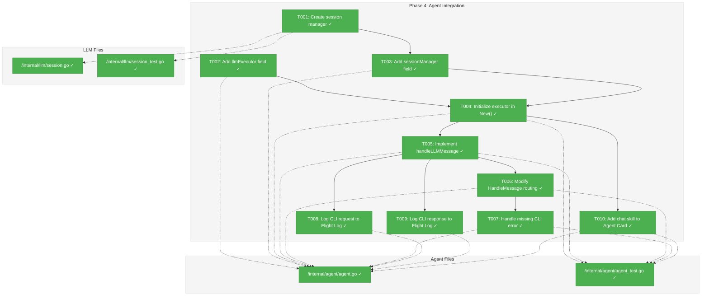
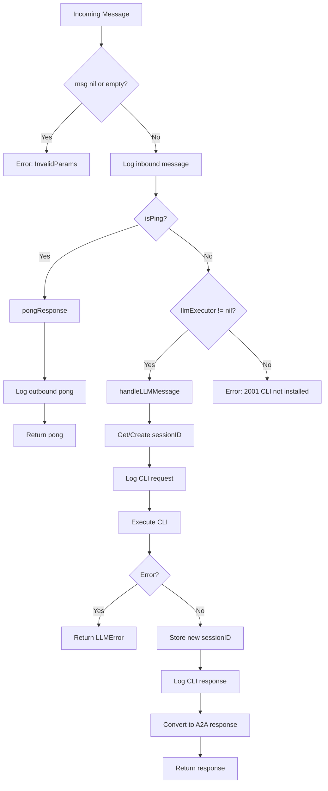
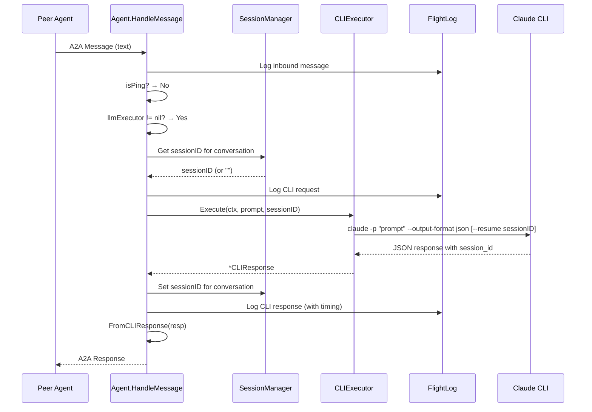

# Phase 4: Agent Integration — Tasks & Alignment Brief

**Spec**: [claude-api-integration-spec.md](../../claude-api-integration-spec.md)
**Plan**: [claude-api-integration-plan.md](../../claude-api-integration-plan.md)
**Date**: 2026-01-21

---

## Executive Briefing

### Purpose
This phase wires the Claude CLI executor into the Agent's message handling pipeline, enabling intelligent natural language processing for non-ping messages. This is the core integration that transforms Wingmate from a simple ping/pong agent into a Claude-powered conversational peer.

### What We're Building
Integration of `CLIExecutor` into the Agent that:
- Routes non-ping messages to Claude CLI for processing
- Manages session IDs for conversation continuity
- Logs all CLI interactions to the Flight Log
- Returns graceful errors when CLI is unavailable

### User Value
Users can send natural language messages to Wingmate agents and receive intelligent responses powered by Claude. Session continuity means follow-up questions maintain context.

### Example
**Before (current)**:
- Input: "What does this code do?"
- Output: `Error: unknown message type`

**After (Phase 4)**:
- Input: "What does this code do?"
- Output: Claude's analysis of the code
- Input: "And the error handling?"
- Output: Claude continues with context from previous question

---

## Objectives & Scope

### Objective
Modify `HandleMessage` to route non-ping messages to Claude CLI, implementing session management and Flight Log integration per plan acceptance criteria AC1, AC2, AC3, AC4, AC6.

### Goals

- ✅ Add `llmExecutor` field to Agent struct (uses `LLMExecutor` interface from Phase 1)
- ✅ Add session manager for conversation continuity (stores session IDs per conversation)
- ✅ Initialize executor in `New()` when CLI is available
- ✅ Route non-ping text messages to CLI executor
- ✅ Return error 2001 when CLI unavailable for non-ping messages
- ✅ Log CLI request/response to Flight Log with timing
- ✅ Ping/pong behavior unchanged

### Non-Goals

- ❌ Authentication/authorization for CLI calls (CLI handles its own auth)
- ❌ Rate limiting (not in scope for MVP)
- ❌ Streaming responses (spec says no streaming)
- ❌ Retry logic (enhancement candidate for future)
- ❌ Session persistence across agent restarts (in-memory only per spec)
- ❌ Model validation (CLI validates internally)

---

## Architecture Map

### Component Diagram
<!-- Status: grey=pending, orange=in-progress, green=completed, red=blocked -->
<!-- Updated by plan-6 during implementation -->



### Task-to-Component Mapping

<!-- Status: ⬜ Pending | 🟧 In Progress | ✅ Complete | 🔴 Blocked -->

| Task | Component(s) | Files | Status | Comment |
|------|-------------|-------|--------|---------|
| T001 | SessionManager | /internal/llm/session.go, session_test.go | ✅ Complete | Thread-safe map for conversation→session mapping |
| T002 | Agent struct | /internal/agent/agent.go | ✅ Complete | Add llmExecutor LLMExecutor field |
| T003 | Agent struct | /internal/agent/agent.go | ✅ Complete | Add sessionManager *SessionManager field |
| T004 | Agent.New() | /internal/agent/agent.go, agent_test.go | ✅ Complete | Create executor if CLI installed |
| T005 | Agent.handleLLMMessage | /internal/agent/agent.go, agent_test.go | ✅ Complete | Core LLM processing logic |
| T006 | Agent.HandleMessage | /internal/agent/agent.go, agent_test.go | ✅ Complete | Route non-ping to LLM |
| T007 | Agent.HandleMessage | /internal/agent/agent.go, agent_test.go | ✅ Complete | Return error 2001 when no CLI |
| T008 | Flight Log | /internal/agent/agent.go | ✅ Complete | Log outbound CLI request |
| T009 | Flight Log | /internal/agent/agent.go | ✅ Complete | Log inbound CLI response |
| T010 | Agent Card | /internal/agent/agent.go, agent_test.go | ✅ Complete | Add "chat" skill when CLI available |

---

## Tasks

| Status | ID | Task | CS | Type | Dependencies | Absolute Path(s) | Validation | Subtasks | Notes |
|--------|------|------|-----|------|--------------|------------------|------------|----------|-------|
| [x] | T001 | Create SessionManager with Get/Set/Clear methods | 2 | Core | – | /Users/vaughanknight/GitHub/wingmate/internal/llm/session.go, /Users/vaughanknight/GitHub/wingmate/internal/llm/session_test.go | Tests pass, thread-safe operations verified | – | Plan task 4.2 |
| [x] | T002 | Add `llmExecutor llm.LLMExecutor` field to Agent struct | 1 | Setup | – | /Users/vaughanknight/GitHub/wingmate/internal/agent/agent.go | Compiles, field accessible | – | Plan task 4.1 |
| [x] | T003 | Add `sessionManager *llm.SessionManager` field to Agent struct | 1 | Setup | T001 | /Users/vaughanknight/GitHub/wingmate/internal/agent/agent.go | Compiles, field accessible | – | Plan task 4.2 |
| [x] | T004 | Initialize executor and sessionManager in New() when CLI installed | 2 | Core | T002, T003 | /Users/vaughanknight/GitHub/wingmate/internal/agent/agent.go, /Users/vaughanknight/GitHub/wingmate/internal/agent/agent_test.go | Test: executor nil when CLI missing, non-nil when present | – | Plan task 4.3 |
| [x] | T005 | Implement handleLLMMessage() method | 3 | Core | T004 | /Users/vaughanknight/GitHub/wingmate/internal/agent/agent.go, /Users/vaughanknight/GitHub/wingmate/internal/agent/agent_test.go | Test: prompt sent to executor, session stored, response converted | – | Plan task 4.5 |
| [x] | T006 | Modify HandleMessage routing: ping→pong, else→LLM | 2 | Core | T005 | /Users/vaughanknight/GitHub/wingmate/internal/agent/agent.go, /Users/vaughanknight/GitHub/wingmate/internal/agent/agent_test.go | Test: ping returns pong, text routes to LLM | – | Plan task 4.4, AC6 |
| [x] | T007 | Handle missing CLI: return error 2001 | 1 | Core | T006 | /Users/vaughanknight/GitHub/wingmate/internal/agent/agent.go, /Users/vaughanknight/GitHub/wingmate/internal/agent/agent_test.go | Test: non-ping without CLI returns error 2001 | – | Plan task 4.6, AC4 |
| [x] | T008 | Log CLI request to Flight Log before execution | 1 | Observability | T005 | /Users/vaughanknight/GitHub/wingmate/internal/agent/agent.go | Test: flight log contains cli_request entry | – | Plan task 4.7, AC3 |
| [x] | T009 | Log CLI response to Flight Log after execution | 1 | Observability | T005 | /Users/vaughanknight/GitHub/wingmate/internal/agent/agent.go | Test: flight log contains cli_response entry with timing | – | Plan task 4.8, AC3 |
| [x] | T010 | Add "chat" skill to Agent Card when CLI available | 1 | Polish | T004 | /Users/vaughanknight/GitHub/wingmate/internal/agent/agent.go, /Users/vaughanknight/GitHub/wingmate/internal/agent/agent_test.go | Test: card has chat skill when executor present | – | Plan task 5.3 |

---

## Alignment Brief

### Prior Phases Review

#### Phase-by-Phase Summary

**Phase 1: Core LLM Types and Interface** (Complete)
- Established `/internal/llm/` package with foundational types
- Created `LLMExecutor` interface that Phase 4 will depend on
- Defined error codes 2001-2006 for CLI error scenarios
- Implemented `FromCLIResponse()` for converting CLI output to A2A messages

**Phase 2: CLI Executor Implementation** (Complete)
- Implemented `CLIExecutor` struct satisfying `LLMExecutor` interface
- Established TestHelperProcess pattern for mocking `exec.Command`
- Created functional options: `WithTimeout()`, `WithCLIPath()`, `WithModel()`
- `IsInstalled()` method checks CLI availability
- `Execute()` handles exit codes 0, 1, 2, 127 appropriately

**Phase 3: Configuration Extension** (Complete)
- Added `ClaudeConfig` struct to agent configuration
- Defined environment variables: `WINGMATE_CLAUDE_CLI_PATH`, `WINGMATE_CLAUDE_MODEL`, `WINGMATE_CLAUDE_TIMEOUT`, `WINGMATE_CLAUDE_SYSTEM_PROMPT`
- Default timeout: 120 seconds
- Validation: CLI path must exist if specified, timeout must be non-negative

#### Cumulative Deliverables

| Phase | Files | Key Exports |
|-------|-------|-------------|
| 1 | types.go, client.go, errors.go, convert.go | `CLIResponse`, `LLMExecutor`, `LLMError`, `FromCLIResponse()`, error codes 2001-2006 |
| 2 | cli.go, cli_test.go | `CLIExecutor`, `NewCLIExecutor()`, `WithTimeout()`, `WithCLIPath()`, `WithModel()` |
| 3 | config.go, validate.go | `ClaudeConfig`, `DefaultClaudeTimeout`, `EnvClaudeCLIPath`, etc. |

#### Complete Dependency Tree for Phase 4

```
Phase 4 depends on:
├── Phase 1: LLMExecutor interface, error codes, FromCLIResponse
├── Phase 2: CLIExecutor implementation, IsInstalled(), Execute()
└── Phase 3: ClaudeConfig with CLIPath, Timeout, Model, SystemPrompt
```

#### Pattern Evolution

1. **Dependency Injection**: Phase 2 established injectable `execCommand`/`lookPath` for testing. Phase 4 should use injectable `LLMExecutor` field.
2. **Immutable Config**: Phase 3 established `WithEnv()`, `WithDefaults()` returning new instances. Agent already uses this.
3. **TDD**: All phases used test-first approach with comprehensive coverage.

#### Reusable Test Infrastructure

From Phase 2:
- `MockExecutor` (client_test.go) - implements `LLMExecutor` with configurable responses
- TestHelperProcess pattern for subprocess mocking

From Phase 3:
- `t.Setenv()` pattern for environment variable testing
- Table-driven tests for validation scenarios

#### Cross-Phase Learnings

1. **Exit code 1 as error**: Phase 2 treats exit code 1 as error (CodeLLMNonBlocking=2004) rather than partial success
2. **Zero value semantics**: Phase 3 uses `Timeout=0` as "use default", not "no timeout"
3. **Silent env failures**: Invalid env vars are silently ignored for graceful degradation

### Critical Findings Affecting This Phase

| Finding | Source | Impact | Addressed by |
|---------|--------|--------|--------------|
| CLI not installed handling | research-cli-integration.md | Must return error 2001 with helpful message | T007 |
| Session ID from CLI response | research-cli-integration.md | Must extract and store for follow-ups | T001, T005 |
| Ping unchanged | Plan AC6 | HandleMessage must check ping first | T006 |
| Flight Log required | Constitution P1 | All CLI interactions logged | T008, T009 |

### ADR Decision Constraints

**ADR-001: Language Choice (Go)**
- Use only Go standard library
- Constrains: All new code; Addressed by: All tasks

**ADR-002: Flight Log Storage (JSONL)**
- CLI entries use same JSONL format with `direction` field
- Constrains: T008, T009; Addressed by: Use existing `flightlog.NewEntryWithRole()`

**ADR-003: Unified Peer Architecture**
- No mode-specific handling; LLM is part of unified Agent
- Constrains: All agent modifications; Addressed by: Single `handleLLMMessage` path

### Invariants & Guardrails

1. **Ping always works**: Even without CLI, ping returns pong
2. **No API keys**: CLI handles its own authentication
3. **Timeout configurable**: Uses `cfg.Claude.Timeout` (default 120s)
4. **Session in-memory**: No persistence across restarts

### Inputs to Read

| File | Lines | Purpose |
|------|-------|---------|
| /Users/vaughanknight/GitHub/wingmate/internal/agent/agent.go | 20-36 | Current Agent struct |
| /Users/vaughanknight/GitHub/wingmate/internal/agent/agent.go | 38-80 | New() constructor |
| /Users/vaughanknight/GitHub/wingmate/internal/agent/agent.go | 227-273 | HandleMessage() |
| /Users/vaughanknight/GitHub/wingmate/internal/llm/client.go | 9-27 | LLMExecutor interface |
| /Users/vaughanknight/GitHub/wingmate/internal/llm/cli.go | All | CLIExecutor implementation |
| /Users/vaughanknight/GitHub/wingmate/internal/agent/config.go | 41-46, 57 | ClaudeConfig struct |

### Visual Alignment Aids

#### Flow Diagram: Message Handling



#### Sequence Diagram: LLM Message Flow



### Test Plan (Full TDD)

| Test Name | Type | Purpose | Fixtures | Expected |
|-----------|------|---------|----------|----------|
| TestSessionManager_GetSet | Unit | Basic get/set | None | Set returns same ID |
| TestSessionManager_Clear | Unit | Clear removes entry | None | Get returns "" after clear |
| TestSessionManager_ThreadSafe | Unit | Concurrent access | Goroutines | No race conditions |
| TestAgent_New_WithCLI | Integration | Executor created | Mock CLI path | executor != nil |
| TestAgent_New_WithoutCLI | Integration | No executor | No CLI | executor == nil |
| TestAgent_HandleMessage_Ping | Unit | Ping unchanged | Mock executor | Returns pong |
| TestAgent_HandleMessage_TextWithCLI | Unit | Routes to LLM | MockExecutor | Returns CLI response |
| TestAgent_HandleMessage_TextWithoutCLI | Unit | Error 2001 | No executor | Error code 2001 |
| TestAgent_HandleMessage_SessionContinuity | Unit | Session reused | MockExecutor | Same sessionID passed |
| TestAgent_AgentCard_ChatSkill | Unit | Chat skill present | Mock CLI | Card has chat skill |
| TestAgent_FlightLog_CLIRequest | Integration | Request logged | MockExecutor | Entry with cli_request |
| TestAgent_FlightLog_CLIResponse | Integration | Response logged | MockExecutor | Entry with cli_response, timing |

### Step-by-Step Implementation Outline

1. **T001**: Create `session.go` with `SessionManager` struct (map + mutex), `Get(conversationID)`, `Set(conversationID, sessionID)`, `Clear(conversationID)`
2. **T002**: Add `llmExecutor llm.LLMExecutor` field to Agent struct
3. **T003**: Add `sessionManager *llm.SessionManager` field to Agent struct
4. **T004**: In `New()`, check `CLIExecutor.IsInstalled()`, if true create executor with config options
5. **T005**: Implement `handleLLMMessage()`: extract text, get session, log request, execute, store session, log response, convert
6. **T006**: Modify `HandleMessage()`: after ping check, route to `handleLLMMessage()` if executor present
7. **T007**: In `HandleMessage()`, if no executor and not ping, return error 2001
8. **T008**: In `handleLLMMessage()`, log CLI request before `Execute()`
9. **T009**: In `handleLLMMessage()`, log CLI response after `Execute()` with execution time
10. **T010**: In `buildAgentCard()`, add "chat" skill if executor will be created

### Commands to Run

```bash
# Run session manager tests
go test -v ./internal/llm/... -run "Session"

# Run agent tests
go test -v ./internal/agent/... -run "HandleMessage|AgentCard"

# Full test suite with coverage
go test -coverprofile=coverage.out ./internal/...
go tool cover -func=coverage.out | grep total

# Race detection
go test -race ./internal/...

# Verify build
go build ./...
```

### Risks/Unknowns

| Risk | Severity | Mitigation |
|------|----------|------------|
| Conversation ID extraction unclear | Medium | Use A2A message ID or create new ID scheme |
| Flight Log entry format for CLI | Low | Follow existing entry patterns with new payload types |
| Mock executor for agent tests | Low | Reuse MockExecutor from Phase 1 client_test.go |

### Ready Check

- [x] Prior phases reviewed (Phases 1, 2, 3 complete)
- [x] Critical findings understood and mapped to tasks
- [x] ADR constraints mapped to tasks (ADR-001, ADR-002, ADR-003)
- [x] Test plan covers all acceptance criteria
- [x] Implementation outline matches task dependencies
- [ ] **AWAITING GO/NO-GO**

---

## Phase Footnote Stubs

| ID | Date | Description | Affected Sections |
|----|------|-------------|-------------------|
| | | | |

_Populated by plan-6 during implementation._

---

## Evidence Artifacts

- **Execution Log**: `phase-4-agent-integration/execution.log.md` (created by plan-6)
- **Test Coverage Report**: Generated during implementation
- **Flight Log Samples**: Sample entries demonstrating cli_request/cli_response format

---

## Discoveries & Learnings

_Populated during implementation by plan-6. Log anything of interest to your future self._

| Date | Task | Type | Discovery | Resolution | References |
|------|------|------|-----------|------------|------------|
| | | | | | |

**Types**: `gotcha` | `research-needed` | `unexpected-behavior` | `workaround` | `decision` | `debt` | `insight`

**What to log**:
- Things that didn't work as expected
- External research that was required
- Implementation troubles and how they were resolved
- Gotchas and edge cases discovered
- Decisions made during implementation
- Technical debt introduced (and why)
- Insights that future phases should know about

_See also: `execution.log.md` for detailed narrative._

---

## Directory Layout

```
docs/plans/002-claude-api-integration/
├── claude-api-integration-plan.md
├── claude-api-integration-spec.md
├── research-cli-integration.md
├── research-dossier.md
└── tasks/
    ├── phase-1-core-llm-types-and-interface/
    │   ├── tasks.md
    │   └── execution.log.md
    ├── phase-2-cli-executor-implementation/
    │   ├── tasks.md
    │   └── execution.log.md
    ├── phase-3-configuration-extension/
    │   ├── tasks.md
    │   └── execution.log.md
    └── phase-4-agent-integration/
        ├── tasks.md          # This file
        └── execution.log.md  # Created by plan-6
```
