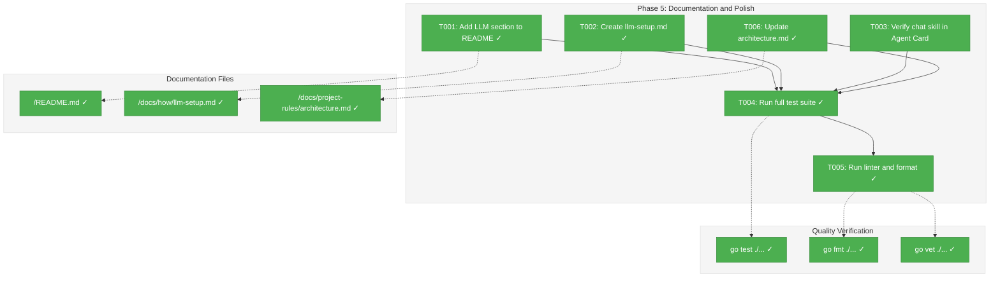

# Phase 5: Documentation and Polish — Tasks & Alignment Brief

**Spec**: [claude-api-integration-spec.md](../../claude-api-integration-spec.md)
**Plan**: [claude-api-integration-plan.md](../../claude-api-integration-plan.md)
**Date**: 2026-01-21

---

## Executive Briefing

### Purpose
This phase finalizes the Claude CLI integration by adding user documentation, ensuring code quality, and completing all Definition of Done criteria. It transforms a working implementation into a polished, user-ready feature.

### What We're Building
Documentation and quality gates that:
- Provide clear setup instructions for Claude CLI
- Add troubleshooting guide for common errors
- Update project architecture documentation
- Ensure code passes all quality checks (tests, linting, formatting)

### User Value
Users can easily set up and troubleshoot Claude CLI integration with clear documentation. The codebase remains maintainable with consistent code quality.

### Example
**Before**: User installs Wingmate but doesn't know Claude CLI integration exists or how to set it up.

**After**: User reads README, sees "LLM Support" section, follows quick setup steps, and has Claude-powered responses working.

---

## Objectives & Scope

### Objective
Complete the Definition of Done criteria from the constitution: documentation, testing verification, code quality checks, and architecture updates.

### Goals

- ✅ Add LLM Support section to README with quick setup
- ✅ Create detailed setup guide in docs/how/llm-setup.md
- ✅ Verify Agent Card includes chat skill (done in Phase 4)
- ✅ Run full test suite and verify 90%+ coverage
- ✅ Run linter (go vet, go fmt) with no issues
- ✅ Update architecture.md with internal/llm/ module

### Non-Goals

- ❌ New features or functionality (implementation complete)
- ❌ Extensive tutorials or video content
- ❌ Localization of documentation
- ❌ API reference documentation (CLI-based, not API)
- ❌ Performance optimization documentation

---

## Architecture Map

### Component Diagram
<!-- Status: grey=pending, orange=in-progress, green=completed, red=blocked -->
<!-- Updated by plan-6 during implementation -->



### Task-to-Component Mapping

<!-- Status: ⬜ Pending | 🟧 In Progress | ✅ Complete | 🔴 Blocked -->

| Task | Component(s) | Files | Status | Comment |
|------|-------------|-------|--------|---------|
| T001 | README | /README.md | ✅ Complete | Add LLM Support section with quick setup |
| T002 | Setup Guide | /docs/how/llm-setup.md | ✅ Complete | Detailed installation and troubleshooting |
| T003 | Agent Card | /internal/agent/agent.go | ✅ Complete | Done in Phase 4 T010 |
| T004 | Test Suite | All test files | ✅ Complete | Verify all tests pass |
| T005 | Code Quality | All Go files | ✅ Complete | fmt, vet, staticcheck |
| T006 | Architecture | /docs/project-rules/architecture.md | ✅ Complete | Add internal/llm/ module |

---

## Tasks

| Status | ID | Task | CS | Type | Dependencies | Absolute Path(s) | Validation | Subtasks | Notes |
|--------|------|------|-----|------|--------------|------------------|------------|----------|-------|
| [x] | T001 | Add LLM Support section to README | 1 | Doc | – | /Users/vaughanknight/GitHub/wingmate/README.md | README has "LLM Support" section with quick setup | – | Plan task 5.1 |
| [x] | T002 | Create docs/how/llm-setup.md guide | 2 | Doc | – | /Users/vaughanknight/GitHub/wingmate/docs/how/llm-setup.md | Guide covers installation, config, troubleshooting | – | Plan task 5.2 |
| [x] | T003 | Verify Agent Card includes chat skill | 1 | Verify | – | /Users/vaughanknight/GitHub/wingmate/internal/agent/agent.go | Chat skill appears when CLI available | – | Plan task 5.3, done in Phase 4 T010 |
| [x] | T004 | Run full test suite | 1 | Verify | T001, T002 | All test files | `go test ./...` passes | – | Plan task 5.4 |
| [x] | T005 | Run linter and format | 1 | Verify | T004 | All Go files | `go fmt`, `go vet` pass | – | Plan task 5.5 |
| [x] | T006 | Update architecture.md | 1 | Doc | – | /Users/vaughanknight/GitHub/wingmate/docs/project-rules/architecture.md | internal/llm/ module documented | – | Plan task 5.6 |

---

## Alignment Brief

### Prior Phases Review

#### Phase 4 Summary (Just Completed)

Phase 4 implemented the complete Agent integration for Claude CLI:

**Deliverables**:
- `/internal/llm/session.go` - SessionManager for conversation continuity
- `/internal/llm/session_test.go` - Thread-safe tests for SessionManager
- Modified `/internal/agent/agent.go`:
  - Added llmExecutor and sessionManager fields
  - Modified New() to initialize executor when CLI available
  - Implemented handleLLMMessage() for LLM processing
  - Modified HandleMessage() routing: ping→pong, else→LLM
  - Added error 2001 handling when CLI unavailable
  - Flight Log integration for CLI request/response

**Tests Added**:
- 7 new tests in agent_test.go
- 1 updated test in server_test.go
- All pass with race detection

**Key Learnings**:
- Conversation ID uses trace ID from context
- Tests must be environment-agnostic (CLI may or may not be installed)

#### Cumulative Deliverables (All Phases)

| Phase | Files | Status |
|-------|-------|--------|
| 1 | types.go, client.go, errors.go, convert.go + tests | ✅ Complete |
| 2 | cli.go, cli_test.go | ✅ Complete |
| 3 | config.go, validate.go + tests | ✅ Complete |
| 4 | session.go, agent.go modifications + tests | ✅ Complete |
| 5 | README, llm-setup.md, architecture.md | ⬜ This Phase |

### Critical Findings Affecting This Phase

| Finding | Source | Impact | Addressed by |
|---------|--------|--------|--------------|
| CLI authentication handled by CLI | research-cli-integration.md | Don't document API keys | T002 |
| Error 2001 for missing CLI | Phase 4 | Document in troubleshooting | T002 |
| Session in-memory only | Spec | Document limitation | T002 |

### ADR Decision Constraints

**ADR-001: Language Choice (Go)**
- Documentation uses Go conventions
- Constrains: All docs; Addressed by: Use idiomatic Go examples

**ADR-002: Flight Log Storage (JSONL)**
- Document CLI entry format
- Constrains: T002; Addressed by: Include log format examples

### Invariants & Guardrails

1. **No sensitive data in docs**: No API keys, no real session IDs
2. **Consistent terminology**: Use "Claude CLI" not "Claude API"
3. **Cross-platform**: Document works on macOS, Linux, Windows

### Inputs to Read

| File | Purpose |
|------|---------|
| /Users/vaughanknight/GitHub/wingmate/README.md | Current README structure |
| /Users/vaughanknight/GitHub/wingmate/docs/project-rules/architecture.md | Current architecture |
| /Users/vaughanknight/GitHub/wingmate/docs/how/ | Existing how-to guides (if any) |

### Test Plan

| Test Name | Type | Purpose | Validation |
|-----------|------|---------|------------|
| N/A | Manual | Run `go test ./...` | All tests pass |
| N/A | Manual | Run `go fmt ./...` | No changes needed |
| N/A | Manual | Run `go vet ./...` | No issues |

### Step-by-Step Implementation Outline

1. **T001**: Add "LLM Support" section to README.md with:
   - Quick setup (3 steps)
   - Link to detailed guide
   - Basic troubleshooting

2. **T002**: Create docs/how/llm-setup.md with:
   - Claude CLI installation (with platform-specific notes)
   - Authentication setup
   - Environment variable configuration
   - Model selection
   - Troubleshooting common errors (2001, timeout, etc.)

3. **T003**: Already complete - verify chat skill in Agent Card

4. **T004**: Run full test suite, verify coverage

5. **T005**: Run linters, fix any issues

6. **T006**: Update architecture.md to include internal/llm/ package

### Commands to Run

```bash
# Run full test suite
go test ./...

# Check coverage
go test -coverprofile=coverage.out ./internal/...
go tool cover -func=coverage.out | grep total

# Format code
go fmt ./...

# Run vet
go vet ./...

# Verify docs directory
ls -la docs/how/
```

### Risks/Unknowns

| Risk | Severity | Mitigation |
|------|----------|------------|
| docs/how/ directory may not exist | Low | Create if needed |
| Claude CLI installation varies by platform | Low | Provide generic instructions + link to official docs |

### Ready Check

- [x] Prior phases reviewed (Phase 1-4 complete)
- [x] Critical findings understood and mapped to tasks
- [x] ADR constraints mapped to tasks (ADR-001, ADR-002)
- [x] Implementation outline matches task dependencies
- [ ] **AWAITING GO/NO-GO**

---

## Phase Footnote Stubs

| ID | Date | Description | Affected Sections |
|----|------|-------------|-------------------|
| | | | |

_Populated by plan-6 during implementation._

---

## Evidence Artifacts

- **Execution Log**: `phase-5-documentation-and-polish/execution.log.md` (created by plan-6)
- **Test Coverage Report**: Generated during T004
- **Documentation Files**: README.md, llm-setup.md, architecture.md

---

## Discoveries & Learnings

_Populated during implementation by plan-6. Log anything of interest to your future self._

| Date | Task | Type | Discovery | Resolution | References |
|------|------|------|-----------|------------|------------|
| | | | | | |

**Types**: `gotcha` | `research-needed` | `unexpected-behavior` | `workaround` | `decision` | `debt` | `insight`

---

## Directory Layout

```
docs/plans/002-claude-api-integration/
├── claude-api-integration-plan.md
├── claude-api-integration-spec.md
├── research-cli-integration.md
├── research-dossier.md
└── tasks/
    ├── phase-1-core-llm-types-and-interface/
    │   ├── tasks.md
    │   └── execution.log.md
    ├── phase-2-cli-executor-implementation/
    │   ├── tasks.md
    │   └── execution.log.md
    ├── phase-3-configuration-extension/
    │   ├── tasks.md
    │   └── execution.log.md
    ├── phase-4-agent-integration/
    │   ├── tasks.md
    │   └── execution.log.md
    └── phase-5-documentation-and-polish/
        ├── tasks.md          # This file
        └── execution.log.md  # Created by plan-6
```
