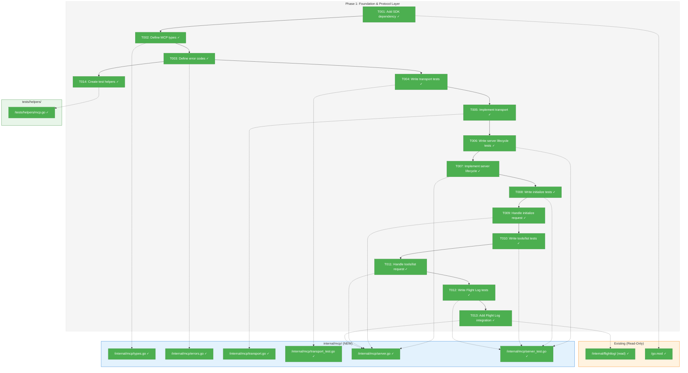
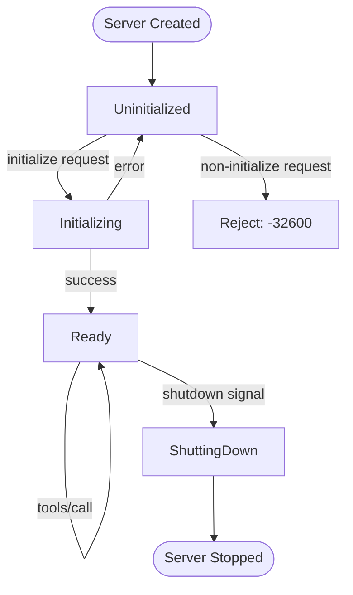
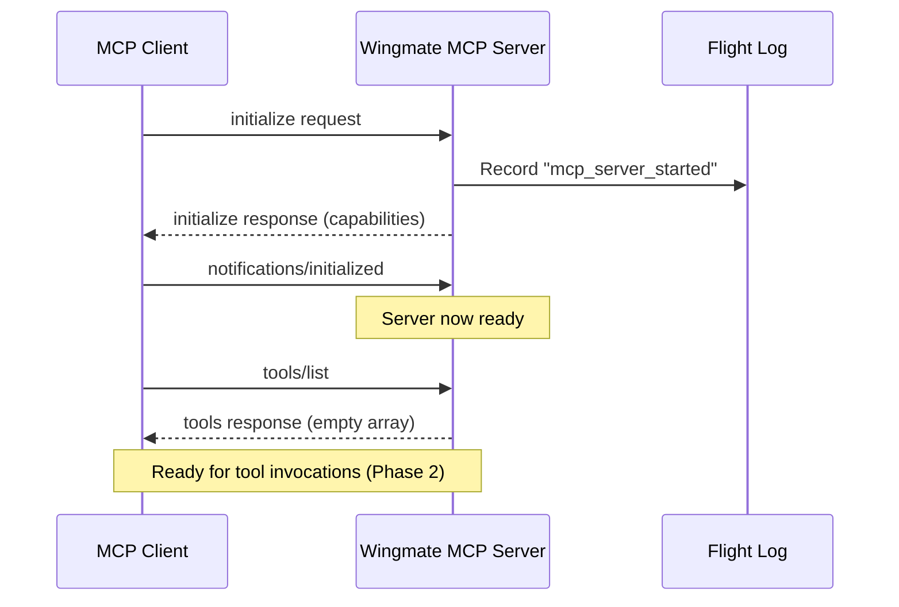

# Phase 1: Foundation & Protocol Layer – Tasks & Alignment Brief

**Spec**: [mcp-server-integration-spec.md](../../mcp-server-integration-spec.md)
**Plan**: [mcp-server-integration-plan.md](../../mcp-server-integration-plan.md)
**Date**: 2026-01-22
**Phase Complexity**: CS-2

---

## Executive Briefing

### Purpose
This phase establishes the foundational infrastructure for Wingmate's MCP server - the transport layer, message handling, and protocol handshake. Without this foundation, no MCP tools can be exposed to Claude Code or other MCP clients.

### What We're Building
A working MCP server skeleton that:
- Reads/writes newline-delimited JSON-RPC 2.0 messages over stdio
- Handles the MCP `initialize` request and returns server capabilities
- Responds to `tools/list` with an empty tools array (tools added in Phase 2)
- Logs server lifecycle events to Flight Log (Constitution P1)
- Provides clean error handling with codes in the 3001-3099 range

### User Value
After Phase 1, the `wingmate mcp` command exists and can complete the MCP handshake. While it doesn't expose any tools yet, it validates that Wingmate can communicate as an MCP server, enabling Phase 2 to add actual functionality.

### Example
```
$ wingmate mcp
# Server starts, waits on stdio...

# Client sends:
{"jsonrpc":"2.0","id":1,"method":"initialize","params":{"protocolVersion":"2024-11-05","capabilities":{},"clientInfo":{"name":"claude-code"}}}

# Server responds:
{"jsonrpc":"2.0","id":1,"result":{"protocolVersion":"2024-11-05","serverInfo":{"name":"wingmate","version":"0.1.0"},"capabilities":{"tools":{}}}}

# Client sends:
{"jsonrpc":"2.0","id":2,"method":"tools/list"}

# Server responds:
{"jsonrpc":"2.0","id":2,"result":{"tools":[]}}
```

---

## Objectives & Scope

### Objective
Implement the MCP server foundation that handles protocol handshake and enables tool registration, as specified in the plan Phase 1 acceptance criteria.

### Goals

- ✅ Add `modelcontextprotocol/go-sdk v1.1.0` dependency to go.mod
- ✅ Create `internal/mcp/` package with types, errors, transport, and server
- ✅ Implement NDJSON transport layer for stdio communication
- ✅ Handle MCP `initialize` request returning valid capabilities
- ✅ Handle `tools/list` request returning empty tools array
- ✅ Integrate with Flight Log for server lifecycle events
- ✅ Create test helpers in `tests/helpers/mcp.go`

### Non-Goals

- ❌ Implementing actual tools (Phase 2)
- ❌ CLI `mcp` subcommand integration (Phase 3)
- ❌ Documentation updates (Phase 4)
- ❌ HTTP transport (out of scope - stdio only per spec)
- ❌ Authentication/authorization (not needed for local MCP)
- ❌ Session management (Phase 2 - for tool handlers)
- ❌ LLMExecutor integration (Phase 2)

---

## Architecture Map

### Component Diagram
<!-- Status: grey=pending, orange=in-progress, green=completed, red=blocked -->
<!-- Updated by plan-6 during implementation -->



### Task-to-Component Mapping

<!-- Status: ⬜ Pending | 🟧 In Progress | ✅ Complete | 🔴 Blocked -->

| Task | Component(s) | Files | Status | Comment |
|------|-------------|-------|--------|---------|
| T001 | Dependency | go.mod, go.sum | ✅ Complete | Add modelcontextprotocol/go-sdk v1.2.0 (upgraded) |
| T002 | Types | internal/mcp/types.go | ✅ Complete | Internal types wrapping SDK types |
| T003 | Errors | internal/mcp/errors.go | ✅ Complete | Error codes 3001-3099 |
| T004 | Transport Tests | internal/mcp/transport_test.go | ✅ Complete | TDD: Tests written, fail as expected (RED) |
| T005 | Transport | internal/mcp/transport.go | ✅ Complete | NDJSON read/write implementation |
| T006 | Server Tests (Lifecycle) | internal/mcp/server_test.go | ✅ Complete | TDD: Tests written, fail as expected (RED) |
| T007 | Server Lifecycle | internal/mcp/server.go | ✅ Complete | Server struct with lifecycle methods |
| T008 | Server Tests (Initialize) | internal/mcp/server_test.go | ✅ Complete | TDD: Tests written, fail as expected (RED) |
| T009 | Initialize Handler | internal/mcp/server.go | ✅ Complete | Handle initialize request |
| T010 | Server Tests (Tools/List) | internal/mcp/server_test.go | ✅ Complete | TDD: Tests written, fail as expected (RED) |
| T011 | Tools/List Handler | internal/mcp/server.go | ✅ Complete | Return empty tools array |
| T012 | Server Tests (Flight Log) | internal/mcp/server_test.go | ✅ Complete | TDD: Tests written, fail as expected (RED) |
| T013 | Flight Log Integration | internal/mcp/server.go | ✅ Complete | Log startup/shutdown events |
| T014 | Test Helpers | tests/helpers/mcp.go | ✅ Complete | TestTransport with io.Pipe |

---

## Tasks

| Status | ID | Task | CS | Type | Dependencies | Absolute Path(s) | Validation | Subtasks | Notes |
|--------|------|------|-----|------|--------------|------------------|------------|----------|-------|
| [x] | T001 | Add MCP SDK dependency to go.mod | 1 | Setup | – | /Users/vaughanknight/GitHub/wingmate/go.mod | `go mod tidy` succeeds, SDK importable | – | Per ADR-004 |
| [x] | T002 | Define internal MCP types (adapter pattern) | 1 | Core | T001 | /Users/vaughanknight/GitHub/wingmate/internal/mcp/types.go | Compiles, types match MCP spec | – | Per ADR-004 adapter pattern |
| [x] | T003 | Define MCP error codes (3001-3099) | 1 | Core | T001 | /Users/vaughanknight/GitHub/wingmate/internal/mcp/errors.go | Compiles, codes in valid range | – | Per ADR-004 error allocation |
| [x] | T004 | Write failing transport tests (TDD) | 2 | Test | T002, T003 | /Users/vaughanknight/GitHub/wingmate/internal/mcp/transport_test.go | Tests exist and fail (no impl yet) | – | TDD: Tests must fail initially |
| [x] | T005 | Implement NDJSON transport layer | 2 | Core | T004 | /Users/vaughanknight/GitHub/wingmate/internal/mcp/transport.go | Transport tests pass | – | Use io.Pipe pattern per § 3 |
| [x] | T006 | Write failing server lifecycle tests (TDD) | 2 | Test | T005 | /Users/vaughanknight/GitHub/wingmate/internal/mcp/server_test.go | Tests exist and fail | – | TDD: Start/Stop/Run |
| [x] | T007 | Implement server lifecycle (Start/Stop/Run) | 2 | Core | T006 | /Users/vaughanknight/GitHub/wingmate/internal/mcp/server.go | Lifecycle tests pass | – | Use goroutines + context per § 3 |
| [x] | T008 | Write failing initialize handler tests (TDD) | 2 | Test | T007 | /Users/vaughanknight/GitHub/wingmate/internal/mcp/server_test.go | Tests exist and fail | – | TDD: Protocol compliance |
| [x] | T009 | Handle MCP initialize request | 2 | Core | T008 | /Users/vaughanknight/GitHub/wingmate/internal/mcp/server.go | Initialize tests pass, returns capabilities | – | Must include protocol_version, capabilities.tools |
| [x] | T010 | Write failing tools/list tests (TDD) | 1 | Test | T009 | /Users/vaughanknight/GitHub/wingmate/internal/mcp/server_test.go | Tests exist and fail | – | TDD: Empty tools list |
| [x] | T011 | Handle tools/list request | 1 | Core | T010 | /Users/vaughanknight/GitHub/wingmate/internal/mcp/server.go | tools/list tests pass, returns `{"tools":[]}` | – | Reject pre-initialize requests |
| [x] | T012 | Write failing Flight Log integration tests (TDD) | 1 | Test | T011 | /Users/vaughanknight/GitHub/wingmate/internal/mcp/server_test.go | Tests exist and fail | – | TDD: Verify startup logged |
| [x] | T013 | Add Flight Log integration to server | 2 | Core | T012 | /Users/vaughanknight/GitHub/wingmate/internal/mcp/server.go | Flight Log tests pass, startup/shutdown logged | – | Per Constitution P1 |
| [x] | T014 | Create test helpers (TestTransport) | 1 | Setup | T003 | /Users/vaughanknight/GitHub/wingmate/tests/helpers/mcp.go | Helpers compile, usable in tests | – | NewTestTransport, SendRequest, ReadResponse |

---

## Alignment Brief

### Prior Phases Review
*N/A - This is Phase 1 (no prior phases to review)*

### Critical Findings Affecting This Phase

**From Plan § 3 - Implementation Strategy Research:**

| Finding | Constraint/Requirement | Affected Tasks |
|---------|------------------------|----------------|
| **io.Pipe Pattern** | Use `io.Pipe` for stdio testing, not subprocess spawning | T004, T005, T014 |
| **Adapter Pattern** | Wrap SDK types in internal types to isolate API changes | T002 |
| **Phase Boundaries** | Protocol layer is self-contained (P1) → enables tools (P2) | All tasks |

**From Plan § 3 - Risk Analysis (P0 Risks):**

| Risk | Mitigation | Affected Tasks |
|------|------------|----------------|
| stdio blocking/buffering | Use goroutines + context cancellation | T005, T007 |
| Flight Log observability | Define MCPToolEntry log type | T013 |
| Claude CLI in CI | Mock LLMExecutor for unit tests | N/A (Phase 2) |

### ADR Decision Constraints

**ADR-004: MCP Server Implementation Approach** – Use official `modelcontextprotocol/go-sdk v1.1.0`

| Constraint | Affected Tasks |
|------------|----------------|
| Use modelcontextprotocol/go-sdk v1.1.0 (no other MCP libraries) | T001 |
| MCP error codes must be in range 3001-3099 | T003 |
| All MCP tool invocations must log to Flight Log | T013 (startup/shutdown for Phase 1) |
| Use adapter pattern to isolate SDK API changes | T002 |
| stdio transport only (no HTTP for MCP) | T005 |

### Invariants & Guardrails

- **No secrets in logs**: Flight Log entries must not contain credentials (N/A for Phase 1)
- **Race-safe**: All concurrent access must pass `go test -race`
- **Error codes**: All MCP errors use 3001-3099 range
- **Protocol compliance**: Reject requests before initialize completes

### Inputs to Read

| Purpose | Absolute Path |
|---------|---------------|
| Spec | /Users/vaughanknight/GitHub/wingmate/docs/plans/003-mcp-server-integration/mcp-server-integration-spec.md |
| Plan | /Users/vaughanknight/GitHub/wingmate/docs/plans/003-mcp-server-integration/mcp-server-integration-plan.md |
| ADR-004 | /Users/vaughanknight/GitHub/wingmate/docs/adr/004-mcp-server-implementation.md |
| Existing FlightLog | /Users/vaughanknight/GitHub/wingmate/internal/flightlog/flightlog.go |
| Existing Entry | /Users/vaughanknight/GitHub/wingmate/internal/flightlog/entry.go |
| Existing main.go | /Users/vaughanknight/GitHub/wingmate/cmd/wingmate/main.go |

### Visual Alignment Aids

#### Flow Diagram: MCP Server State Machine



#### Sequence Diagram: MCP Initialize Handshake



### Test Plan (TDD - Hybrid Approach)

Per spec Testing Strategy: TDD for protocol handling and server lifecycle.

#### Transport Tests (T004)

| Test Name | Rationale | Fixture | Expected Output |
|-----------|-----------|---------|-----------------|
| `TestTransportReadNDJSON` | Validate NDJSON parsing | JSON message + newline | Parsed struct |
| `TestTransportWriteNDJSON` | Validate NDJSON output | Go struct | JSON + newline bytes |
| `TestTransportHandlesMultipleMessages` | Validate streaming | 3 messages | 3 parsed structs |
| `TestTransportRejectsInvalidJSON` | Error handling | Malformed JSON | Error returned |

#### Server Lifecycle Tests (T006)

| Test Name | Rationale | Fixture | Expected Output |
|-----------|-----------|---------|-----------------|
| `TestServerStart` | Server starts without error | Config | No error |
| `TestServerStop` | Server stops cleanly | Running server | No error |
| `TestServerRunContext` | Context cancellation stops server | Context with cancel | Server exits |

#### Initialize Tests (T008)

| Test Name | Rationale | Fixture | Expected Output |
|-----------|-----------|---------|-----------------|
| `TestServerInitializeHandshake` | Protocol compliance | Valid initialize request | Valid response with capabilities |
| `TestServerRejectsPreInitializeRequests` | Protocol compliance | tools/list before init | Error -32600 |

#### Tools/List Tests (T010)

| Test Name | Rationale | Fixture | Expected Output |
|-----------|-----------|---------|-----------------|
| `TestServerToolsListEmpty` | Phase 1 returns empty | Initialized server | `{"tools":[]}` |

#### Flight Log Tests (T012)

| Test Name | Rationale | Fixture | Expected Output |
|-----------|-----------|---------|-----------------|
| `TestServerLogsStartup` | Constitution P1 compliance | Server start | Entry with event "mcp_server_started" |
| `TestServerGracefulShutdownOnEOF` | Clean shutdown logging | EOF on stdin | Entry with event "mcp_server_stopped" |

### Step-by-Step Implementation Outline

| Step | Task ID | Action |
|------|---------|--------|
| 1 | T001 | Run `go get github.com/modelcontextprotocol/go-sdk@v1.1.0`, verify imports |
| 2 | T002 | Create `internal/mcp/types.go` with ToolInput, ToolOutput, internal types |
| 3 | T003 | Create `internal/mcp/errors.go` with MCPError type and codes 3001-3005 |
| 4 | T014 | Create `tests/helpers/mcp.go` with TestTransport using io.Pipe |
| 5 | T004 | Write transport tests (must fail - no implementation yet) |
| 6 | T005 | Implement transport.go to make tests pass |
| 7 | T006 | Write server lifecycle tests (must fail) |
| 8 | T007 | Implement server.go Start/Stop/Run to make tests pass |
| 9 | T008 | Write initialize handler tests (must fail) |
| 10 | T009 | Implement initialize handler to make tests pass |
| 11 | T010 | Write tools/list tests (must fail) |
| 12 | T011 | Implement tools/list handler to make tests pass |
| 13 | T012 | Write Flight Log integration tests (must fail) |
| 14 | T013 | Add Flight Log integration to make tests pass |

### Commands to Run

```bash
# Environment setup
cd /Users/vaughanknight/GitHub/wingmate

# Add SDK dependency (T001)
go get github.com/modelcontextprotocol/go-sdk@v1.1.0
go mod tidy

# Run all Phase 1 tests with race detection
go test ./internal/mcp/... -v -race -count=3

# Run with coverage
go test ./internal/mcp/... -coverprofile=coverage.out -covermode=atomic
go tool cover -func=coverage.out | grep -E "(transport|server)\.go"

# Verify minimum 80% coverage on new files
go tool cover -func=coverage.out | grep "total:" | awk '{print $3}'

# Type checking
go build ./...

# Lint (if golangci-lint installed)
golangci-lint run ./internal/mcp/...
```

### Risks/Unknowns

| Risk | Severity | Mitigation |
|------|----------|------------|
| SDK API differs from documentation | Medium | Read SDK source, adapt types in T002 |
| stdio buffering issues | Medium | Use `bufio.Scanner` with proper line handling |
| Context cancellation edge cases | Low | Comprehensive tests in T007 |

### Ready Check

- [x] Plan Phase 1 tasks extracted and understood
- [x] ADR-004 constraints identified and mapped to tasks
- [x] Critical findings from plan § 3 incorporated
- [x] Testing strategy defined (TDD for protocol, lightweight for config)
- [x] Mock boundaries clear (io.Pipe for stdio, real FlightLog)
- [x] Absolute paths specified for all files
- [x] Mermaid diagrams created for flow and sequence
- [ ] **AWAITING GO/NO-GO from human sponsor**

---

## Phase Footnote Stubs

| ID | Date | Change | Rationale |
|----|------|--------|-----------|
| | | | |

*Footnotes will be added by plan-6 during implementation to track deviations, discoveries, and decisions.*

---

## Evidence Artifacts

| Artifact | Location | Created By |
|----------|----------|------------|
| Execution Log | /Users/vaughanknight/GitHub/wingmate/docs/plans/003-mcp-server-integration/tasks/phase-1-foundation-protocol-layer/execution.log.md | plan-6 |
| Test Coverage Report | /Users/vaughanknight/GitHub/wingmate/coverage.out | go test |

---

## Discoveries & Learnings

_Populated during implementation by plan-6. Log anything of interest to your future self._

| Date | Task | Type | Discovery | Resolution | References |
|------|------|------|-----------|------------|------------|
| 2026-01-22 | T001 | decision | SDK v1.2.0 used instead of v1.1.0 (plan specified) | Using latest stable; backward compatible | log#task-t001 |
| 2026-01-22 | T001 | insight | SDK requires Go 1.23.0, brought indirect deps (jsonschema-go, uritemplate, oauth2) | Accepted; SDK benefit outweighs deps | log#task-t001 |

**Types**: `gotcha` | `research-needed` | `unexpected-behavior` | `workaround` | `decision` | `debt` | `insight`

**What to log**:
- Things that didn't work as expected
- External research that was required
- Implementation troubles and how they were resolved
- Gotchas and edge cases discovered
- Decisions made during implementation
- Technical debt introduced (and why)
- Insights that future phases should know about

_See also: `execution.log.md` for detailed narrative._

---

## Directory Layout

```
docs/plans/003-mcp-server-integration/
├── mcp-server-integration-spec.md
├── mcp-server-integration-plan.md
├── research-dossier.md
├── external-research/
│   ├── 01-mcp-protocol-specification-results.md
│   ├── 02-go-mcp-libraries-results.md
│   └── 03-claude-code-mcp-configuration-results.md
└── tasks/
    └── phase-1-foundation-protocol-layer/
        ├── tasks.md                    # This file
        └── execution.log.md            # Created by plan-6
```

---

*Tasks generated by /plan-5-phase-tasks-and-brief based on Phase 1 from mcp-server-integration-plan.md*
