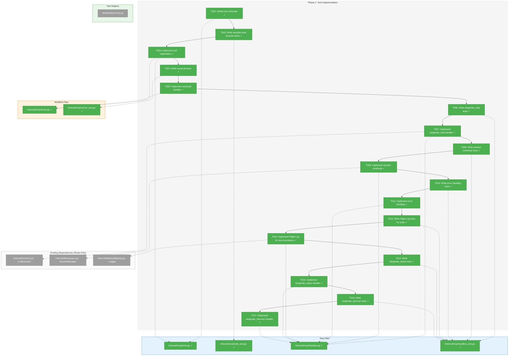
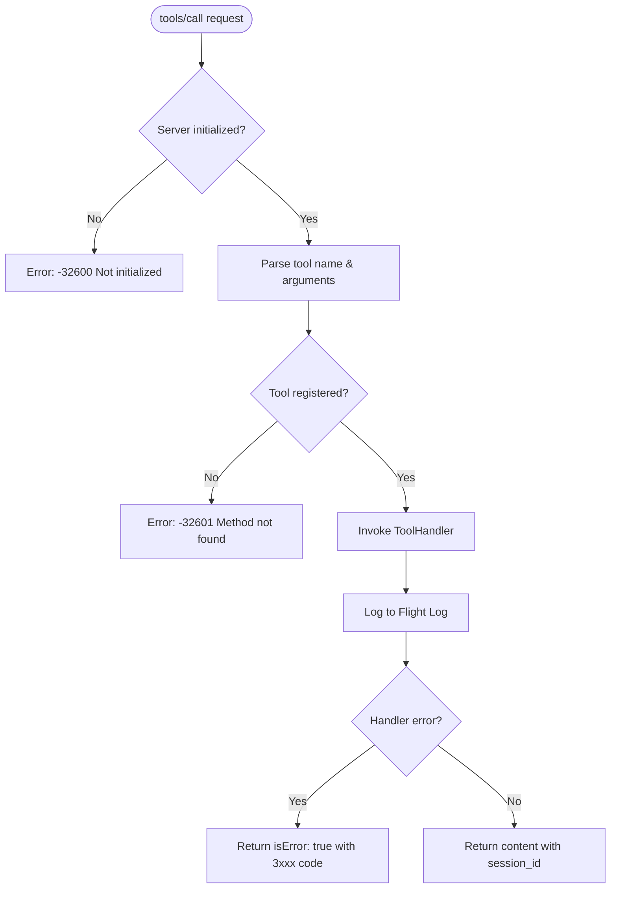
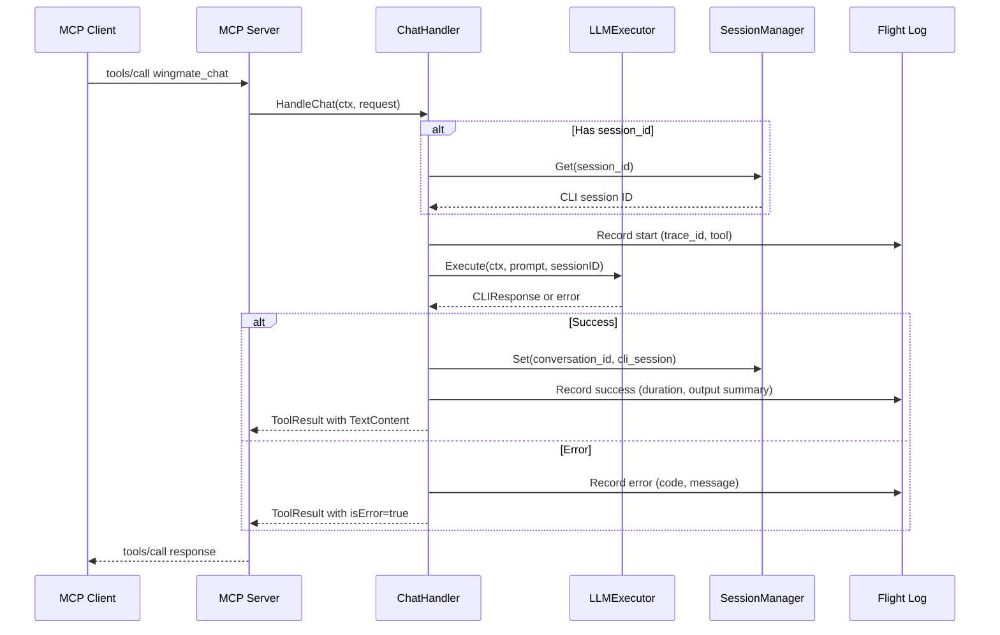

# Phase 2: Tool Implementation – Tasks & Alignment Brief

**Spec**: [mcp-server-integration-spec.md](../../mcp-server-integration-spec.md)
**Plan**: [mcp-server-integration-plan.md](../../mcp-server-integration-plan.md)
**Date**: 2026-01-22
**Phase Complexity**: CS-2

---

## Executive Briefing

### Purpose
This phase implements the actual MCP tools that make Wingmate useful - the `wingmate_chat`, `wingmate_status`, and `wingmate_discover` tools. Without these tools, the MCP server (built in Phase 1) cannot perform any meaningful work. This phase transforms the protocol skeleton into a functional assistant that Claude Code can invoke.

### What We're Building
Three MCP tools with full Flight Log integration:

1. **wingmate_chat** - The primary tool that sends prompts to Claude CLI and returns responses with session continuity support
2. **wingmate_status** - Health monitoring showing uptime, active sessions, and CLI availability
3. **wingmate_discover** - Peer agent discovery (returns empty list for now, A2A integration future)

Plus the server-side infrastructure:
- Tool registration API (`RegisterTool`)
- `tools/call` request handler
- LLMExecutor and SessionManager integration
- Flight Log entries for all tool invocations with trace_id and session_id

### User Value
After Phase 2, Claude Code users can invoke `wingmate_chat` to send prompts through Wingmate's LLM integration. They can check server health with `wingmate_status` and prepare for future peer discovery with `wingmate_discover`.

### Example
```
# Client sends tools/list after initialize:
{"jsonrpc":"2.0","id":2,"method":"tools/list"}

# Server responds with registered tools:
{"jsonrpc":"2.0","id":2,"result":{"tools":[
  {"name":"wingmate_chat","description":"Send a prompt to Claude CLI and get a response","inputSchema":{...}},
  {"name":"wingmate_status","description":"Get Wingmate server health status","inputSchema":{...}},
  {"name":"wingmate_discover","description":"List known peer agents","inputSchema":{...}}
]}}

# Client invokes wingmate_chat:
{"jsonrpc":"2.0","id":3,"method":"tools/call","params":{"name":"wingmate_chat","arguments":{"prompt":"Hello!"}}}

# Server responds with Claude's response:
{"jsonrpc":"2.0","id":3,"result":{"content":[{"type":"text","text":"Hello! How can I help you today?"}],"session_id":"abc-123"}}
```

---

## Objectives & Scope

### Objective
Implement the three core MCP tools as specified in the plan Phase 2 acceptance criteria, with full LLMExecutor integration and Flight Log observability.

### Goals

- ✅ Create `internal/mcp/tools.go` with tool schema definitions
- ✅ Add tool registration API to Server (`RegisterTool`)
- ✅ Implement `tools/call` handler in Server
- ✅ Create `internal/mcp/handlers.go` with tool handler implementations
- ✅ Implement `wingmate_chat` with LLMExecutor and session continuity
- ✅ Implement `wingmate_status` returning health info
- ✅ Implement `wingmate_discover` returning peer list (empty for now)
- ✅ Add Flight Log entries for all tool invocations with trace_id
- ✅ Handle errors with appropriate 3xxx codes

### Non-Goals

- ❌ CLI `mcp` subcommand (Phase 3)
- ❌ Environment variable configuration (Phase 3)
- ❌ Signal handling for graceful shutdown (Phase 3)
- ❌ A2A peer integration for wingmate_discover (future, returns empty)
- ❌ wingmate_send tool (P2, deferred to Phase 5)
- ❌ Rate limiting (P3, deferred)
- ❌ Caching of responses (not needed)
- ❌ HTTP transport (stdio only per spec)

---

## Architecture Map

### Component Diagram
<!-- Status: grey=pending, orange=in-progress, green=completed, red=blocked -->
<!-- Updated by plan-6 during implementation -->



### Task-to-Component Mapping

<!-- Status: ⬜ Pending | 🟧 In Progress | ✅ Complete | 🔴 Blocked -->

| Task | Component(s) | Files | Status | Comment |
|------|-------------|-------|--------|---------|
| T001 | Tool Schemas | internal/mcp/tools.go | ✅ Complete | Define wingmate_chat, wingmate_status, wingmate_discover schemas |
| T002 | Tools Tests | internal/mcp/tools_test.go | ✅ Complete | TDD: tools/list includes registered tools |
| T003 | Tool Registration | internal/mcp/tools.go, server.go | ✅ Complete | RegisterTool method on Server |
| T004 | Call Handler Tests | internal/mcp/server_test.go | ✅ Complete | TDD: tools/call request handling |
| T005 | Call Handler | internal/mcp/server.go | ✅ Complete | Implement tools/call in handleMessage |
| T006 | Chat Tests | internal/mcp/handlers_test.go | ✅ Complete | TDD: wingmate_chat success case |
| T007 | Chat Handler | internal/mcp/handlers.go | ✅ Complete | Call LLMExecutor, return response |
| T008 | Session Tests | internal/mcp/handlers_test.go | ✅ Complete | TDD: session_id continuity |
| T009 | Session Logic | internal/mcp/handlers.go | ✅ Complete | Use SessionManager for continuity |
| T010 | Error Tests | internal/mcp/handlers_test.go | ✅ Complete | TDD: CLI not available, timeout |
| T011 | Error Handling | internal/mcp/handlers.go | ✅ Complete | Map LLM errors to MCP error codes |
| T012 | FlightLog Tests | internal/mcp/handlers_test.go | ✅ Complete | TDD: Tool invocations logged |
| T013 | FlightLog Integration | internal/mcp/handlers.go | ✅ Complete | Log all tool calls with trace_id |
| T014 | Status Tests | internal/mcp/handlers_test.go | ✅ Complete | TDD: wingmate_status response |
| T015 | Status Handler | internal/mcp/handlers.go | ✅ Complete | Return uptime, sessions, cli_available |
| T016 | Discover Tests | internal/mcp/handlers_test.go | ✅ Complete | TDD: wingmate_discover response |
| T017 | Discover Handler | internal/mcp/handlers.go | ✅ Complete | Return empty peers, agent_id |

---

## Tasks

| Status | ID | Task | CS | Type | Dependencies | Absolute Path(s) | Validation | Subtasks | Notes |
|--------|------|------|-----|------|--------------|------------------|------------|----------|-------|
| [x] | T001 | Define tool schemas (wingmate_chat, wingmate_status, wingmate_discover) | 1 | Core | – | /Users/vaughanknight/GitHub/wingmate/internal/mcp/tools.go | JSON schemas valid, match plan spec | – | Per plan § 6 Phase 2 |
| [x] | T002 | Write failing tests for tools/list with registered tools (TDD) | 2 | Test | T001 | /Users/vaughanknight/GitHub/wingmate/internal/mcp/tools_test.go | Tests fail (tools not registered yet) | – | TDD: Must fail initially |
| [x] | T003 | Implement tool registration API and update tools/list | 2 | Core | T002 | /Users/vaughanknight/GitHub/wingmate/internal/mcp/tools.go, /Users/vaughanknight/GitHub/wingmate/internal/mcp/server.go | tools/list returns registered tools | – | Add RegisterTool to Server |
| [x] | T004 | Write failing tests for tools/call handler (TDD) | 2 | Test | T003 | /Users/vaughanknight/GitHub/wingmate/internal/mcp/server_test.go | Tests fail (handler not implemented) | – | TDD: Must fail initially |
| [x] | T005 | Implement tools/call handler in server | 2 | Core | T004 | /Users/vaughanknight/GitHub/wingmate/internal/mcp/server.go | tools/call tests pass | – | Dispatch to registered handlers |
| [x] | T006 | Write failing tests for wingmate_chat success case (TDD) | 2 | Test | T005 | /Users/vaughanknight/GitHub/wingmate/internal/mcp/handlers_test.go | Tests fail (handler not implemented) | – | TDD: Mock LLMExecutor |
| [x] | T007 | Implement wingmate_chat handler with LLMExecutor | 2 | Core | T006 | /Users/vaughanknight/GitHub/wingmate/internal/mcp/handlers.go | Chat tests pass, returns response | – | Use llm.LLMExecutor |
| [x] | T008 | Write failing tests for session continuity (TDD) | 2 | Test | T007 | /Users/vaughanknight/GitHub/wingmate/internal/mcp/handlers_test.go | Tests fail (session not wired) | – | TDD: Second call with session_id |
| [x] | T009 | Implement session continuity in wingmate_chat | 2 | Core | T008 | /Users/vaughanknight/GitHub/wingmate/internal/mcp/handlers.go | Session tests pass | – | Use llm.SessionManager |
| [x] | T010 | Write failing tests for error handling (TDD) | 2 | Test | T009 | /Users/vaughanknight/GitHub/wingmate/internal/mcp/handlers_test.go | Tests fail (errors not mapped) | – | TDD: CLI unavailable, timeout |
| [x] | T011 | Implement error handling with MCP error codes | 2 | Core | T010 | /Users/vaughanknight/GitHub/wingmate/internal/mcp/handlers.go | Error tests pass, 3xxx codes used | – | Per ADR-004 error range |
| [x] | T012 | Write failing tests for Flight Log tool invocation logging (TDD) | 2 | Test | T011 | /Users/vaughanknight/GitHub/wingmate/internal/mcp/handlers_test.go | Tests fail (logging not added) | – | TDD: Verify log entries |
| [x] | T013 | Implement Flight Log integration for tool invocations | 2 | Core | T012 | /Users/vaughanknight/GitHub/wingmate/internal/mcp/handlers.go | FlightLog tests pass, entries with trace_id | – | Per Constitution P1 |
| [x] | T014 | Write failing tests for wingmate_status (TDD) | 1 | Test | T013 | /Users/vaughanknight/GitHub/wingmate/internal/mcp/handlers_test.go | Tests fail (handler not implemented) | – | TDD: uptime, sessions, cli |
| [x] | T015 | Implement wingmate_status handler | 1 | Core | T014 | /Users/vaughanknight/GitHub/wingmate/internal/mcp/handlers.go | Status tests pass | – | Return health info |
| [x] | T016 | Write failing tests for wingmate_discover (TDD) | 1 | Test | T015 | /Users/vaughanknight/GitHub/wingmate/internal/mcp/handlers_test.go | Tests fail (handler not implemented) | – | TDD: Empty peers, agent_id |
| [x] | T017 | Implement wingmate_discover handler | 1 | Core | T016 | /Users/vaughanknight/GitHub/wingmate/internal/mcp/handlers.go | Discover tests pass | – | Return placeholder data |

---

## Alignment Brief

### Prior Phases Review

#### Phase 1: Foundation & Protocol Layer (Complete)

**A. Deliverables Created**

| File | Absolute Path | Key Exports |
|------|---------------|-------------|
| types.go | `/Users/vaughanknight/GitHub/wingmate/internal/mcp/types.go` | ServerInfo, ToolDefinition, ToolResult, TextContent, ToolRequest, ToolHandler, ServerCapabilities |
| errors.go | `/Users/vaughanknight/GitHub/wingmate/internal/mcp/errors.go` | MCPError, error codes 3001-3022, NewMCPError, WrapMCPError, IsMCPError |
| transport.go | `/Users/vaughanknight/GitHub/wingmate/internal/mcp/transport.go` | Transport, NewTransport, Read, Write |
| server.go | `/Users/vaughanknight/GitHub/wingmate/internal/mcp/server.go` | Server, ServerConfig, ServerState, Logger interface, NewServer, NewServerWithLogger, Start, Stop, Run, State |
| mcp.go | `/Users/vaughanknight/GitHub/wingmate/tests/helpers/mcp.go` | TestTransport, NewTestTransport, SendRequest, ReadResponse, JSONRPCRequest/Response/Error |

**B. Lessons Learned**

- SDK v1.2.0 used (plan said v1.1.0) - backward compatible
- Go 1.23.0 required by SDK (upgraded from 1.21)
- Initial server state must be `StateStopped` not `StateUninitialized` for double-start detection
- `Run()` must explicitly set state to `StateUninitialized` for pre-init rejection

**C. Technical Discoveries**

- JSON number parsing: `float64` type assertion then cast to `int`
- bufio.Scanner EOF: Check both `!Scan()` AND `Err()`
- Empty NDJSON line treated as EOF

**D. Dependencies Exported for Phase 2**

Phase 2 will use these Phase 1 APIs:

```go
// Tool definition (tools.go will create these)
type ToolDefinition struct {
    Name        string
    Description string
    InputSchema map[string]any
}

// Tool handler signature (handlers.go will implement)
type ToolHandler func(ctx context.Context, req *ToolRequest) (*ToolResult, error)

// Tool request (received in handlers)
type ToolRequest struct {
    Name      string
    Arguments map[string]any
}

// Tool result (returned from handlers)
type ToolResult struct {
    Content []Content
    IsError bool
}

// Error codes (used in handlers)
ErrCodeCLIUnavailable    = 3001
ErrCodeExecutionFailed   = 3002
ErrCodeTimeout           = 3003
ErrCodeInvalidInput      = 3004
ErrCodeSessionNotFound   = 3005
```

**E. Critical Findings Applied**

| Finding | Applied In Phase 1 |
|---------|-------------------|
| io.Pipe pattern | All tests use io.Pipe, no subprocess |
| Adapter pattern | types.go wraps all SDK types |
| Flight Log observability | server.go logs startup/shutdown |

**F. Test Infrastructure Available**

```go
// tests/helpers/mcp.go - available for Phase 2
TestTransport         // Bidirectional io.Pipe transport
NewTestTransport()    // Constructor
SendRequest()         // Send JSON-RPC request
ReadResponse()        // Read JSON-RPC response
AssertNoError()       // Test helper
AssertEqual[T]()      // Generic assertion
```

**G. Technical Debt from Phase 1**

- Hardcoded protocol version `"2024-11-05"` in server.go
- No input validation on JSON requests
- `logEvent()` swallows logger errors

**H. Key Log References**

- Phase 1 completion: `execution.log.md#phase-1-complete`
- SDK decision: `execution.log.md#task-t001`
- Server state fix: `execution.log.md#task-t007`

### Critical Findings Affecting This Phase

**From Plan § 3 - Risk Analysis:**

| Finding | Constraint | Affected Tasks |
|---------|------------|----------------|
| Claude CLI in CI | Mock LLMExecutor for unit tests | T006, T007, T010, T011 |
| Flight Log observability | All tool invocations MUST log | T012, T013 |
| Session thread safety | Verify mutex locks + race detector | T008, T009 |

**From Plan § 6 - Phase 2 Flight Log Integration:**

| Requirement | Implementation |
|-------------|----------------|
| Trace ID per connection | Generate UUID on `initialize`, store in context |
| Session ID propagation | Return session_id in tool output |
| Truncated input/output | First 200 chars input, 500 chars output |

### ADR Decision Constraints

**ADR-004: MCP Server Implementation Approach**

| Constraint | Affected Tasks |
|------------|----------------|
| Error codes 3001-3099 | T010, T011 (error handling) |
| All tool invocations must log to Flight Log | T012, T013 |
| Use adapter pattern | T001 (tool definitions use internal types) |

### Invariants & Guardrails

- **No secrets in logs**: Truncate prompts to 200 chars, responses to 500 chars
- **Race-safe**: All tests must pass with `go test -race`
- **Error codes**: All errors use 3001-3099 range (per ADR-004)
- **Protocol compliance**: tools/call only accepted after initialize

### Inputs to Read

| Purpose | Absolute Path |
|---------|---------------|
| LLMExecutor interface | /Users/vaughanknight/GitHub/wingmate/internal/llm/client.go |
| SessionManager | /Users/vaughanknight/GitHub/wingmate/internal/llm/session.go |
| CLIResponse type | /Users/vaughanknight/GitHub/wingmate/internal/llm/types.go |
| FlightLog Logger | /Users/vaughanknight/GitHub/wingmate/internal/flightlog/flightlog.go |
| Entry type | /Users/vaughanknight/GitHub/wingmate/internal/flightlog/entry.go |
| Phase 1 Server | /Users/vaughanknight/GitHub/wingmate/internal/mcp/server.go |
| Phase 1 Types | /Users/vaughanknight/GitHub/wingmate/internal/mcp/types.go |
| Phase 1 Errors | /Users/vaughanknight/GitHub/wingmate/internal/mcp/errors.go |

### Visual Alignment Aids

#### Flow Diagram: Tool Invocation Flow



#### Sequence Diagram: wingmate_chat Invocation



### Test Plan (TDD - Hybrid Approach)

Per spec Testing Strategy: TDD for tool handlers, mock LLMExecutor.

#### Tool Schema Tests (T002)

| Test Name | Rationale | Fixture | Expected Output |
|-----------|-----------|---------|-----------------|
| `TestToolsListIncludesWingmateChat` | Verify tool registration | Initialized server with tool | Tool in list |
| `TestWingmateChatSchema` | Validate JSON schema | Tool definition | Schema matches spec |
| `TestWingmateStatusSchema` | Validate JSON schema | Tool definition | Schema matches spec |
| `TestWingmateDiscoverSchema` | Validate JSON schema | Tool definition | Schema matches spec |

#### Handler Tests (T006, T008, T010)

| Test Name | Rationale | Fixture | Expected Output |
|-----------|-----------|---------|-----------------|
| `TestWingmateChatSuccess` | Happy path | Mock executor returning response | TextContent with result |
| `TestWingmateChatMissingPrompt` | Input validation | Empty prompt | Error 3004 |
| `TestWingmateChatSessionContinuity` | Session handling | Two calls, second with session_id | Same session used |
| `TestWingmateChatCLINotAvailable` | Error handling | Mock executor with IsInstalled=false | Error 3001 |
| `TestWingmateChatTimeout` | Error handling | Mock executor returning timeout error | Error 3003 |
| `TestWingmateChatLogsToFlightLog` | Observability | Mock logger | Entry recorded |

#### Status/Discover Tests (T014, T016)

| Test Name | Rationale | Fixture | Expected Output |
|-----------|-----------|---------|-----------------|
| `TestWingmateStatusReturnsHealth` | Health check | Running server | uptime_ms, sessions_active, cli_available |
| `TestWingmateDiscoverReturnsEmpty` | Placeholder | Server | peers: [], agent_id |

### Mock Boundaries

**Mock (External)**:
- `LLMExecutor` - Create MockExecutor implementing interface
- `FlightLog Logger` - Use mockLogger from Phase 1 or create new

**Real (Internal)**:
- `SessionManager` - Use real implementation (thread-safe)
- Transport - Use io.Pipe via TestTransport

### Step-by-Step Implementation Outline

| Step | Task ID | Action |
|------|---------|--------|
| 1 | T001 | Create `tools.go` with ToolSchema constants and CreateXxxTool() functions |
| 2 | T002 | Write tests for tools/list returning registered tools (must fail) |
| 3 | T003 | Add `RegisterTool()` to Server, update `handleToolsList()` |
| 4 | T004 | Write tests for tools/call handler (must fail) |
| 5 | T005 | Add `case "tools/call":` to `handleMessage()` |
| 6 | T006 | Write tests for wingmate_chat success (must fail) |
| 7 | T007 | Create `handlers.go` with HandleChat() |
| 8 | T008 | Write tests for session continuity (must fail) |
| 9 | T009 | Add SessionManager to HandleChat() |
| 10 | T010 | Write tests for error cases (must fail) |
| 11 | T011 | Implement error mapping in HandleChat() |
| 12 | T012 | Write tests for Flight Log entries (must fail) |
| 13 | T013 | Add logging to HandleChat() |
| 14 | T014 | Write tests for wingmate_status (must fail) |
| 15 | T015 | Implement HandleStatus() |
| 16 | T016 | Write tests for wingmate_discover (must fail) |
| 17 | T017 | Implement HandleDiscover() |

### Commands to Run

```bash
# Environment setup
cd /Users/vaughanknight/GitHub/wingmate

# Run all Phase 2 tests with race detection
go test ./internal/mcp/... -v -race -count=3

# Run specific handler tests
go test ./internal/mcp/... -v -run "TestWingmateChat"

# Run with coverage
go test ./internal/mcp/... -coverprofile=coverage.out -covermode=atomic
go tool cover -func=coverage.out | grep -E "(tools|handlers|server)\.go"

# Verify minimum 80% coverage on new files
go tool cover -func=coverage.out | grep "total:" | awk '{print $3}'

# Type checking
go build ./...
```

### Risks/Unknowns

| Risk | Severity | Mitigation |
|------|----------|------------|
| Mock executor may not exercise all LLM paths | Medium | Test with real CLI in integration tests (Phase 4) |
| Session state race conditions | Medium | Use SessionManager's mutex, run with -race |
| Flight Log entry format may differ from existing | Low | Follow Entry struct from flightlog/entry.go |

### Ready Check

- [x] Phase 1 review complete with all deliverables documented
- [x] Phase 1 dependencies exported and understood
- [x] Plan Phase 2 tasks extracted and understood
- [x] ADR-004 constraints identified and mapped to tasks
- [x] Critical findings from plan § 3 incorporated
- [x] Testing strategy defined (TDD with mock LLMExecutor)
- [x] Mock boundaries clear (LLMExecutor mocked, SessionManager real)
- [x] Absolute paths specified for all files
- [x] Mermaid diagrams created for flow and sequence
- [ ] **AWAITING GO/NO-GO from human sponsor**

---

## Phase Footnote Stubs

| ID | Date | Change | Rationale |
|----|------|--------|-----------|
| | | | |

*Footnotes will be added by plan-6 during implementation to track deviations, discoveries, and decisions.*

---

## Evidence Artifacts

| Artifact | Location | Created By |
|----------|----------|------------|
| Execution Log | /Users/vaughanknight/GitHub/wingmate/docs/plans/003-mcp-server-integration/tasks/phase-2-tool-implementation/execution.log.md | plan-6 |
| Test Coverage Report | /Users/vaughanknight/GitHub/wingmate/coverage.out | go test |

---

## Discoveries & Learnings

_Populated during implementation by plan-6. Log anything of interest to your future self._

| Date | Task | Type | Discovery | Resolution | References |
|------|------|------|-----------|------------|------------|
| | | | | | |

**Types**: `gotcha` | `research-needed` | `unexpected-behavior` | `workaround` | `decision` | `debt` | `insight`

**What to log**:
- Things that didn't work as expected
- External research that was required
- Implementation troubles and how they were resolved
- Gotchas and edge cases discovered
- Decisions made during implementation
- Technical debt introduced (and why)
- Insights that future phases should know about

_See also: `execution.log.md` for detailed narrative._

---

## Directory Layout

```
docs/plans/003-mcp-server-integration/
├── mcp-server-integration-spec.md
├── mcp-server-integration-plan.md
├── research-dossier.md
├── external-research/
│   ├── 01-mcp-protocol-specification-results.md
│   ├── 02-go-mcp-libraries-results.md
│   └── 03-claude-code-mcp-configuration-results.md
└── tasks/
    ├── phase-1-foundation-protocol-layer/
    │   ├── tasks.md
    │   └── execution.log.md
    └── phase-2-tool-implementation/
        ├── tasks.md                    # This file
        └── execution.log.md            # Created by plan-6
```

---

*Tasks generated by /plan-5-phase-tasks-and-brief based on Phase 2 from mcp-server-integration-plan.md*
