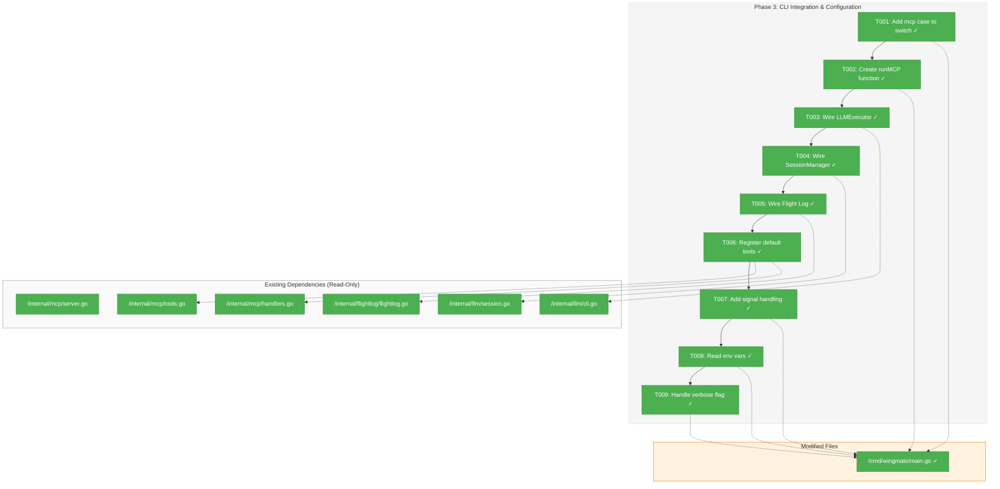
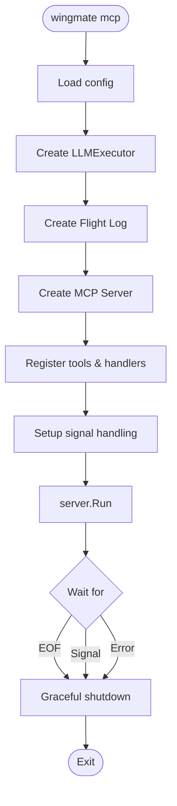
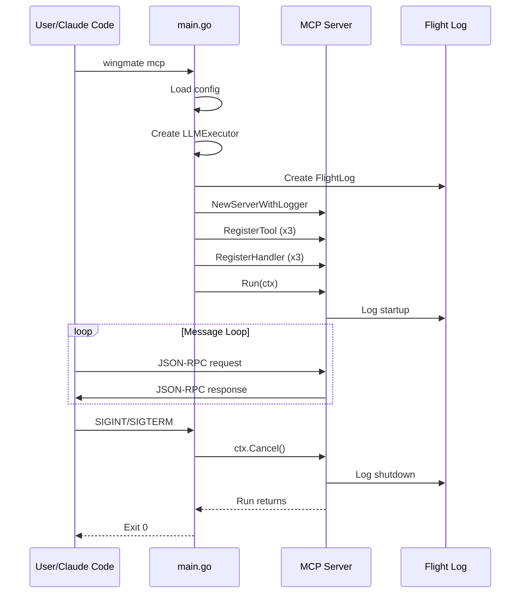

# Phase 3: CLI Integration & Configuration – Tasks & Alignment Brief

**Spec**: [mcp-server-integration-spec.md](../../mcp-server-integration-spec.md)
**Plan**: [mcp-server-integration-plan.md](../../mcp-server-integration-plan.md)
**Date**: 2026-01-22
**Phase Complexity**: CS-1

---

## Executive Briefing

### Purpose
This phase adds the `wingmate mcp` CLI subcommand that users will actually run. While Phases 1 and 2 built the MCP protocol infrastructure and tool handlers, this phase wires everything together into a usable command that can be configured in Claude Code's `~/.claude.json`.

### What We're Building
A fully functional `wingmate mcp` command that:
- Starts an MCP server on stdio (stdin/stdout)
- Wires up the LLMExecutor, SessionManager, and Flight Log
- Handles SIGINT/SIGTERM for graceful shutdown
- Reads configuration from environment variables
- Optionally mirrors log output to stderr with `--verbose`

### User Value
After Phase 3, users can:
1. Run `wingmate mcp` to start the MCP server
2. Configure it in `~/.claude.json` for Claude Code integration
3. Set environment variables for customization
4. Gracefully stop the server with Ctrl+C

### Example
```bash
# Basic usage - start MCP server
wingmate mcp

# With verbose logging
wingmate mcp --verbose

# With custom model
WINGMATE_LLM_MODEL=claude-opus-4 wingmate mcp
```

```json
// ~/.claude.json configuration
{
  "mcpServers": {
    "wingmate": {
      "command": "/usr/local/bin/wingmate",
      "args": ["mcp"],
      "type": "stdio"
    }
  }
}
```

---

## Objectives & Scope

### Objective
Implement the `wingmate mcp` subcommand as specified in the plan Phase 3, making the MCP server accessible from the command line.

### Goals

- ✅ Add `case "mcp":` handler to cmd/wingmate/main.go
- ✅ Wire LLMExecutor, SessionManager, and Flight Log to MCP server
- ✅ Implement signal handling for graceful shutdown (SIGINT/SIGTERM)
- ✅ Read configuration from WINGMATE_LLM_* environment variables
- ✅ Add `--verbose` flag to mirror logs to stderr
- ✅ Register default tools (wingmate_chat, wingmate_status, wingmate_discover)

### Non-Goals

- ❌ HTTP transport (stdio only per spec)
- ❌ Config file support (environment variables only in Phase 3)
- ❌ Health endpoint (deferred to Phase 5)
- ❌ Rate limiting (deferred to Phase 5)
- ❌ Integration testing with Claude Code (Phase 4)
- ❌ Documentation (Phase 4)

---

## Architecture Map

### Component Diagram
<!-- Status: grey=pending, orange=in-progress, green=completed, red=blocked -->
<!-- Updated by plan-6 during implementation -->



### Task-to-Component Mapping

<!-- Status: ⬜ Pending | 🟧 In Progress | ✅ Complete | 🔴 Blocked -->

| Task | Component(s) | Files | Status | Comment |
|------|-------------|-------|--------|---------|
| T001 | CLI Command | cmd/wingmate/main.go | ✅ Complete | Add case "mcp": to switch |
| T002 | runMCP | cmd/wingmate/main.go | ✅ Complete | Create runMCP function skeleton |
| T003 | LLMExecutor | cmd/wingmate/main.go | ✅ Complete | Create CLIExecutor with config |
| T004 | SessionManager | cmd/wingmate/main.go | ✅ Complete | Create SessionManager (if needed) |
| T005 | Flight Log | cmd/wingmate/main.go | ✅ Complete | Create FlightLog with verbose option |
| T006 | Tool Registration | cmd/wingmate/main.go | ✅ Complete | Register tools and handlers |
| T007 | Signal Handling | cmd/wingmate/main.go | ✅ Complete | SIGINT/SIGTERM graceful shutdown |
| T008 | Env Vars | cmd/wingmate/main.go | ✅ Complete | Read WINGMATE_LLM_* variables |
| T009 | Verbose Flag | cmd/wingmate/main.go | ✅ Complete | Mirror logs to stderr |

---

## Tasks

| Status | ID | Task | CS | Type | Dependencies | Absolute Path(s) | Validation | Subtasks | Notes |
|--------|------|------|-----|------|--------------|------------------|------------|----------|-------|
| [x] | T001 | Add mcp case to switch statement in run() | 1 | Core | – | /Users/vaughanknight/GitHub/wingmate/cmd/wingmate/main.go | `wingmate mcp` recognized | – | Per plan § 6 Phase 3 |
| [x] | T002 | Create runMCP function skeleton | 1 | Core | T001 | /Users/vaughanknight/GitHub/wingmate/cmd/wingmate/main.go | Function compiles, returns exit code | – | Start with basic structure |
| [x] | T003 | Wire LLMExecutor with config | 1 | Core | T002 | /Users/vaughanknight/GitHub/wingmate/cmd/wingmate/main.go | Executor created with model/timeout | – | Use llm.NewCLIExecutor |
| [x] | T004 | Wire SessionManager | 1 | Core | T003 | /Users/vaughanknight/GitHub/wingmate/cmd/wingmate/main.go | SessionManager available (optional) | – | May be nil initially |
| [x] | T005 | Wire Flight Log with verbose support | 1 | Core | T004 | /Users/vaughanknight/GitHub/wingmate/cmd/wingmate/main.go | Flight Log created, writes to file | – | Support --verbose flag |
| [x] | T006 | Register default tools and handlers with server | 1 | Core | T005 | /Users/vaughanknight/GitHub/wingmate/cmd/wingmate/main.go | tools/list returns 3 tools | – | Use mcp.DefaultTools() |
| [x] | T007 | Implement signal handling for graceful shutdown | 1 | Core | T006 | /Users/vaughanknight/GitHub/wingmate/cmd/wingmate/main.go | SIGINT/SIGTERM handled within 5s | – | signal.NotifyContext |
| [x] | T008 | Read WINGMATE_LLM_* environment variables | 1 | Core | T007 | /Users/vaughanknight/GitHub/wingmate/cmd/wingmate/main.go | Env vars override defaults | – | Model, timeout |
| [x] | T009 | Handle --verbose flag for log mirroring | 1 | Core | T008 | /Users/vaughanknight/GitHub/wingmate/cmd/wingmate/main.go | Logs appear on stderr with --verbose | – | Reuse existing verbose flag |

---

## Alignment Brief

### Prior Phases Review

#### Phase 1: Foundation & Protocol Layer (Complete)

**A. Deliverables Created**

| File | Absolute Path | Key Exports |
|------|---------------|-------------|
| types.go | `/Users/vaughanknight/GitHub/wingmate/internal/mcp/types.go` | ServerInfo, ToolDefinition, ToolResult, TextContent, ToolRequest, ToolHandler, ServerCapabilities |
| errors.go | `/Users/vaughanknight/GitHub/wingmate/internal/mcp/errors.go` | MCPError, error codes 3001-3022 |
| transport.go | `/Users/vaughanknight/GitHub/wingmate/internal/mcp/transport.go` | Transport, NewTransport, Read, Write |
| server.go | `/Users/vaughanknight/GitHub/wingmate/internal/mcp/server.go` | Server, ServerConfig, ServerState, Logger interface, NewServer, NewServerWithLogger, Start, Stop, Run, State, RegisterTool, RegisterHandler |

**B. Key APIs for Phase 3**

```go
// Create MCP server
server := mcp.NewServerWithLogger(
    mcp.ServerConfig{Name: "wingmate", Version: "0.1.0"},
    mcp.NewTransport(os.Stdin, os.Stdout),
    flightLog, // implements mcp.Logger
)

// Register tools
for _, tool := range mcp.DefaultTools() {
    server.RegisterTool(tool)
}

// Register handlers
server.RegisterHandler(mcp.ToolNameChat, mcp.NewChatHandler(executor, nil, flightLog))
server.RegisterHandler(mcp.ToolNameStatus, mcp.NewStatusHandler(executor, startTime))
server.RegisterHandler(mcp.ToolNameDiscover, mcp.NewDiscoverHandler(agentID))

// Run server (blocks until context cancelled)
err := server.Run(ctx)
```

#### Phase 2: Tool Implementation (Complete)

**A. Deliverables Created**

| File | Absolute Path | Key Exports |
|------|---------------|-------------|
| tools.go | `/Users/vaughanknight/GitHub/wingmate/internal/mcp/tools.go` | ToolNameChat, ToolNameStatus, ToolNameDiscover, NewChatTool, NewStatusTool, NewDiscoverTool, DefaultTools |
| handlers.go | `/Users/vaughanknight/GitHub/wingmate/internal/mcp/handlers.go` | NewChatHandler, NewStatusHandler, NewDiscoverHandler, SessionManager interface |

**B. Handler Signatures**

```go
// Chat handler - requires LLMExecutor
NewChatHandler(executor llm.LLMExecutor, sessions SessionManager, logger Logger) ToolHandler

// Status handler - requires LLMExecutor for IsInstalled check
NewStatusHandler(executor llm.LLMExecutor, startTime time.Time) ToolHandler

// Discover handler - requires agent ID
NewDiscoverHandler(agentID string) ToolHandler
```

### Critical Findings Affecting This Phase

**From Plan § 3 - CLI Integration:**

| Finding | Constraint | Affected Tasks |
|---------|------------|----------------|
| stdio blocking | Use goroutines + context cancellation | T007 |
| Binary path resolution | Document absolute paths in setup | Phase 4 |
| Existing CLI structure | Follow existing patterns in main.go | All tasks |

### ADR Decision Constraints

**ADR-004: MCP Server Implementation Approach**

| Constraint | Affected Tasks |
|------------|----------------|
| stdio transport only | T002 (no HTTP) |
| Flight Log required | T005 |
| Use adapter pattern | Already done in Phase 1/2 |

### Invariants & Guardrails

- **No network**: MCP is stdio-only, no HTTP listener
- **Graceful shutdown**: Must complete within 5 seconds
- **Flight Log**: All startup/shutdown events must be logged
- **Existing patterns**: Follow the structure of runServer(), runPing(), runStatus()

### Inputs to Read

| Purpose | Absolute Path |
|---------|---------------|
| CLI entry point | /Users/vaughanknight/GitHub/wingmate/cmd/wingmate/main.go |
| MCP Server | /Users/vaughanknight/GitHub/wingmate/internal/mcp/server.go |
| MCP Tools | /Users/vaughanknight/GitHub/wingmate/internal/mcp/tools.go |
| MCP Handlers | /Users/vaughanknight/GitHub/wingmate/internal/mcp/handlers.go |
| LLMExecutor | /Users/vaughanknight/GitHub/wingmate/internal/llm/cli.go |
| SessionManager | /Users/vaughanknight/GitHub/wingmate/internal/llm/session.go |
| FlightLog | /Users/vaughanknight/GitHub/wingmate/internal/flightlog/flightlog.go |

### Visual Alignment Aids

#### Flow Diagram: wingmate mcp Command Flow



#### Sequence Diagram: MCP Server Lifecycle



### Test Plan (Lightweight)

Per spec Testing Strategy: Lightweight for CLI subcommand.

#### Manual Test Cases

| Test | Steps | Expected |
|------|-------|----------|
| Basic run | `wingmate mcp` | Starts, accepts input |
| Ctrl+C | Start, press Ctrl+C | Graceful shutdown <5s |
| Env var model | `WINGMATE_LLM_MODEL=test wingmate mcp` | Model used |
| Verbose | `wingmate mcp --verbose` | Logs to stderr |

#### Unit Test Cases (Optional)

| Test Name | Rationale | Expected |
|-----------|-----------|----------|
| `TestMCPCommandRecognized` | Verify case added | No "unknown command" error |
| `TestRunMCPReturnsOnContextCancel` | Lifecycle test | Returns within timeout |

### Step-by-Step Implementation Outline

| Step | Task ID | Action |
|------|---------|--------|
| 1 | T001 | Add `case "mcp": return runMCP(cfg)` to switch in run() |
| 2 | T002 | Create `runMCP(cfg *agent.Config) int` function |
| 3 | T003 | In runMCP, create `llm.NewCLIExecutor(...)` with model/timeout |
| 4 | T004 | (Optional) Create SessionManager if needed |
| 5 | T005 | Create FlightLog with verbose option |
| 6 | T006 | Register tools via DefaultTools() and handlers via New*Handler() |
| 7 | T007 | Setup signal.NotifyContext for SIGINT/SIGTERM |
| 8 | T008 | Read WINGMATE_LLM_MODEL, WINGMATE_LLM_TIMEOUT from env |
| 9 | T009 | Pass verbose to FlightLog for stderr mirroring |

### Commands to Run

```bash
# Build and test
cd /Users/vaughanknight/GitHub/wingmate
go build -o wingmate ./cmd/wingmate

# Manual test - basic run (Ctrl+C to stop)
./wingmate mcp

# Manual test - verbose
./wingmate mcp --verbose

# Manual test - with env var
WINGMATE_LLM_MODEL=claude-sonnet-4 ./wingmate mcp

# Verify help updated
./wingmate --help | grep mcp

# Run existing tests (no regressions)
go test ./cmd/wingmate/... -v
go test ./internal/mcp/... -v -race
```

### Risks/Unknowns

| Risk | Severity | Mitigation |
|------|----------|------------|
| FlightLog interface mismatch | Low | Check if flightlog implements mcp.Logger |
| SessionManager not needed | Low | Can pass nil, handlers handle it |
| Existing verbose flag conflict | Low | Reuse existing flag, already works |

### Ready Check

- [x] Phase 1 and Phase 2 complete with all deliverables documented
- [x] Phase 1/2 APIs understood for wiring
- [x] Plan Phase 3 tasks extracted and understood
- [x] Existing CLI structure (main.go) reviewed
- [x] Testing strategy defined (lightweight manual tests)
- [x] Absolute paths specified for all files
- [x] Mermaid diagrams created for flow and sequence
- [ ] **AWAITING GO/NO-GO from human sponsor**

---

## Phase Footnote Stubs

| ID | Date | Change | Rationale |
|----|------|--------|-----------|
| | | | |

*Footnotes will be added by plan-6 during implementation to track deviations, discoveries, and decisions.*

---

## Evidence Artifacts

| Artifact | Location | Created By |
|----------|----------|------------|
| Execution Log | /Users/vaughanknight/GitHub/wingmate/docs/plans/003-mcp-server-integration/tasks/phase-3-cli-integration-configuration/execution.log.md | plan-6 |

---

## Discoveries & Learnings

_Populated during implementation by plan-6. Log anything of interest to your future self._

| Date | Task | Type | Discovery | Resolution | References |
|------|------|------|-----------|------------|------------|
| 2026-01-22 | T005 | gotcha | Logger interface mismatch: `mcp.Logger` uses `Record(any)` while `flightlog.Logger` uses `Record(Entry)` | Created `mcpLoggerAdapter` type in main.go that adapts flightlog.FlightLog to mcp.Logger interface | log#task-t005 |
| 2026-01-22 | T005 | decision | In verbose mode, logs go to stderr (not stdout) because stdout is used by MCP stdio transport | Used `flightlog.WithStdout(os.Stderr)` when verbose | log#task-t005 |
| 2026-01-22 | T004 | decision | SessionManager is nil initially since handlers accept nil and handle it gracefully | Passed nil for SessionManager - can be enhanced later | log#task-t004 |

**Types**: `gotcha` | `research-needed` | `unexpected-behavior` | `workaround` | `decision` | `debt` | `insight`

**What to log**:
- Things that didn't work as expected
- External research that was required
- Implementation troubles and how they were resolved
- Gotchas and edge cases discovered
- Decisions made during implementation
- Technical debt introduced (and why)
- Insights that future phases should know about

_See also: `execution.log.md` for detailed narrative._

---

## Directory Layout

```
docs/plans/003-mcp-server-integration/
├── mcp-server-integration-spec.md
├── mcp-server-integration-plan.md
├── research-dossier.md
├── external-research/
│   ├── 01-mcp-protocol-specification-results.md
│   ├── 02-go-mcp-libraries-results.md
│   └── 03-claude-code-mcp-configuration-results.md
└── tasks/
    ├── phase-1-foundation-protocol-layer/
    │   ├── tasks.md
    │   └── execution.log.md
    ├── phase-2-tool-implementation/
    │   ├── tasks.md
    │   └── execution.log.md
    └── phase-3-cli-integration-configuration/
        ├── tasks.md                    # This file
        └── execution.log.md            # Created by plan-6
```

---

*Tasks generated by /plan-5-phase-tasks-and-brief based on Phase 3 from mcp-server-integration-plan.md*
