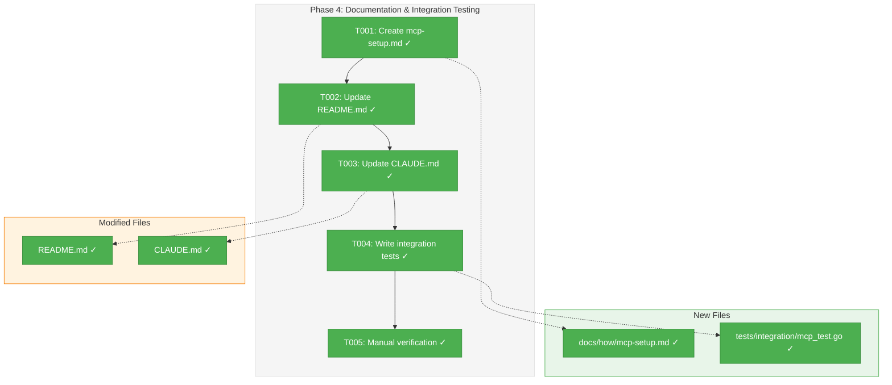
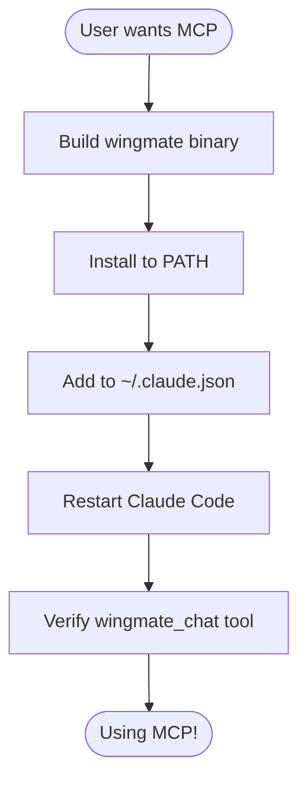
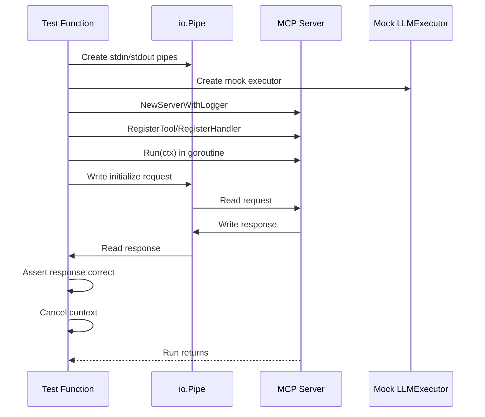

# Phase 4: Documentation & Integration Testing – Tasks & Alignment Brief

**Spec**: [mcp-server-integration-spec.md](../../mcp-server-integration-spec.md)
**Plan**: [mcp-server-integration-plan.md](../../mcp-server-integration-plan.md)
**Date**: 2026-01-22
**Phase Complexity**: CS-1

---

## Executive Briefing

### Purpose
This phase completes the MCP Server Integration by adding documentation and integration tests. While Phases 1-3 built the working implementation, users cannot effectively use the feature without clear setup instructions and verification that all components work together end-to-end.

### What We're Building
Complete documentation and testing infrastructure:
- A comprehensive MCP setup guide (`docs/how/mcp-setup.md`)
- Updated README.md with quick-start section
- Updated CLAUDE.md with MCP context for AI assistants
- Integration tests using `io.Pipe` for E2E testing
- Manual verification checklist

### User Value
After Phase 4, users can:
1. Follow clear instructions to set up MCP with Claude Code
2. Troubleshoot common issues with the guide
3. Developers can run integration tests to verify their changes
4. AI assistants understand MCP context when working on this codebase

### Example
**Before Phase 4**: User builds Wingmate but doesn't know how to configure Claude Code
**After Phase 4**: User follows README quick-start, adds config to `~/.claude.json`, and starts using `wingmate_chat` tool

---

## Objectives & Scope

### Objective
Provide comprehensive documentation and integration tests that enable users to successfully configure and use the MCP server with Claude Code.

### Goals

- ✅ Create docs/how/mcp-setup.md with complete setup guide
- ✅ Update README.md with MCP quick-start section
- ✅ Update CLAUDE.md with MCP server context
- ✅ Write integration tests using io.Pipe pattern
- ✅ Manual verification with Claude Code

### Non-Goals

- ❌ Video tutorials (text documentation only)
- ❌ Automated E2E tests with actual Claude Code (manual only)
- ❌ Translation to other languages
- ❌ Interactive setup wizard
- ❌ Phase 5 extensions (wingmate_send, config file, etc.)

---

## Architecture Map

### Component Diagram
<!-- Status: grey=pending, orange=in-progress, green=completed, red=blocked -->
<!-- Updated by plan-6 during implementation -->



### Task-to-Component Mapping

<!-- Status: ⬜ Pending | 🟧 In Progress | ✅ Complete | 🔴 Blocked -->

| Task | Component(s) | Files | Status | Comment |
|------|-------------|-------|--------|---------|
| T001 | Documentation | docs/how/mcp-setup.md | ✅ Complete | Complete setup guide |
| T002 | Documentation | README.md | ✅ Complete | Quick-start section |
| T003 | Documentation | CLAUDE.md | ✅ Complete | MCP context for AI |
| T004 | Testing | tests/integration/mcp_test.go | ✅ Complete | E2E with io.Pipe |
| T005 | Verification | N/A | ✅ Complete | Manual Claude Code test |

---

## Tasks

| Status | ID | Task | CS | Type | Dependencies | Absolute Path(s) | Validation | Subtasks | Notes |
|--------|------|------|-----|------|--------------|------------------|------------|----------|-------|
| [x] | T001 | Create comprehensive mcp-setup.md guide | 1 | Doc | – | /Users/vaughanknight/GitHub/wingmate/docs/how/mcp-setup.md | Guide covers install, config, troubleshooting | – | Per plan § 6 Phase 4 |
| [x] | T002 | Update README.md with MCP quick-start | 1 | Doc | T001 | /Users/vaughanknight/GitHub/wingmate/README.md | Working code snippets | – | Link to full guide |
| [x] | T003 | Update CLAUDE.md with MCP context | 1 | Doc | T002 | /Users/vaughanknight/GitHub/wingmate/CLAUDE.md | MCP section with error codes | – | For AI assistants |
| [x] | T004 | Write MCP integration tests with io.Pipe | 1 | Test | T003 | /Users/vaughanknight/GitHub/wingmate/tests/integration/mcp_test.go | Tests pass with race detector | – | E2E server test |
| [x] | T005 | Manual verification with Claude Code | 1 | Test | T004 | N/A | wingmate_chat tool visible and working | – | Document results |

---

## Alignment Brief

### Prior Phases Review

#### Phase 1: Foundation & Protocol Layer (Complete)

**Deliverables Created**:
- `internal/mcp/types.go` - ServerInfo, ToolDefinition, ToolResult, etc.
- `internal/mcp/errors.go` - MCPError, error codes 3001-3022
- `internal/mcp/transport.go` - NDJSON transport over stdio
- `internal/mcp/server.go` - Server lifecycle, message handling

#### Phase 2: Tool Implementation (Complete)

**Deliverables Created**:
- `internal/mcp/tools.go` - Tool schema definitions, DefaultTools()
- `internal/mcp/handlers.go` - NewChatHandler, NewStatusHandler, NewDiscoverHandler

#### Phase 3: CLI Integration (Complete)

**Deliverables Created**:
- `cmd/wingmate/main.go` - `wingmate mcp` command, runMCP function, mcpLoggerAdapter

**Key Learning**: Logger interface required adapter due to mismatch between `mcp.Logger` (any) and `flightlog.Logger` (Entry).

### Critical Findings Affecting This Phase

| Finding | Constraint | Affected Tasks |
|---------|------------|----------------|
| stdio blocking | Use io.Pipe in integration tests | T004 |
| Claude CLI dependency | Mock LLMExecutor in integration tests | T004 |
| Binary path resolution | Document absolute paths clearly | T001, T002 |

### ADR Decision Constraints

**ADR-004: MCP Server Implementation Approach**

| Constraint | Affected Tasks |
|------------|----------------|
| stdio transport documented | T001 (setup guide) |
| Flight Log integration | T001 (troubleshooting) |
| Environment variables | T001, T002 |

### Invariants & Guardrails

- **Documentation accuracy**: All code snippets must be verified working
- **Platform coverage**: Guide must cover macOS, Linux, Windows
- **Error codes**: CLAUDE.md must include error code reference
- **Integration tests**: Must use io.Pipe, not actual subprocess

### Inputs to Read

| Purpose | Absolute Path |
|---------|---------------|
| Existing README | /Users/vaughanknight/GitHub/wingmate/README.md |
| Existing CLAUDE.md | /Users/vaughanknight/GitHub/wingmate/CLAUDE.md |
| MCP Server code | /Users/vaughanknight/GitHub/wingmate/internal/mcp/ |
| CLI code | /Users/vaughanknight/GitHub/wingmate/cmd/wingmate/main.go |
| Existing integration tests | /Users/vaughanknight/GitHub/wingmate/tests/integration/ |

### Visual Alignment Aids

#### Flow Diagram: User Setup Flow



#### Sequence Diagram: Integration Test Pattern



### Test Plan (Lightweight)

Per spec Testing Strategy: Lightweight for documentation phase.

#### Integration Test Cases

| Test Name | Purpose | Expected |
|-----------|---------|----------|
| `TestMCPServerInitialize` | Server handles initialize handshake | Returns server info |
| `TestMCPServerToolsList` | Server returns registered tools | Returns 3 tools |
| `TestMCPServerToolsCallChat` | Chat tool invokes mock executor | Returns response |
| `TestMCPServerToolsCallStatus` | Status tool returns health | Returns JSON |
| `TestMCPServerGracefulShutdown` | Server stops on context cancel | No errors |

#### Manual Test Checklist

- [ ] Build binary: `go build -o wingmate ./cmd/wingmate`
- [ ] Start MCP: `wingmate mcp` (verify no errors)
- [ ] Ctrl+C: Graceful shutdown
- [ ] Configure Claude Code with `~/.claude.json`
- [ ] Restart Claude Code
- [ ] Verify `wingmate_chat` tool appears
- [ ] Test tool invocation (requires Claude CLI)

### Step-by-Step Implementation Outline

| Step | Task ID | Action |
|------|---------|--------|
| 1 | T001 | Create docs/how/ directory if needed, write mcp-setup.md |
| 2 | T002 | Add "Using with Claude Code" section to README.md |
| 3 | T003 | Add "MCP Server" section to CLAUDE.md with error codes |
| 4 | T004 | Create tests/integration/mcp_test.go with io.Pipe tests |
| 5 | T005 | Run manual verification, document results |

### Commands to Run

```bash
# Run integration tests with race detection
go test ./tests/integration/... -v -race -count=1

# Run specific MCP integration test
go test ./tests/integration/... -v -run "TestMCP"

# Build and verify binary
go build -o wingmate ./cmd/wingmate
./wingmate --help | grep mcp

# Manual verification
./wingmate mcp --verbose  # In one terminal
# Ctrl+C to stop
```

### Risks/Unknowns

| Risk | Severity | Mitigation |
|------|----------|------------|
| Integration tests may need tuning | Low | Start simple, add complexity |
| Claude Code behavior may change | Low | Document version tested |
| Platform-specific paths | Low | Use examples with placeholders |

### Ready Check

- [x] Phase 1, 2, 3 complete with all deliverables
- [x] README.md and CLAUDE.md exist and can be updated
- [x] Existing integration test patterns available to follow
- [x] Testing strategy defined (lightweight)
- [x] Absolute paths specified for all files
- [x] Mermaid diagrams created for flow and sequence
- [ ] **AWAITING GO/NO-GO from human sponsor**

---

## Phase Footnote Stubs

| ID | Date | Change | Rationale |
|----|------|--------|-----------|
| | | | |

*Footnotes will be added by plan-6 during implementation to track deviations, discoveries, and decisions.*

---

## Evidence Artifacts

| Artifact | Location | Created By |
|----------|----------|------------|
| Execution Log | /Users/vaughanknight/GitHub/wingmate/docs/plans/003-mcp-server-integration/tasks/phase-4-documentation-integration-testing/execution.log.md | plan-6 |

---

## Discoveries & Learnings

_Populated during implementation by plan-6. Log anything of interest to your future self._

| Date | Task | Type | Discovery | Resolution | References |
|------|------|------|-----------|------------|------------|
| | | | | | |

**Types**: `gotcha` | `research-needed` | `unexpected-behavior` | `workaround` | `decision` | `debt` | `insight`

**What to log**:
- Things that didn't work as expected
- External research that was required
- Implementation troubles and how they were resolved
- Gotchas and edge cases discovered
- Decisions made during implementation
- Technical debt introduced (and why)
- Insights that future phases should know about

_See also: `execution.log.md` for detailed narrative._

---

## Directory Layout

```
docs/plans/003-mcp-server-integration/
├── mcp-server-integration-spec.md
├── mcp-server-integration-plan.md
├── research-dossier.md
├── external-research/
│   ├── 01-mcp-protocol-specification-results.md
│   ├── 02-go-mcp-libraries-results.md
│   └── 03-claude-code-mcp-configuration-results.md
└── tasks/
    ├── phase-1-foundation-protocol-layer/
    │   ├── tasks.md
    │   └── execution.log.md
    ├── phase-2-tool-implementation/
    │   ├── tasks.md
    │   └── execution.log.md
    ├── phase-3-cli-integration-configuration/
    │   ├── tasks.md
    │   └── execution.log.md
    └── phase-4-documentation-integration-testing/
        ├── tasks.md                    # This file
        └── execution.log.md            # Created by plan-6
```

---

*Tasks generated by /plan-5-phase-tasks-and-brief based on Phase 4 from mcp-server-integration-plan.md*
