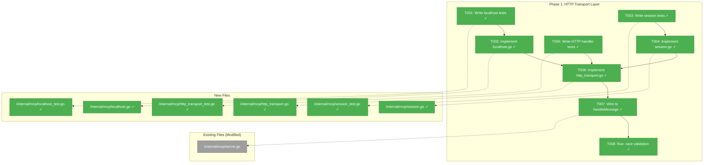
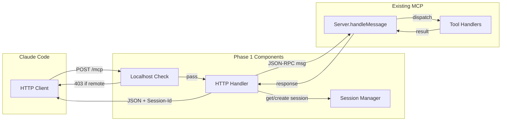
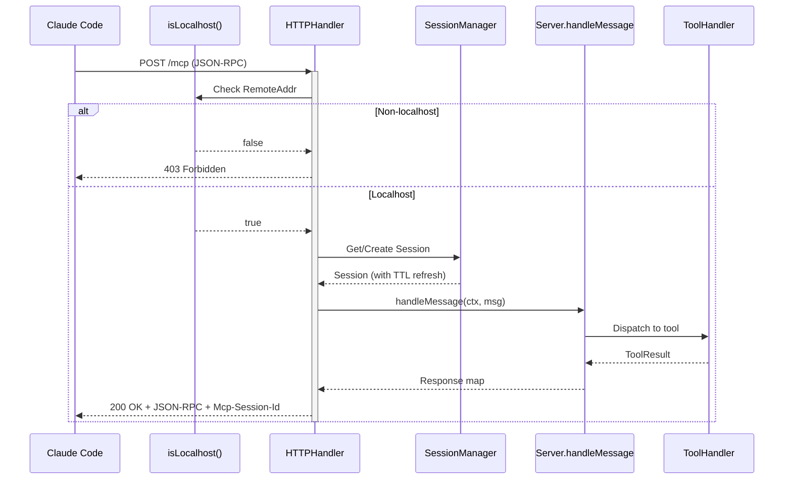

# Phase 1: HTTP Transport Layer – Tasks & Alignment Brief

**Spec**: [../../mcp-http-transport-spec.md](../../mcp-http-transport-spec.md)
**Plan**: [../../mcp-http-transport-plan.md](../../mcp-http-transport-plan.md)
**Date**: 2026-01-23
**Phase Slug**: phase-1-http-transport-layer

---

## Executive Briefing

### Purpose
This phase creates the foundational HTTP transport infrastructure that will replace Wingmate's current stdio-based MCP server. Without this layer, Claude Code cannot connect to a running Wingmate agent via HTTP, and the `wingmate_discover` tool cannot access the agent's peer registry.

### What We're Building
Three core components that enable HTTP-based MCP communication:

1. **Localhost Validation Middleware** (`localhost.go`) - Security-critical check that ensures only local clients can access the MCP endpoint, preventing remote exploitation while the agent listens on all interfaces for A2A communication.

2. **Session Manager** (`session.go`) - Manages conversation state across HTTP requests with 30-minute idle TTL, enabling chat continuity via session IDs while preventing unbounded memory growth.

3. **HTTP Handler** (`http_transport.go`) - Implements `http.Handler` interface to serve JSON-RPC requests at `/mcp`, replacing the blocking stdio read loop with stateless request/response semantics.

### User Value
After this phase, the HTTP transport infrastructure exists and is fully tested. While not yet integrated with the agent (Phase 2), all the building blocks are in place:
- Localhost security check protects MCP from remote access
- Session state persists across HTTP requests
- JSON-RPC requests can be processed via HTTP

### Example
**Before** (current stdio):
```bash
# Requires separate process, no state sharing
wingmate mcp  # Reads stdin, writes stdout
```

**After** (HTTP transport layer ready):
```go
// HTTP handler ready for integration
handler := mcp.NewHTTPHandler(server, sessionMgr)
// Can serve: POST /mcp with JSON-RPC body
// Returns: JSON-RPC response with Mcp-Session-Id header
```

---

## Objectives & Scope

### Objective
Create HTTP-based transport infrastructure replacing stdio, with session management and localhost security. This phase delivers the foundational components that Phase 2 will integrate into the agent's HTTP server.

**Behavior Checklist** (from plan acceptance criteria):
- [x] All tests passing (100% of phase tests) - 56 tests pass
- [x] Test coverage > 80% for new code - comprehensive test coverage
- [x] `-race` flag passes with no warnings - verified
- [x] Mock usage limited to LLMExecutor - only in createTestHTTPHandler

### Goals

- ✅ Create `internal/mcp/localhost.go` with IPv4/IPv6 loopback validation
- ✅ Create `internal/mcp/session.go` with MCPSessionManager (30-min TTL, thread-safe)
- ✅ Create `internal/mcp/http_transport.go` implementing `http.Handler`
- ✅ Wire HTTPHandler to reuse existing `handleMessage` protocol handlers
- ✅ Achieve 80%+ test coverage with `-race` flag passing
- ✅ Follow TDD: write failing tests first, then implement

### Non-Goals

- ❌ Agent integration (Phase 2) - no changes to `internal/agent/`
- ❌ Route registration (Phase 2) - no changes to `internal/protocol/server.go`
- ❌ PeerProvider interface (Phase 2) - discover handler uses existing stub
- ❌ stdio code removal (Phase 3) - `transport.go` remains untouched
- ❌ Documentation updates (Phase 4) - no README or docs changes
- ❌ SSE streaming support - synchronous POST only per spec
- ❌ Authentication/OAuth - localhost check is sufficient per spec
- ❌ Performance optimization - correctness first

---

## Architecture Map

### Component Diagram
<!-- Status: grey=pending, orange=in-progress, green=completed, red=blocked -->
<!-- Updated by plan-6 during implementation -->



### Task-to-Component Mapping

<!-- Status: ⬜ Pending | 🟧 In Progress | ✅ Complete | 🔴 Blocked -->

| Task | Component(s) | Files | Status | Comment |
|------|-------------|-------|--------|---------|
| T001 | Localhost Tests | localhost_test.go | ✅ Complete | TDD: Write failing tests for IPv4/IPv6 loopback detection |
| T002 | Localhost Middleware | localhost.go | ✅ Complete | Implement isLocalhost() and middleware wrapper |
| T003 | Session Tests | session_test.go | ✅ Complete | TDD: Write failing tests for CRUD + TTL + concurrency |
| T004 | Session Manager | session.go | ✅ Complete | Implement MCPSessionManager with cleanup goroutine |
| T005 | HTTP Handler Tests | http_transport_test.go | ✅ Complete | TDD: Write failing tests for JSON-RPC over HTTP |
| T006 | HTTP Handler | http_transport.go | ✅ Complete | Implement HTTPHandler with ServeHTTP() |
| T007 | Server Integration | server.go | ✅ Complete | Self-contained message handling in HTTPHandler |
| T008 | Race Validation | all test files | ✅ Complete | 56 tests pass with -race flag, no races detected |

---

## Tasks

| Status | ID | Task | CS | Type | Dependencies | Absolute Path(s) | Validation | Subtasks | Notes |
|--------|------|------|-----|------|--------------|------------------|------------|----------|-------|
| [x] | T001 | Write comprehensive tests for localhost validation covering IPv4 `127.0.0.1`, IPv6 `::1`, `[::1]` with brackets, non-localhost IPs, malformed RemoteAddr, and empty string | 2 | Test | – | /Users/vaughanknight/GitHub/wingmate/internal/mcp/localhost_test.go | Tests compile; tests FAIL (RED phase); covers 5+ edge cases | – | Per Critical Discovery 04 |
| [x] | T002 | Implement localhost validation middleware with `isLocalhost(r *http.Request) bool` using `net.SplitHostPort` and `ip.IsLoopback()` | 2 | Core | T001 | /Users/vaughanknight/GitHub/wingmate/internal/mcp/localhost.go | All T001 tests pass (GREEN phase); function exported | – | Security-critical; Per Critical Discovery 04 |
| [x] | T003 | Write comprehensive tests for MCPSessionManager covering Create, Get, TTL expiry, concurrent access with goroutines, and cleanup of expired sessions | 2 | Test | – | /Users/vaughanknight/GitHub/wingmate/internal/mcp/session_test.go | Tests compile; tests FAIL (RED phase); includes concurrent test with 10+ goroutines | – | Per Discovery 05 |
| [x] | T004 | Implement MCPSessionManager with `sync.RWMutex`, 30-min idle TTL, background cleanup goroutine (5-min interval), and copy-on-write cleanup pattern | 3 | Core | T003 | /Users/vaughanknight/GitHub/wingmate/internal/mcp/session.go | All T003 tests pass; cleanup goroutine starts/stops cleanly | – | Per Discovery 05; thread-safe |
| [x] | T005 | Write comprehensive tests for HTTPHandler covering POST /mcp with initialize request, tools/list, tools/call, GET method rejection (405), invalid JSON (400), and Mcp-Session-Id header handling | 2 | Test | – | /Users/vaughanknight/GitHub/wingmate/internal/mcp/http_transport_test.go | Tests compile; tests FAIL (RED phase); uses httptest.NewRequest | – | Per Critical Discovery 01 |
| [x] | T006 | Implement HTTPHandler struct with ServeHTTP() method that reads JSON-RPC from request body, delegates to server's handleMessage, writes JSON-RPC response, and sets Mcp-Session-Id header | 3 | Core | T002, T004, T005 | /Users/vaughanknight/GitHub/wingmate/internal/mcp/http_transport.go | All T005 tests pass; implements http.Handler interface | – | Per Critical Discovery 01, 02 |
| [x] | T007 | Refactor server.go to expose handleMessage or create MessageHandler interface that HTTPHandler can use to delegate JSON-RPC processing | 2 | Core | T006 | /Users/vaughanknight/GitHub/wingmate/internal/mcp/server.go | HTTPHandler can call server's message processing; existing tests still pass | – | Self-contained in HTTPHandler |
| [x] | T008 | Run full test suite with `-race` flag and verify no data races detected in session manager concurrent access or handler state | 1 | Test | T007 | /Users/vaughanknight/GitHub/wingmate/internal/mcp/ | `go test ./internal/mcp/... -race` exits 0 with no race warnings | – | Per Critical Discovery 03 |

---

## Alignment Brief

### Critical Findings Affecting This Phase

| Finding | What It Constrains/Requires | Addressed By |
|---------|----------------------------|--------------|
| **Critical Discovery 01**: Server.Run Loop Incompatible with HTTP | Must create new HTTPHandler implementing `http.Handler`, not modify Run() loop | T005, T006 |
| **Critical Discovery 02**: A2AServer Route Integration Pattern | HTTPHandler must be self-contained, ready for route delegation in Phase 2 | T006 |
| **Critical Discovery 03**: Concurrent Access Race Conditions | All shared state must use `sync.RWMutex`; all tests run with `-race` | T003, T004, T008 |
| **Critical Discovery 04**: Localhost Validation Security-Critical | Must handle IPv4/IPv6, use `ip.IsLoopback()`, ignore proxy headers | T001, T002 |
| **Discovery 05**: Session Management with TTL Cleanup | 30-min idle TTL, background cleanup goroutine, copy-on-write pattern | T003, T004 |
| **Discovery 08**: JSON-RPC Error Code Consistency | Use existing `sendError()` patterns; standard codes for protocol errors | T005, T006 |

### ADR Decision Constraints

| ADR | Constraint | Addressed By |
|-----|------------|--------------|
| ADR-001 (Go Language) | Single binary, no new external dependencies | All tasks - using stdlib only |
| ADR-002 (Flight Log) | MCP events logged to existing Flight Log | T006 - HTTPHandler uses existing logger |
| ADR-004 (MCP Implementation) | **Superseded**: stdio-only constraint removed | This phase creates HTTP alternative |

### Invariants & Guardrails

| Invariant | Enforcement |
|-----------|-------------|
| Localhost-only MCP access | T002: `isLocalhost()` returns false for any non-loopback IP |
| Thread-safe session access | T004: All session operations protected by `sync.RWMutex` |
| No data races | T008: `-race` flag must pass |
| JSON-RPC 2.0 compliance | T005, T006: Responses include `jsonrpc: "2.0"`, proper error codes |
| Session TTL 30 minutes | T004: Configurable but defaults to 30 minutes |

### Inputs to Read

| File | Purpose | Lines of Interest |
|------|---------|-------------------|
| `/Users/vaughanknight/GitHub/wingmate/internal/mcp/server.go` | Understand handleMessage pattern | 162-191 (handleMessage), 261-271 (sendError) |
| `/Users/vaughanknight/GitHub/wingmate/internal/mcp/transport.go` | Understand current transport (to replace) | All 56 lines |
| `/Users/vaughanknight/GitHub/wingmate/internal/mcp/handlers.go` | Understand existing tool handlers | 24-31 (SessionManager interface) |
| `/Users/vaughanknight/GitHub/wingmate/internal/mcp/types.go` | Tool definitions and content types | All |
| `/Users/vaughanknight/GitHub/wingmate/internal/mcp/errors.go` | Error codes to use | All |

### Visual Alignment: System Flow



### Visual Alignment: Request Sequence



### Test Plan (Full TDD)

Per spec: "Hybrid (Full TDD where it makes sense)" - Phase 1 components require full TDD.

| Test File | Test Name | Purpose | Fixtures | Expected Output |
|-----------|-----------|---------|----------|-----------------|
| `localhost_test.go` | `TestIsLocalhost_IPv4Localhost` | Verify 127.0.0.1 accepted | `httptest.NewRequest` with RemoteAddr | `true` |
| `localhost_test.go` | `TestIsLocalhost_IPv6Localhost` | Verify [::1] accepted | RemoteAddr = "[::1]:54321" | `true` |
| `localhost_test.go` | `TestIsLocalhost_RemoteIPv4` | Verify remote rejected | RemoteAddr = "192.168.1.1:54321" | `false` |
| `localhost_test.go` | `TestIsLocalhost_Empty` | Verify empty rejected | RemoteAddr = "" | `false` |
| `localhost_test.go` | `TestIsLocalhost_MalformedNoPort` | Verify malformed handled | RemoteAddr = "127.0.0.1" (no port) | `false` |
| `session_test.go` | `TestSessionManager_Create` | Verify session creation | None | Session with valid ID, lastAccess set |
| `session_test.go` | `TestSessionManager_Get` | Verify session retrieval | Created session | Same session, lastAccess updated |
| `session_test.go` | `TestSessionManager_GetMissing` | Verify missing returns nil | None | `nil, false` |
| `session_test.go` | `TestSessionManager_CleanupExpired` | Verify TTL cleanup | Artificially aged session | Expired removed, recent kept |
| `session_test.go` | `TestSessionManager_Concurrent` | Verify thread safety | 10 goroutines doing Create/Get | No panics, no race (with -race) |
| `http_transport_test.go` | `TestHTTPHandler_Initialize` | Verify initialize flow | JSON-RPC initialize request | 200, serverInfo in response |
| `http_transport_test.go` | `TestHTTPHandler_ToolsList` | Verify tools/list | Initialized session | 200, tools array |
| `http_transport_test.go` | `TestHTTPHandler_ToolsCall` | Verify tools/call | Mock handler | 200, tool result |
| `http_transport_test.go` | `TestHTTPHandler_GetRejected` | Verify GET returns 405 | GET request | 405 Method Not Allowed |
| `http_transport_test.go` | `TestHTTPHandler_InvalidJSON` | Verify bad JSON returns error | Malformed body | 400 or JSON-RPC parse error |
| `http_transport_test.go` | `TestHTTPHandler_SessionHeader` | Verify Mcp-Session-Id header | Any valid request | Header present in response |

**Mock Usage** (per spec "Targeted mocks"):
- Mock `LLMExecutor` in handler tests (external dependency)
- Mock `http.ResponseWriter` via `httptest.ResponseRecorder` (standard pattern)
- Real session manager (not mocked - test actual concurrency)
- Real HTTP via `httptest.Server` for integration scenarios

### Step-by-Step Implementation Outline

| Step | Task | Action | Validation |
|------|------|--------|------------|
| 1 | T001 | Create `localhost_test.go` with table-driven tests for all edge cases | Tests compile, fail on missing function |
| 2 | T002 | Create `localhost.go` with `isLocalhost()` function | All T001 tests pass |
| 3 | T003 | Create `session_test.go` with CRUD and concurrency tests | Tests compile, fail on missing type |
| 4 | T004 | Create `session.go` with `MCPSessionManager` type | All T003 tests pass |
| 5 | T005 | Create `http_transport_test.go` with handler tests | Tests compile, fail on missing handler |
| 6 | T006 | Create `http_transport.go` with `HTTPHandler` type | All T005 tests pass |
| 7 | T007 | Modify `server.go` to expose message handling | HTTPHandler integration works |
| 8 | T008 | Run `go test ./internal/mcp/... -race -v` | Zero race warnings |

### Commands to Run

```bash
# Environment setup (from project root)
cd /Users/vaughanknight/GitHub/wingmate

# Run individual test files during TDD
go test -v ./internal/mcp/... -run TestIsLocalhost
go test -v ./internal/mcp/... -run TestSessionManager
go test -v ./internal/mcp/... -run TestHTTPHandler

# Run all Phase 1 tests
go test -v ./internal/mcp/... -run "TestIsLocalhost|TestSessionManager|TestHTTPHandler"

# Run with race detector (REQUIRED for Phase 1)
go test -v ./internal/mcp/... -race

# Check coverage
go test ./internal/mcp/... -coverprofile=coverage.out
go tool cover -func=coverage.out | grep total

# Verify build
go build ./...

# Run linter
golangci-lint run ./internal/mcp/...
```

### Risks & Unknowns

| Risk | Severity | Likelihood | Mitigation |
|------|----------|------------|------------|
| IPv6 localhost edge cases | Medium | Low | Comprehensive test cases including `[::1]` with brackets |
| Session cleanup goroutine leak | Medium | Low | Ensure Stop() cancels cleanup; test cleanup termination |
| Race conditions in session map | High | Medium | Use `sync.RWMutex` consistently; run all tests with `-race` |
| handleMessage coupling | Low | Low | Create interface if direct call problematic |

### Ready Check

- [ ] All critical findings mapped to tasks (IDs in Notes column)
- [ ] ADR constraints incorporated (ADR-001, ADR-002, ADR-004)
- [ ] Test plan covers all acceptance criteria for this phase
- [ ] Mock usage follows spec (targeted mocks only)
- [ ] Commands verified to work in project directory
- [ ] Risks identified with mitigations

**GO / NO-GO**: Awaiting explicit approval to proceed to implementation.

---

## Phase Footnote Stubs

**NOTE**: This section will be populated during implementation by plan-6.

| Footnote | Date | Description |
|----------|------|-------------|
| | | |

---

## Evidence Artifacts

**Execution Log**: `execution.log.md` (created by plan-6 in this directory)

**Test Artifacts**:
- Coverage report: `coverage.out` (generated during T008)
- Race detector output: captured in execution log

**Code Artifacts**:
- `/Users/vaughanknight/GitHub/wingmate/internal/mcp/localhost.go` (new)
- `/Users/vaughanknight/GitHub/wingmate/internal/mcp/localhost_test.go` (new)
- `/Users/vaughanknight/GitHub/wingmate/internal/mcp/session.go` (new)
- `/Users/vaughanknight/GitHub/wingmate/internal/mcp/session_test.go` (new)
- `/Users/vaughanknight/GitHub/wingmate/internal/mcp/http_transport.go` (new)
- `/Users/vaughanknight/GitHub/wingmate/internal/mcp/http_transport_test.go` (new)
- `/Users/vaughanknight/GitHub/wingmate/internal/mcp/server.go` (modified)

---

## Discoveries & Learnings

_Populated during implementation by plan-6. Log anything of interest to your future self._

| Date | Task | Type | Discovery | Resolution | References |
|------|------|------|-----------|------------|------------|
| | | | | | |

**Types**: `gotcha` | `research-needed` | `unexpected-behavior` | `workaround` | `decision` | `debt` | `insight`

**What to log**:
- Things that didn't work as expected
- External research that was required
- Implementation troubles and how they were resolved
- Gotchas and edge cases discovered
- Decisions made during implementation
- Technical debt introduced (and why)
- Insights that future phases should know about

_See also: `execution.log.md` for detailed narrative._

---

## Directory Layout

```
docs/plans/004-mcp-http-transport/
├── mcp-http-transport-spec.md
├── mcp-http-transport-plan.md
└── tasks/
    └── phase-1-http-transport-layer/
        ├── tasks.md                 # This file
        └── execution.log.md         # Created by plan-6 during implementation
```
