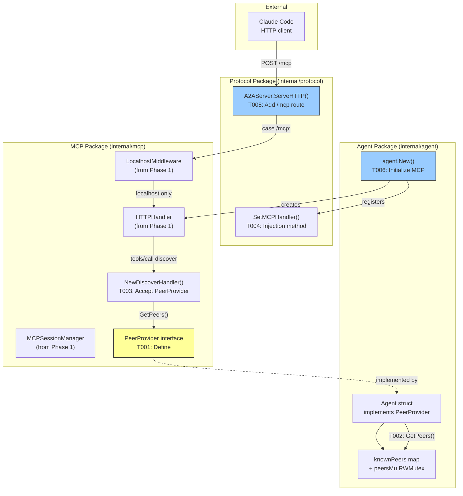

# Phase 2: Agent Integration - Tasks & Alignment Brief

**Feature**: MCP HTTP Transport Migration
**Phase**: 2 of 5
**Plan**: [../../mcp-http-transport-plan.md](../../mcp-http-transport-plan.md)
**Spec**: [../../mcp-http-transport-spec.md](../../mcp-http-transport-spec.md)
**Created**: 2026-01-23
**Status**: ✅ Complete

---

## Executive Briefing

Phase 2 integrates the HTTP transport infrastructure from Phase 1 into the Agent's existing HTTP server. This is the critical "wiring" phase that connects the standalone HTTPHandler to the unified peer architecture.

**Key Challenge**: The `wingmate_discover` tool requires access to the Agent's peer registry, but the MCP package cannot import the agent package (circular dependency). We solve this with a `PeerProvider` interface injected at initialization.

**Risk Areas**:
1. **Circular dependencies** - Agent imports MCP, so MCP cannot import Agent
2. **Concurrent access** - HTTPHandler and A2A requests may modify peer registry simultaneously
3. **Initialization ordering** - MCP handler must be created after Agent but before server starts

**Success Criteria**: Claude Code can call `wingmate_discover` via HTTP at `localhost:PORT/mcp` and receive the actual list of known peers.

---

## Objectives & Scope

### Goals (In Scope)
- [x] Define `PeerProvider` interface in MCP package for dependency injection
- [x] Agent implements `PeerProvider` with thread-safe peer access
- [x] Update `NewDiscoverHandler` to accept `PeerProvider` parameter
- [x] Add `/mcp` route to A2AServer with LocalhostMiddleware
- [x] Initialize MCP HTTPHandler in agent.New() with tool registration
- [x] Verify concurrent MCP and A2A requests don't race

### Non-Goals (Out of Scope)
- SSE streaming (Phase 3)
- Tool forwarding between agents (Phase 4)
- TLS/authentication (Phase 5)
- Modification of stdio MCP transport
- Changes to A2A protocol handling

---

## Architecture Map



### Task-to-Component Mapping

| Task | Primary File | Component Modified |
|------|--------------|-------------------|
| T001 | `internal/mcp/handlers.go` | PeerProvider interface |
| T002 | `internal/agent/agent.go` | Agent.GetPeers() method |
| T003 | `internal/mcp/handlers.go` | NewDiscoverHandler signature |
| T004 | `internal/protocol/server.go` | A2AServer.SetMCPHandler() |
| T005 | `internal/protocol/server.go` | A2AServer.ServeHTTP() |
| T006 | `internal/agent/agent.go` | agent.New() initialization |
| T007 | `internal/agent/agent_test.go` | Integration test |
| T008 | `internal/agent/agent_test.go` | Concurrency test |

---

## Tasks

| ID | Description | CS | Deps | File(s) | AC |
|----|-------------|----|----- |---------|-----|
| T001 | Define `PeerProvider` interface with `GetPeers() []string` in MCP package | 1 | - | `/Users/vaughanknight/GitHub/wingmate/internal/mcp/handlers.go` | Interface compiles, documented |
| T002 | Implement `PeerProvider` on Agent struct with RWMutex-protected accessor | 2 | T001 | `/Users/vaughanknight/GitHub/wingmate/internal/agent/agent.go` | Returns peer URLs thread-safely |
| T003 | Update `NewDiscoverHandler` to accept `PeerProvider` and call `GetPeers()` | 2 | T001 | `/Users/vaughanknight/GitHub/wingmate/internal/mcp/handlers.go` | Returns actual peer list |
| T004 | Add `SetMCPHandler(http.Handler)` method to A2AServer | 2 | - | `/Users/vaughanknight/GitHub/wingmate/internal/protocol/server.go` | Method available, thread-safe |
| T005 | Add `/mcp` route case to `ServeHTTP` switch with `LocalhostMiddleware` wrapping | 2 | T004 | `/Users/vaughanknight/GitHub/wingmate/internal/protocol/server.go` | Route responds to POST /mcp |
| T006 | Initialize MCP HTTPHandler in `agent.New()` with all tool registrations | 3 | T002, T003, T004 | `/Users/vaughanknight/GitHub/wingmate/internal/agent/agent.go` | Handler wired with real peers |
| T007 | Write integration test: initialize → tools/list → tools/call discover | 3 | T006 | `/Users/vaughanknight/GitHub/wingmate/internal/agent/agent_test.go` | End-to-end test passes |
| T008 | Write concurrency test: parallel MCP and A2A requests | 3 | T007 | `/Users/vaughanknight/GitHub/wingmate/internal/agent/agent_test.go` | No races under -race |

### Task Details

#### T001: Define PeerProvider Interface
**Location**: `/Users/vaughanknight/GitHub/wingmate/internal/mcp/handlers.go`

```go
// PeerProvider supplies peer information for the discover tool.
// This interface enables dependency injection from the agent package
// without creating circular imports.
type PeerProvider interface {
    // GetPeers returns URLs of known peer agents.
    GetPeers() []string
}
```

**Why interface in MCP package**: The MCP package is imported by Agent. If we defined PeerProvider in Agent, we'd have MCP → Agent → MCP circular dependency. Defining it in MCP lets Agent implement it.

---

#### T002: Implement PeerProvider on Agent
**Location**: `/Users/vaughanknight/GitHub/wingmate/internal/agent/agent.go`

```go
// GetPeers implements mcp.PeerProvider.
// Returns URLs of all known peer agents in a thread-safe manner.
func (a *Agent) GetPeers() []string {
    a.peersMu.RLock()
    defer a.peersMu.RUnlock()

    peers := make([]string, 0, len(a.knownPeers))
    for url := range a.knownPeers {
        peers = append(peers, url)
    }
    return peers
}
```

**Thread safety**: Uses existing `peersMu sync.RWMutex` at line 40 of agent.go. Read lock allows concurrent GetPeers() calls while blocking writes.

---

#### T003: Update NewDiscoverHandler Signature
**Location**: `/Users/vaughanknight/GitHub/wingmate/internal/mcp/handlers.go`

Change from:
```go
func NewDiscoverHandler(agentID string) ToolHandler
```

To:
```go
func NewDiscoverHandler(agentID string, peers PeerProvider) ToolHandler
```

**Inside handler**: Replace `Peers: []string{}` with:
```go
Peers: peers.GetPeers()
```

---

#### T004: Add SetMCPHandler Method
**Location**: `/Users/vaughanknight/GitHub/wingmate/internal/protocol/server.go`

Add to A2AServer struct (around line 26):
```go
mcpHandler http.Handler
```

Add method:
```go
// SetMCPHandler registers an HTTP handler for the /mcp route.
// The handler should be wrapped with LocalhostMiddleware before passing.
func (s *A2AServer) SetMCPHandler(h http.Handler) {
    s.mu.Lock()
    defer s.mu.Unlock()
    s.mcpHandler = h
}
```

---

#### T005: Add /mcp Route
**Location**: `/Users/vaughanknight/GitHub/wingmate/internal/protocol/server.go` line 136

Add case to ServeHTTP switch:
```go
case "/mcp":
    s.mu.RLock()
    h := s.mcpHandler
    s.mu.RUnlock()
    if h != nil {
        h.ServeHTTP(w, r)
    } else {
        http.NotFound(w, r)
    }
```

**Note**: LocalhostMiddleware wrapping happens at registration time (T006), not here. This keeps the route handler simple and testable.

---

#### T006: Initialize MCP in agent.New()
**Location**: `/Users/vaughanknight/GitHub/wingmate/internal/agent/agent.go`

After Agent struct is created but before ListenAndServe:

```go
// Initialize MCP HTTP handler
sessionMgr := mcp.NewMCPSessionManager(30*time.Minute, 5*time.Minute)
mcpConfig := mcp.ServerConfig{
    Name:    "wingmate",
    Version: "0.1.0",
}
mcpHandler := mcp.NewHTTPHandler(mcpConfig, sessionMgr)

// Register tools
executor := llm.NewClaudeCLI()
mcpHandler.RegisterTool(mcp.WingmateChat)
mcpHandler.RegisterHandler("wingmate_chat", mcp.NewChatHandler(executor, nil, nil))
mcpHandler.RegisterTool(mcp.WingmateStatus)
mcpHandler.RegisterHandler("wingmate_status", mcp.NewStatusHandler(executor, time.Now()))
mcpHandler.RegisterTool(mcp.WingmateDiscover)
mcpHandler.RegisterHandler("wingmate_discover", mcp.NewDiscoverHandler(a.id, a)) // Agent implements PeerProvider

// Register with server (wrapped with localhost middleware)
a.server.SetMCPHandler(mcp.LocalhostMiddleware(mcpHandler))
```

**Dependency ordering**: Agent `a` must exist before passing as PeerProvider. Session manager must be created before HTTPHandler.

---

#### T007: Integration Test
**Location**: `/Users/vaughanknight/GitHub/wingmate/internal/agent/agent_test.go`

```go
func TestAgent_MCPOverHTTP_EndToEnd(t *testing.T) {
    // Create agent with known peer
    ctx, cancel := context.WithCancel(context.Background())
    defer cancel()

    agent, err := New(ctx, Config{Port: 0}) // Port 0 = ephemeral
    require.NoError(t, err)

    // Add a known peer
    agent.AddPeer("http://peer1:9000", &types.AgentCard{...})

    addr := agent.Addr()

    // Step 1: Initialize
    initResp := postMCP(t, addr, `{"jsonrpc":"2.0","id":1,"method":"initialize","params":{}}`)
    assert.Equal(t, "wingmate", initResp.Result.ServerInfo.Name)

    // Step 2: List tools
    listResp := postMCP(t, addr, `{"jsonrpc":"2.0","id":2,"method":"tools/list"}`)
    assert.Len(t, listResp.Result.Tools, 3)

    // Step 3: Call discover
    discoverResp := postMCP(t, addr, `{"jsonrpc":"2.0","id":3,"method":"tools/call","params":{"name":"wingmate_discover"}}`)
    var info mcp.DiscoverInfo
    json.Unmarshal(discoverResp.Result.Content[0].Text, &info)
    assert.Contains(t, info.Peers, "http://peer1:9000")
}
```

---

#### T008: Concurrency Test
**Location**: `/Users/vaughanknight/GitHub/wingmate/internal/agent/agent_test.go`

```go
func TestAgent_ConcurrentMCPAndA2A(t *testing.T) {
    // Run with -race flag
    agent := setupTestAgent(t)

    var wg sync.WaitGroup
    for i := 0; i < 10; i++ {
        wg.Add(2)
        // MCP request
        go func() {
            defer wg.Done()
            postMCP(t, agent.Addr(), `{"jsonrpc":"2.0","id":1,"method":"tools/call","params":{"name":"wingmate_discover"}}`)
        }()
        // A2A request (modifies peers)
        go func() {
            defer wg.Done()
            agent.AddPeer("http://dynamic:9000", &types.AgentCard{...})
        }()
    }
    wg.Wait()
    // No race detector warnings = pass
}
```

---

## Alignment Brief

### Phase 1 Review Summary

**Completed**: All 8 tasks (T001-T008) finished successfully.

**Deliverables Available for Phase 2**:
| Export | File | Purpose |
|--------|------|---------|
| `HTTPHandler` | http_transport.go | Main HTTP handler implementing `http.Handler` |
| `NewHTTPHandler(config, sessionMgr)` | http_transport.go | Factory function |
| `LocalhostMiddleware(h http.Handler)` | localhost.go | Security wrapper |
| `NewMCPSessionManager(ttl, cleanup)` | session.go | Session manager factory |
| `MCPSessionManager.ActiveCount()` | session.go | For status reporting |
| `IsLocalhost(r *http.Request)` | localhost.go | Direct check if needed |

**Lessons Learned**:
1. Self-contained HTTPHandler approach worked well - handlers don't need access to server.go internals
2. Copy-on-write pattern for cleanup is race-safe
3. JSON-RPC IDs come as `float64` from `json.Unmarshal` - preserve as `any`

**Technical Debt**: None blocking Phase 2. Minor: consider adding server name/version to StatusInfo later.

---

### Critical Findings from Plan

| ID | Finding | How Phase 2 Addresses It |
|----|---------|--------------------------|
| Discovery 02 | A2AServer Route Integration Pattern | T005 adds `/mcp` case to ServeHTTP switch |
| Discovery 03 | Concurrent Access Race Conditions | T002 uses existing RWMutex, T008 validates with -race |
| Discovery 06 | Discover Handler Needs Peer Access | T001 defines PeerProvider, T003 accepts it |

---

### ADR Constraints

| ADR | Constraint | Phase 2 Compliance |
|-----|------------|-------------------|
| [ADR-003](../../../../adr/003-unified-peer-architecture.md) | Unified peer architecture, no --mode flag | Agent remains single entity; MCP is added capability |
| [ADR-004](../../../../adr/004-mcp-server-implementation.md) | MCP server with Flight Log integration | HTTPHandler from Phase 1 supports logging |
| Constitution P1 | Observability First | Tool invocations can be logged via handler Logger param |
| Constitution P6 | Security by Design | LocalhostMiddleware enforces localhost-only access |

---

### Test Plan

| Test Type | Coverage | File |
|-----------|----------|------|
| Unit: PeerProvider | Interface definition compiles | handlers_test.go |
| Unit: Agent.GetPeers | Thread-safe peer retrieval | agent_test.go |
| Unit: NewDiscoverHandler | Returns peers from provider | handlers_test.go |
| Unit: SetMCPHandler | Handler registration | server_test.go |
| Unit: /mcp route | 404 without handler, 200 with | server_test.go |
| Integration: End-to-end | initialize → tools/list → discover | agent_test.go (T007) |
| Concurrency: -race | No data races | agent_test.go (T008) |

**Test Execution Order**: T001-T003 (unit) → T004-T005 (unit) → T006 (integration setup) → T007 (e2e) → T008 (race)

---

### Dependency Graph

```
T001 (PeerProvider interface)
  │
  ├──► T002 (Agent implements PeerProvider)
  │       │
  │       └──► T006 (Initialize in agent.New)
  │               │
  │               ├──► T007 (Integration test)
  │               │       │
  │               │       └──► T008 (Concurrency test)
  │               │
  └──► T003 (NewDiscoverHandler accepts PeerProvider)
          │
          └──► T006

T004 (SetMCPHandler method)
  │
  └──► T005 (/mcp route)
          │
          └──► T006
```

**Critical Path**: T001 → T003 → T006 → T007 → T008

---

## Discoveries & Learnings

*This section will be populated during /plan-6-implement-phase execution.*

---

## Evidence Artifacts

*Links to test output, logs, and screenshots will be added during implementation.*

| Task | Evidence | Notes |
|------|----------|-------|
| T001 | | |
| T002 | | |
| T003 | | |
| T004 | | |
| T005 | | |
| T006 | | |
| T007 | | |
| T008 | | |
