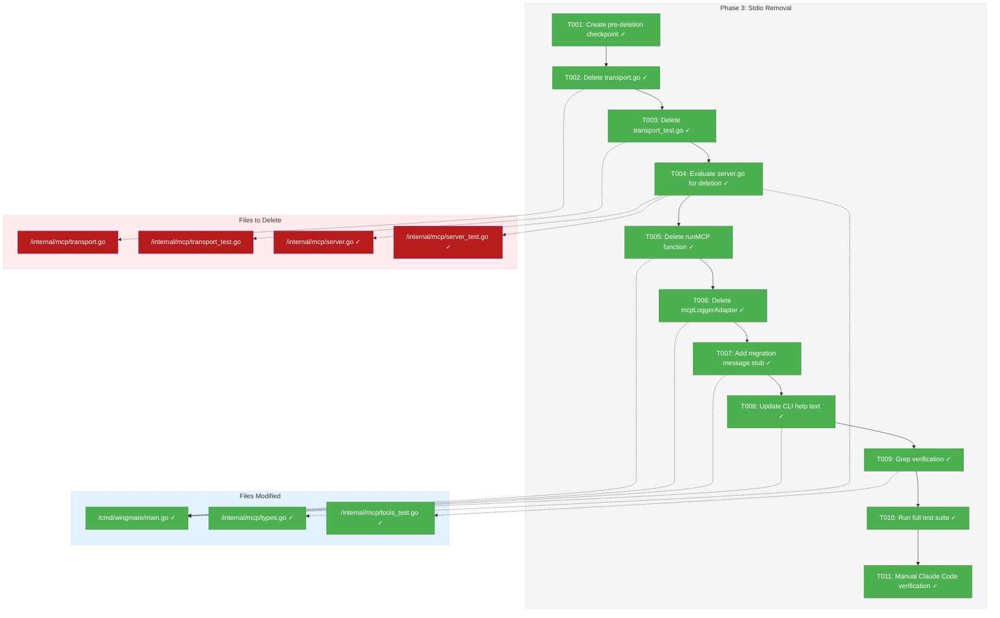

# Phase 3: Stdio Removal - Tasks & Alignment Brief

**Feature**: MCP HTTP Transport Migration
**Phase**: 3 of 4
**Plan**: [../../mcp-http-transport-plan.md](../../mcp-http-transport-plan.md)
**Spec**: [../../mcp-http-transport-spec.md](../../mcp-http-transport-spec.md)
**Created**: 2026-01-24
**Status**: ✅ COMPLETE

---

## Executive Briefing

### Purpose
This phase performs the clean removal of all stdio-based MCP code from Wingmate. With HTTP transport fully functional and verified via Phase 2's integration tests, the stdio code is now dead weight that must be deleted to complete the migration and prevent user confusion.

### What We're Doing
Complete removal of:
- `internal/mcp/transport.go` (56 lines) - NDJSON stdio transport
- `internal/mcp/transport_test.go` (127 lines) - stdio transport tests
- `internal/mcp/server.go` - stdio-based server (replace with stub or delete if unused)
- `cmd/wingmate/main.go:runMCP()` function (90 lines) - MCP subprocess entry point
- `cmd/wingmate/main.go:mcpLoggerAdapter` type (30 lines) - stdio logging adapter
- `wingmate mcp` CLI command - now shows helpful migration message

### User Value
Users get a cleaner codebase with no dead code paths. The `wingmate mcp` command now returns a helpful message guiding users to the new HTTP-based integration instead of silently failing or causing confusion.

### Example
**Before (stdio mode)**:
```bash
$ wingmate mcp
# Runs MCP server on stdin/stdout (deprecated)
```

**After (migration message)**:
```bash
$ wingmate mcp
Error: The 'mcp' command has been removed. MCP is now available via HTTP.

Start the agent: wingmate --port 9000
Configure Claude Code: claude mcp add --transport http wingmate http://localhost:9000/mcp

See docs/how/mcp-setup.md for detailed configuration.
```

---

## Objectives & Scope

### Objective
Complete removal of all stdio-based MCP code per acceptance criteria AC-6, ensuring the codebase contains only the HTTP transport implementation.

### Goals

- [x] Delete `internal/mcp/transport.go` (stdio transport)
- [x] Delete `internal/mcp/transport_test.go` (stdio tests)
- [x] Delete or refactor `internal/mcp/server.go` (stdio server)
- [x] Delete `runMCP()` function from main.go
- [x] Delete `mcpLoggerAdapter` type from main.go
- [x] Replace `mcp` command with helpful migration message
- [x] Update CLI help text to remove stdio references
- [x] Verify no remaining references to deleted code
- [x] Full test suite passes after deletion

### Non-Goals (Scope Boundaries)

- ❌ **Documentation updates** (Phase 4)
- ❌ **Backward compatibility** - Explicitly breaking change, no migration shim
- ❌ **New functionality** - This is pure deletion/cleanup
- ❌ **Refactoring HTTP transport** - HTTP code is complete from Phase 1/2
- ❌ **ADR updates** - ADR-004 amendment is Phase 4
- ❌ **Test additions** - Only test for migration message; existing integration tests validate HTTP

---

## Architecture Map

### Component Diagram
<!-- Status: grey=pending, orange=in-progress, green=completed, red=blocked -->
<!-- Updated by plan-6 during implementation -->



### Task-to-Component Mapping

<!-- Status: ⬜ Pending | 🟧 In Progress | ✅ Complete | 🔴 Blocked -->

| Task | Component(s) | Files | Status | Comment |
|------|-------------|-------|--------|---------|
| T001 | Git | N/A | ✅ Complete | Create `pre-stdio-removal` tag for rollback |
| T002 | MCP Transport | `/Users/vaughanknight/GitHub/wingmate/internal/mcp/transport.go` | ✅ Complete | DELETED - 56-line stdio transport |
| T003 | MCP Tests | `/Users/vaughanknight/GitHub/wingmate/internal/mcp/transport_test.go` | ✅ Complete | DELETED - 127-line stdio tests |
| T004 | MCP Server | `/Users/vaughanknight/GitHub/wingmate/internal/mcp/server.go`, `server_test.go`, `types.go` | ✅ Complete | Moved ServerConfig/ServerState/Logger to types.go, deleted server.go and server_test.go |
| T005 | CLI | `/Users/vaughanknight/GitHub/wingmate/cmd/wingmate/main.go` | ✅ Complete | Deleted runMCP() function |
| T006 | CLI | `/Users/vaughanknight/GitHub/wingmate/cmd/wingmate/main.go` | ✅ Complete | Deleted mcpLoggerAdapter type and methods, removed unused imports |
| T007 | CLI | `/Users/vaughanknight/GitHub/wingmate/cmd/wingmate/main.go` | ✅ Complete | Added runMCPMigrationMessage() function |
| T008 | CLI | `/Users/vaughanknight/GitHub/wingmate/cmd/wingmate/main.go` | ✅ Complete | Updated usage() with HTTP MCP info |
| T009 | Verification | All | ✅ Complete | Verified no references; also cleaned up tools_test.go and deleted tests/integration/mcp_test.go |
| T010 | Testing | All | ✅ Complete | Full test suite passes with -race flag |
| T011 | Validation | N/A | ✅ Complete | HTTP MCP endpoint verified: initialize + tools/list work |

---

## Tasks

| Status | ID | Task | CS | Type | Dependencies | Absolute Path(s) | Validation | Subtasks | Notes |
|--------|-----|------|----|------|--------------|------------------|------------|----------|-------|
| [x] | T001 | Create git tag `pre-stdio-removal` for rollback safety | 1 | Setup | – | N/A | `git tag -l pre-stdio-removal` shows tag | – | Per Discovery 07 rollback strategy |
| [x] | T002 | Delete `internal/mcp/transport.go` | 1 | Delete | T001 | `/Users/vaughanknight/GitHub/wingmate/internal/mcp/transport.go` | File does not exist; `go build ./...` succeeds | – | 56 lines removed |
| [x] | T003 | Delete `internal/mcp/transport_test.go` | 1 | Delete | T002 | `/Users/vaughanknight/GitHub/wingmate/internal/mcp/transport_test.go` | File does not exist; `go test ./...` compiles | – | 127 lines removed |
| [x] | T004 | Evaluate `internal/mcp/server.go` - delete if unused, keep types if needed | 2 | Delete/Eval | T003 | `/Users/vaughanknight/GitHub/wingmate/internal/mcp/server.go` | Decision documented; compile succeeds | – | Moved ServerConfig, ServerState, Logger to types.go; deleted server.go and server_test.go |
| [x] | T005 | Delete `runMCP()` function from main.go | 1 | Delete | T004 | `/Users/vaughanknight/GitHub/wingmate/cmd/wingmate/main.go` | Function removed; `go build ./cmd/wingmate` succeeds | – | Lines 363-454 |
| [x] | T006 | Delete `mcpLoggerAdapter` type and methods from main.go | 1 | Delete | T005 | `/Users/vaughanknight/GitHub/wingmate/cmd/wingmate/main.go` | Type removed; compile succeeds | – | Lines 332-361 |
| [x] | T007 | Replace `mcp` command case with helpful migration message and exit code 1 | 2 | Core | T006 | `/Users/vaughanknight/GitHub/wingmate/cmd/wingmate/main.go` | `wingmate mcp` prints migration guidance | – | AC-6 compliance |
| [x] | T008 | Update `usage()` function to remove stdio MCP references, add HTTP MCP info | 1 | Doc | T007 | `/Users/vaughanknight/GitHub/wingmate/cmd/wingmate/main.go` | Help text reflects HTTP transport | – | Remove env vars for MCP |
| [x] | T009 | Verify no remaining references to deleted identifiers | 1 | Verify | T008 | All | `grep -r "NewTransport\|runMCP\|mcpLoggerAdapter" internal/ cmd/` returns empty | – | Also removed stdio tests from tools_test.go and deleted tests/integration/mcp_test.go |
| [x] | T010 | Run full test suite including `-race` flag | 1 | Test | T009 | All | `go test ./... -race` passes; no regressions | – | All tests pass |
| [x] | T011 | Manual verification: Claude Code connects via HTTP transport | 1 | Verify | T010 | N/A | Claude Code initialize succeeds at localhost:PORT/mcp | – | Verified via curl: initialize + tools/list work |

### Task Details

#### T001: Create Pre-deletion Checkpoint

**Location**: Git working directory
**Command**:
```bash
git tag -a pre-stdio-removal -m "Checkpoint before stdio MCP code removal (Phase 3)"
```

**Rollback procedure** (if needed):
```bash
git checkout pre-stdio-removal
go build -o wingmate ./cmd/wingmate
```

---

#### T002: Delete transport.go

**Location**: `/Users/vaughanknight/GitHub/wingmate/internal/mcp/transport.go`

**Action**: `rm internal/mcp/transport.go`

**Contains** (56 lines):
- `Transport` struct (bufio.Scanner + io.Writer)
- `NewTransport(r io.Reader, w io.Writer)` factory
- `Read(v any) error` - NDJSON reader
- `Write(v any) error` - NDJSON writer

**Impact**: Removes stdio transport entirely. Server.go references Transport - must handle.

---

#### T003: Delete transport_test.go

**Location**: `/Users/vaughanknight/GitHub/wingmate/internal/mcp/transport_test.go`

**Action**: `rm internal/mcp/transport_test.go`

**Contains** (127 lines):
- `TestTransportReadNDJSON`
- `TestTransportWriteNDJSON`
- `TestTransportHandlesMultipleMessages`
- `TestTransportRejectsInvalidJSON`
- `TestTransportReturnsEOFOnEmptyInput`

---

#### T004: Evaluate server.go for Deletion

**Location**: `/Users/vaughanknight/GitHub/wingmate/internal/mcp/server.go`

**Decision Required**: The stdio `Server` struct depends on deleted `Transport`. Options:

**Option A: Delete entire file** (Recommended if types not used elsewhere)
- `Server` struct
- `ServerState` enum
- `ServerConfig` struct
- `Logger` interface
- All methods

**Option B: Keep types, delete Server**
- Keep: `ServerConfig`, `ServerState`, `Logger`
- Delete: `Server` struct and all methods

**Check for usage**:
```bash
grep -r "ServerConfig\|ServerState\|mcp\.Logger" --include="*.go" | grep -v "server.go\|server_test.go"
```

**Note**: `http_transport.go` uses `ServerConfig` for HTTPHandler. Must verify before deletion.

---

#### T005: Delete runMCP Function

**Location**: `/Users/vaughanknight/GitHub/wingmate/cmd/wingmate/main.go` lines 363-454

**Contains**:
- Environment variable reading for `WINGMATE_LLM_MODEL`, `WINGMATE_LLM_TIMEOUT`
- LLM executor creation with options
- Flight Log setup for MCP
- Transport creation (`NewTransport(os.Stdin, os.Stdout)`)
- Server creation and tool registration
- Signal handling
- Server.Run() call

**Note**: Remove the `case "mcp":` handler in the switch statement but add a stub (T007).

---

#### T006: Delete mcpLoggerAdapter Type

**Location**: `/Users/vaughanknight/GitHub/wingmate/cmd/wingmate/main.go` lines 332-361

**Contains**:
- `mcpLoggerAdapter` struct with `fl` and `agentID` fields
- `Record(entry any) error` method
- `Close() error` method

---

#### T007: Add Migration Message Stub

**Location**: `/Users/vaughanknight/GitHub/wingmate/cmd/wingmate/main.go`

**Replace** `case "mcp":` with:
```go
case "mcp":
    return runMCPMigrationMessage()
```

**Add function**:
```go
// runMCPMigrationMessage prints guidance for users trying to use the removed stdio MCP mode.
func runMCPMigrationMessage() int {
    fmt.Fprintln(os.Stderr, `Error: The 'mcp' command has been removed. MCP is now available via HTTP.

Start the agent:
  wingmate --port 9000

Configure Claude Code:
  claude mcp add --transport http wingmate http://localhost:9000/mcp

See docs/how/mcp-setup.md for detailed configuration.`)
    return ExitConfigError
}
```

**AC-6 Compliance**: User runs `wingmate mcp` → gets helpful migration message.

---

#### T008: Update CLI Help Text

**Location**: `/Users/vaughanknight/GitHub/wingmate/cmd/wingmate/main.go` `usage()` function

**Changes**:
1. Remove `mcp` command from Commands section
2. Remove `Environment Variables (for mcp command)` section
3. Update Examples to show HTTP MCP configuration

**New usage**:
```go
func usage() {
    fmt.Fprintf(os.Stderr, `Usage: wingmate [options] [command]

Wingmate is an A2A (Agent-to-Agent) communication tool with MCP support.

Options:
  --name      Agent name (required for server mode)
  --port      Listen port (default: 9000)
  --peers     Comma-separated list of peer URLs
  --log       Flight log path (default: ./flight.jsonl)
  --verbose   Mirror logs to stdout
  --config    Config file path
  --help      Show help

Commands:
  (none)              Start agent server (serves A2A and MCP)
  ping <peer-url>     Send ping to a peer
  status <peer-url>   Fetch peer's Agent Card

MCP Integration:
  MCP tools are available at http://localhost:<port>/mcp
  Configure Claude Code: claude mcp add --transport http wingmate http://localhost:9000/mcp

Examples:
  wingmate --port 9000 --name my-agent
  wingmate ping http://localhost:9001 --name sender
  wingmate status http://localhost:9001
`)
}
```

---

#### T009: Grep Verification

**Commands**:
```bash
# Verify no references to deleted stdio code
grep -r "NewTransport" internal/ cmd/ --include="*.go"
grep -r "runMCP" cmd/ --include="*.go" | grep -v "runMCPMigrationMessage"
grep -r "mcpLoggerAdapter" cmd/ --include="*.go"
grep -r "mcp\.Transport" --include="*.go"
```

**Expected**: All commands return empty (no matches).

---

#### T010: Run Full Test Suite

**Commands**:
```bash
# Build check
go build ./...

# Test suite with race detector
go test ./... -race -timeout 120s

# Verify MCP integration tests still pass
go test ./internal/agent/... -v -run "TestAgent_MCP" -timeout 60s
```

**Expected**: All tests pass, no races.

---

#### T011: Manual Claude Code Verification

**Steps**:
1. Start agent: `./wingmate --port 9000 --name test-agent`
2. Configure Claude Code (if not already):
   ```bash
   claude mcp add --transport http wingmate http://localhost:9000/mcp
   ```
3. Verify tools available: In Claude Code, check MCP tools list
4. Test `wingmate_status` tool returns valid JSON
5. Stop agent: Ctrl+C

**Expected**: Claude Code connects successfully, lists 3 tools, can invoke them.

---

## Alignment Brief

### Prior Phases Review Summary

#### Phase 1: HTTP Transport Layer (Complete)

**Deliverables Available**:
| Export | File | Purpose |
|--------|------|---------|
| `HTTPHandler` | `/Users/vaughanknight/GitHub/wingmate/internal/mcp/http_transport.go` | HTTP handler implementing `http.Handler` |
| `NewHTTPHandler(config, sessionMgr)` | http_transport.go | Factory function |
| `LocalhostMiddleware(h http.Handler)` | `/Users/vaughanknight/GitHub/wingmate/internal/mcp/localhost.go` | Security wrapper |
| `NewMCPSessionManager(ttl, cleanup)` | `/Users/vaughanknight/GitHub/wingmate/internal/mcp/session.go` | Session manager factory |
| `MCPSessionManager.ActiveCount()` | session.go | For status reporting |
| `IsLocalhost(r *http.Request)` | localhost.go | Direct check if needed |
| `ServerConfig` | http_transport.go | Configuration struct (also in server.go) |

**Lessons Learned**:
1. Self-contained HTTPHandler approach worked well - handlers don't need access to server.go internals
2. Copy-on-write pattern for cleanup is race-safe
3. JSON-RPC IDs come as `float64` from `json.Unmarshal` - preserve as `any`
4. IPv6 localhost requires `net.SplitHostPort` for bracket handling

**Test Infrastructure Created**:
- `localhost_test.go` (20 test cases)
- `session_test.go` (13 tests)
- `http_transport_test.go` (12 tests)
- All tests pass with `-race` flag

---

#### Phase 2: Agent Integration (Complete)

**Deliverables Available**:
| Export | File | Purpose |
|--------|------|---------|
| `PeerProvider` interface | `/Users/vaughanknight/GitHub/wingmate/internal/mcp/handlers.go` | Dependency injection for peers |
| `Agent.GetPeers()` | `/Users/vaughanknight/GitHub/wingmate/internal/agent/agent.go` | Thread-safe peer retrieval |
| `A2AServer.SetMCPHandler(h)` | `/Users/vaughanknight/GitHub/wingmate/internal/protocol/server.go` | MCP handler injection |
| `/mcp` route | server.go | HTTP route for MCP requests |

**Lessons Learned**:
1. Interface-based dependency injection avoids circular imports
2. `Port: 0` means auto-assign - don't override in `WithDefaults()`
3. Pre-existing test failures (`TestAgent_Start`, `TestAgent_FullPingPong`) unrelated to Phase 2

**Test Infrastructure Created**:
- `mcp_integration_test.go` - 4 integration tests
- `mockPeerProvider` in handlers_test.go
- Concurrent MCP + A2A test validates no interference

**Key Integration Point**:
```go
// In agent.New()
mcpHandler := mcp.NewHTTPHandler(mcpConfig, mcpSessionMgr)
// ... register tools ...
server.SetMCPHandler(mcp.LocalhostMiddleware(mcpHandler))
```

---

### Cross-Phase Synthesis

**Evolution**:
- Phase 1 built standalone HTTP infrastructure
- Phase 2 integrated it into the agent
- Phase 3 removes the now-obsolete stdio code

**Cumulative Deliverables** (all still needed after Phase 3):
- All Phase 1 exports (HTTP transport, session, localhost)
- All Phase 2 exports (PeerProvider, integration)
- `ServerConfig` struct (used by HTTPHandler)

**Components Becoming Obsolete**:
- `Transport` struct and functions (stdio)
- `Server` struct (stdio-based, may have useful types)
- `runMCP()` function
- `mcpLoggerAdapter` type

**Pattern Continuity**:
- `sync.RWMutex` for thread-safe access
- Interface-based dependency injection
- Table-driven tests with Test Doc headers

---

### Critical Findings Affecting This Phase

| Finding | Impact | How Addressed |
|---------|--------|---------------|
| **Discovery 07**: Rollback Strategy | Task ordering | T001 creates git tag before any deletions |
| **AC-6**: stdio mode removed | Primary goal | T007 adds migration message |
| **ADR-004 superseding** | Documentation | Phase 4 will update ADR; this phase just deletes code |

---

### ADR Decision Constraints

**ADR-004**: "stdio transport only (no HTTP for MCP)" - **BEING SUPERSEDED**

This phase completes the supersession declared in the plan:
- Remove all stdio transport code
- HTTP transport (Phase 1/2) is now the only MCP transport
- ADR-004 will be updated in Phase 4 to reflect this

**Constraint Compliance**:
- T001-T006: Perform removal of stdio code
- T007: AC-6 compliance (helpful error message)
- Phase 4: ADR-004 amendment (not this phase)

---

### Test Plan

**Approach**: Lightweight (deletion phase)

| Test | Type | Purpose | File |
|------|------|---------|------|
| Build check | Compile | Code compiles after deletion | All |
| Full test suite | Regression | Existing tests still pass | `go test ./...` |
| Race detection | Concurrency | No races introduced | `-race` flag |
| Integration tests | E2E | HTTP MCP still works | `mcp_integration_test.go` |
| Manual validation | Acceptance | Claude Code connects | Manual |

**No new tests needed** except:
- Optionally test `wingmate mcp` returns exit code 1 and migration message

---

### Implementation Outline

1. **T001**: Create safety checkpoint (git tag)
2. **T002-T003**: Delete stdio transport files
3. **T004**: Evaluate and handle server.go
4. **T005-T006**: Delete runMCP and adapter from main.go
5. **T007**: Add migration message stub
6. **T008**: Update help text
7. **T009**: Grep verification (no dangling references)
8. **T010**: Full test suite
9. **T011**: Manual Claude Code verification

---

### Commands to Run

```bash
# Pre-implementation
git status
git tag -a pre-stdio-removal -m "Checkpoint before stdio MCP code removal"

# Deletion (T002-T006)
rm internal/mcp/transport.go
rm internal/mcp/transport_test.go
# Edit server.go or delete based on T004 evaluation
# Edit main.go to remove runMCP, mcpLoggerAdapter

# Verification (T009)
grep -r "NewTransport" internal/ cmd/ --include="*.go"
grep -r "runMCP" cmd/ --include="*.go" | grep -v "runMCPMigrationMessage"
grep -r "mcpLoggerAdapter" cmd/ --include="*.go"

# Build and test (T010)
go build ./...
go test ./... -race -timeout 120s
go test ./internal/agent/... -v -run "TestAgent_MCP"

# Manual verification (T011)
./wingmate --port 9000 --name test-agent
# In another terminal: test with Claude Code
```

---

### Risks & Mitigations

| Risk | Likelihood | Impact | Mitigation |
|------|------------|--------|------------|
| Missed reference causes compile error | Low | Low | T009 grep verification |
| server.go types needed elsewhere | Medium | Medium | T004 evaluates before deletion |
| Regression in HTTP transport | Low | High | T010 full test suite + T011 manual |
| Users confused by removal | Medium | Medium | T007 migration message |

---

### Ready Check

- [x] Phase 2 integration tests passing
- [x] All dependencies (Phase 1, Phase 2) complete
- [x] Plan tasks understood
- [x] ADR constraints identified (superseding ADR-004)
- [x] Rollback strategy defined (git tag)
- [x] Test commands prepared

---

## Phase Footnote Stubs

_To be populated during implementation by plan-6a-update-progress._

| ID | Note | Task |
|----|------|------|
| | | |

---

## Evidence Artifacts

| Task | Evidence | Notes |
|------|----------|-------|
| T001 | `git tag -l pre-stdio-removal` output | |
| T002 | `ls internal/mcp/transport.go` shows "No such file" | |
| T003 | `ls internal/mcp/transport_test.go` shows "No such file" | |
| T004 | Decision documented + compile output | |
| T005 | `grep runMCP cmd/` returns empty | |
| T006 | `grep mcpLoggerAdapter cmd/` returns empty | |
| T007 | `wingmate mcp` stderr output | |
| T008 | `wingmate --help` output | |
| T009 | All grep commands return empty | |
| T010 | `go test ./... -race` output | |
| T011 | Claude Code connection screenshot/log | |

**Execution log location**: `docs/plans/004-mcp-http-transport/tasks/phase-3-stdio-removal/execution.log.md`

---

## Discoveries & Learnings

_Populated during implementation by plan-6. Log anything of interest to your future self._

| Date | Task | Type | Discovery | Resolution | References |
|------|------|------|-----------|------------|------------|
| 2026-01-24 | T004 | decision | `ServerConfig`, `ServerState`, `Logger` used by http_transport.go - cannot delete server.go completely | Moved shared types to types.go before deleting server.go and server_test.go | execution.log.md#task-t004 |
| 2026-01-24 | T009 | unexpected-behavior | Found stdio tests in tools_test.go and tests/integration/mcp_test.go that referenced deleted NewTransport/NewServer | Removed stdio tests from tools_test.go (kept schema tests); deleted entire mcp_test.go since HTTP tests cover functionality | execution.log.md#task-t009 |

**Types**: `gotcha` | `research-needed` | `unexpected-behavior` | `workaround` | `decision` | `debt` | `insight`

**What to log**:
- Things that didn't work as expected
- External research that was required
- Implementation troubles and how they were resolved
- Gotchas and edge cases discovered
- Decisions made during implementation
- Technical debt introduced (and why)
- Insights that future phases should know about

_See also: `execution.log.md` for detailed narrative._

---

## Directory Structure

```
docs/plans/004-mcp-http-transport/
├── mcp-http-transport-plan.md
├── mcp-http-transport-spec.md
└── tasks/
    ├── phase-1-http-transport/
    │   ├── tasks.md
    │   └── execution.log.md
    ├── phase-2-agent-integration/
    │   ├── tasks.md
    │   └── execution.log.md
    └── phase-3-stdio-removal/
        ├── tasks.md              ← This file
        └── execution.log.md      ← Created by /plan-6
```
