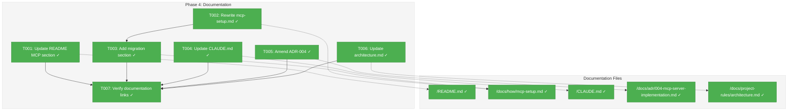

# Phase 4: Documentation - Tasks & Alignment Brief

**Feature**: MCP HTTP Transport Migration
**Phase**: 4 of 4
**Plan**: [../../mcp-http-transport-plan.md](../../mcp-http-transport-plan.md)
**Spec**: [../../mcp-http-transport-spec.md](../../mcp-http-transport-spec.md)
**Created**: 2026-01-24
**Status**: COMPLETE

---

## Executive Briefing

### Purpose
This phase updates all user-facing and developer documentation to reflect the completed MCP HTTP transport migration. With Phases 1-3 complete, Wingmate now exclusively uses HTTP transport for MCP—the documentation must be updated to prevent user confusion and provide clear setup instructions.

### What We're Doing
Documentation updates across 5 files:
1. **README.md** - Update MCP quick-start section with HTTP configuration
2. **docs/how/mcp-setup.md** - Complete rewrite from stdio to HTTP transport
3. **CLAUDE.md** - Update MCP section for Claude Code integration context
4. **docs/adr/004-mcp-server-implementation.md** - Amend to remove "stdio only" constraint
5. **docs/project-rules/architecture.md** - Document `/mcp` route pattern

### User Value
Users get accurate, up-to-date documentation that:
- Enables successful first-time MCP setup with HTTP transport
- Provides migration guidance for users upgrading from stdio (if any)
- Prevents confusion from outdated stdio references
- Gives Claude Code developers proper onboarding context

### Example
**Before (stdio):**
```json
{
  "mcpServers": {
    "wingmate": {
      "command": "/usr/local/bin/wingmate",
      "args": ["mcp"],
      "type": "stdio"
    }
  }
}
```

**After (HTTP):**
```bash
# Start Wingmate agent
wingmate --port 9000 --name my-agent

# Configure Claude Code
claude mcp add --transport http wingmate http://localhost:9000/mcp
```

---

## Objectives & Scope

### Objective
Update all documentation to reflect HTTP-only MCP transport per acceptance criteria AC-7, AC-9, and AC-10.

### Goals

- [x] Update README.md MCP quick-start with `claude mcp add --transport http` command
- [x] Rewrite docs/how/mcp-setup.md for HTTP transport with complete configuration guide
- [x] Add migration section for users upgrading from stdio (if any existed)
- [x] Update CLAUDE.md MCP section to reflect HTTP transport
- [x] Amend ADR-004 to remove "stdio transport only" constraint
- [x] Document `/mcp` route pattern in architecture.md
- [x] Verify all internal documentation links work

### Non-Goals (Scope Boundaries)

- ❌ **New features** - Documentation only, no code changes
- ❌ **External documentation** - Only updating docs in this repository
- ❌ **Translation** - English only
- ❌ **Video tutorials** - Text documentation only
- ❌ **API reference generation** - Manual documentation updates only
- ❌ **Changelog** - Will be handled at release time

---

## Architecture Map

### Component Diagram
<!-- Status: grey=pending, orange=in-progress, green=completed, red=blocked -->
<!-- Updated by plan-6 during implementation -->



### Task-to-Component Mapping

<!-- Status: ⬜ Pending | 🟧 In Progress | ✅ Complete | 🔴 Blocked -->

| Task | Component(s) | Files | Status | Comment |
|------|-------------|-------|--------|---------|
| T001 | README | `/Users/vaughanknight/GitHub/wingmate/README.md` | ✅ Complete | Update MCP quick-start section |
| T002 | Setup Guide | `/Users/vaughanknight/GitHub/wingmate/docs/how/mcp-setup.md` | ✅ Complete | Major rewrite for HTTP transport |
| T003 | Setup Guide | `/Users/vaughanknight/GitHub/wingmate/docs/how/mcp-setup.md` | ✅ Complete | Add migration from stdio section |
| T004 | Project Context | `/Users/vaughanknight/GitHub/wingmate/CLAUDE.md` | ✅ Complete | Update MCP section for HTTP |
| T005 | ADR | `/Users/vaughanknight/GitHub/wingmate/docs/adr/004-mcp-server-implementation.md` | ✅ Complete | Remove stdio-only constraint |
| T006 | Architecture | `/Users/vaughanknight/GitHub/wingmate/docs/project-rules/architecture.md` | ✅ Complete | Document /mcp route pattern |
| T007 | Verification | All docs | ✅ Complete | Check all internal links |

---

## Tasks

| Status | ID | Task | CS | Type | Dependencies | Absolute Path(s) | Validation | Subtasks | Notes |
|--------|-----|------|----|------|--------------|------------------|------------|----------|-------|
| [x] | T001 | Update README.md MCP quick-start section | 2 | Doc | – | `/Users/vaughanknight/GitHub/wingmate/README.md` | Shows `claude mcp add --transport http` command; removes `wingmate mcp` command | – | Plan task 4.1 |
| [x] | T002 | Rewrite docs/how/mcp-setup.md for HTTP transport | 3 | Doc | – | `/Users/vaughanknight/GitHub/wingmate/docs/how/mcp-setup.md` | Complete guide with HTTP configuration, troubleshooting | – | Plan task 4.2; major update |
| [x] | T003 | Add "Migrating from Stdio" section to mcp-setup.md | 2 | Doc | T002 | `/Users/vaughanknight/GitHub/wingmate/docs/how/mcp-setup.md` | Clear guidance for users upgrading from stdio | – | Plan task 4.3 |
| [x] | T004 | Update CLAUDE.md MCP section | 2 | Doc | – | `/Users/vaughanknight/GitHub/wingmate/CLAUDE.md` | Reflects HTTP transport; removes stdio references | – | Plan task 4.4 |
| [x] | T005 | Amend ADR-004 to reflect HTTP transport decision | 2 | Doc | – | `/Users/vaughanknight/GitHub/wingmate/docs/adr/004-mcp-server-implementation.md` | Remove "stdio transport only" constraint; add HTTP rationale | – | Plan task 4.5; ADR-004 amendment |
| [x] | T006 | Update architecture.md with /mcp route pattern | 1 | Doc | – | `/Users/vaughanknight/GitHub/wingmate/docs/project-rules/architecture.md` | Document HTTP transport and A2AServer routing | – | Plan task 4.7 |
| [x] | T007 | Verify all documentation links | 1 | Verify | T001, T002, T003, T004, T005, T006 | All docs | No broken internal links | – | Plan task 4.6 |

### Task Details

#### T001: Update README.md MCP Quick-Start Section

**Location**: `/Users/vaughanknight/GitHub/wingmate/README.md` lines 231-282

**Current Content** (needs update):
- References `wingmate mcp` command
- Shows stdio configuration in `~/.claude.json`
- Lists `mcp` in Commands section

**Updated Content**:
```markdown
## MCP Server (Claude Code Integration)

Wingmate exposes MCP tools via HTTP for Claude Code integration:

```bash
# Start Wingmate agent
wingmate --port 9000 --name my-agent

# Configure Claude Code (run once)
claude mcp add --transport http wingmate http://localhost:9000/mcp
```

Available tools: `wingmate_chat`, `wingmate_status`, `wingmate_discover`

For detailed setup, see [docs/how/mcp-setup.md](docs/how/mcp-setup.md).
```

**Changes Required**:
1. Replace MCP section content with HTTP-based setup
2. Remove `mcp` from Commands list (line 94)
3. Update example commands section
4. Keep troubleshooting reference to mcp-setup.md

---

#### T002: Rewrite docs/how/mcp-setup.md for HTTP Transport

**Location**: `/Users/vaughanknight/GitHub/wingmate/docs/how/mcp-setup.md`

**Current Content**: ~400 lines describing stdio transport setup

**New Structure**:
1. **Overview** - HTTP transport, single process architecture
2. **Prerequisites** - Wingmate installed, Claude Code CLI
3. **Quick Start** - 3-step setup (start agent, configure Claude Code, verify)
4. **Configuration** - `claude mcp add --transport http` command details
5. **Environment Variables** - Unchanged (WINGMATE_LLM_MODEL, WINGMATE_LLM_TIMEOUT)
6. **Available Tools** - wingmate_chat, wingmate_status, wingmate_discover (schemas)
7. **Architecture** - New diagram showing HTTP transport flow
8. **Troubleshooting** - Updated for HTTP (connection refused, port in use, 403 errors)
9. **Migration from Stdio** - (T003 adds this)
10. **Security** - Localhost-only access via middleware
11. **Related Documentation** - Links

**Key Content Changes**:
- Remove all stdio configuration (`~/.claude.json` with `"type": "stdio"`)
- Add `claude mcp add --transport http` command
- Update architecture diagram from stdin/stdout to HTTP
- Update troubleshooting for HTTP-specific issues
- Remove `wingmate mcp` manual startup instructions

---

#### T003: Add "Migrating from Stdio" Section

**Location**: `/Users/vaughanknight/GitHub/wingmate/docs/how/mcp-setup.md` (append section)

**Content**:
```markdown
## Migrating from Stdio Transport

If you previously configured Wingmate with stdio transport, follow these steps to migrate:

### Step 1: Remove Old Configuration

Remove the wingmate entry from `~/.claude.json`:

```json
// DELETE this configuration:
{
  "mcpServers": {
    "wingmate": {  // <-- Remove this entire block
      "command": "/usr/local/bin/wingmate",
      "args": ["mcp"],
      "type": "stdio"
    }
  }
}
```

### Step 2: Start Wingmate Agent

The `wingmate mcp` command has been removed. Instead, start the full agent:

```bash
wingmate --port 9000 --name my-agent
```

### Step 3: Configure HTTP Transport

```bash
claude mcp add --transport http wingmate http://localhost:9000/mcp
```

### Step 4: Restart Claude Code

Completely quit and reopen Claude Code for changes to take effect.

### What Changed

| Aspect | Before (Stdio) | After (HTTP) |
|--------|----------------|--------------|
| Command | `wingmate mcp` | `wingmate --port 9000 --name my-agent` |
| Configuration | `~/.claude.json` manual edit | `claude mcp add --transport http` |
| Process Model | Claude Code spawns subprocess | You start agent, Claude Code connects |
| Peer Discovery | Always empty | Returns actual known peers |
| Session State | Per-subprocess | Shared with A2A agent |

### Troubleshooting Migration

**"The 'mcp' command has been removed"**

This is expected. The old stdio transport is no longer available. Start the agent with `wingmate --port 9000 --name my-agent` instead.

**Tools not appearing after migration**

1. Verify agent is running: `curl http://localhost:9000/.well-known/agent.json`
2. Verify MCP configured: `claude mcp list`
3. Restart Claude Code completely
```

---

#### T004: Update CLAUDE.md MCP Section

**Location**: `/Users/vaughanknight/GitHub/wingmate/CLAUDE.md` MCP Server section

**Current Content** (lines ~60-100):
- References `wingmate mcp` command
- Shows stdio configuration
- Lists environment variables for mcp command

**Changes Required**:
1. Update "Running MCP Mode" to show agent mode
2. Remove `wingmate mcp` command references
3. Update configuration to use `claude mcp add --transport http`
4. Update "How It Works" diagram to show HTTP transport
5. Keep tool list and error codes (unchanged)
6. Update file locations table (remove server.go, transport.go references)

**New Content**:
```markdown
## MCP Server

Wingmate exposes MCP (Model Context Protocol) tools via HTTP at `/mcp` endpoint. This enables Claude Code to invoke Wingmate tools directly.

### Running MCP Mode

MCP is available automatically when running the agent:

```bash
# Start agent (MCP available at http://localhost:9000/mcp)
wingmate --port 9000 --name my-agent
```

### Configuring Claude Code

```bash
claude mcp add --transport http wingmate http://localhost:9000/mcp
```

### Tools Exposed

| Tool | Purpose |
|------|---------|
| `wingmate_chat` | Send messages through LLM integration |
| `wingmate_status` | Get operational status and health |
| `wingmate_discover` | Discover available peer agents |
```

---

#### T005: Amend ADR-004 for HTTP Transport

**Location**: `/Users/vaughanknight/GitHub/wingmate/docs/adr/004-mcp-server-implementation.md`

**Changes Required**:

1. **Update Status**: Keep "DECIDED" but note amendment
2. **Add Amendment Section**: Document the HTTP transport change
3. **Update Constraints**: Remove "stdio transport only (no HTTP for MCP)"
4. **Update Implementation Notes**: Reflect current file structure
5. **Update MACHINE-READABLE CONTEXT**: Remove stdio constraint

**Amendment Content**:
```markdown
---

## Amendment: HTTP Transport Migration (2026-01-24)

**Context**: The original ADR specified "stdio transport only (no HTTP for MCP)". This constraint has been superseded by the MCP HTTP Transport Migration (Plan 004).

**Rationale for Change**:
1. Stdio isolation prevented `wingmate_discover` from returning actual peers
2. Users had to manage two separate processes (agent + MCP)
3. Single process serves both A2A and MCP, simplifying operations
4. MCP Streamable HTTP (2025-03-26) is the current protocol standard

**New Decision**:
- MCP is available via HTTP transport only at `/mcp` endpoint
- Stdio transport has been removed
- Users configure via `claude mcp add --transport http`

**Updated Implementation**:
```
internal/mcp/
├── http_transport.go   # HTTP handler implementing http.Handler
├── localhost.go        # Localhost-only middleware (returns 403)
├── session.go          # Session manager with 30-min TTL
├── tools.go            # Tool definitions (unchanged)
├── handlers.go         # Tool handlers with PeerProvider interface
├── types.go            # ServerConfig, ServerState, Logger (moved from server.go)
└── errors.go           # Error codes 3001-3099 (unchanged)
```

**Files Removed**:
- `transport.go` (stdio transport)
- `server.go` (stdio server)

**Superseded Constraint**:
~~"stdio transport only (no HTTP for MCP)"~~ → HTTP transport only at `/mcp` endpoint
```

**MACHINE-READABLE CONTEXT Update**:
```yaml
constraints:
  - "Use modelcontextprotocol/go-sdk v1.1.0 (no other MCP libraries)"
  - "MCP error codes must be in range 3001-3099"
  - "All MCP tool invocations must log to Flight Log"
  - "Use adapter pattern to isolate SDK API changes"
  - "HTTP transport only at /mcp endpoint (stdio removed)"  # UPDATED

implementation:
  status: "complete"  # UPDATED
  location: "internal/mcp/"
```

---

#### T006: Update architecture.md with /mcp Route Pattern

**Location**: `/Users/vaughanknight/GitHub/wingmate/docs/project-rules/architecture.md`

**Changes Required**:

1. **Update Section 2.3 Module Boundaries**: Add `internal/mcp/` to dependency rules
2. **Add MCP HTTP Route Pattern**: Document `/mcp` endpoint in A2AServer
3. **Update Component Diagram**: Show HTTP transport integration

**New Content for Section 2.3**:
```markdown
### 2.4 MCP HTTP Integration

The MCP server is integrated into the A2A server via HTTP transport:

```
┌─────────────────────────────────────────────────────────────────┐
│                    A2A SERVER HTTP ROUTES                        │
├─────────────────────────────────────────────────────────────────┤
│                                                                  │
│   /.well-known/agent.json  →  handleAgentCard()                 │
│   /a2a                     →  handleA2A()                       │
│   /mcp                     →  LocalhostMiddleware(MCPHandler)   │
│                                                                  │
└─────────────────────────────────────────────────────────────────┘
```

**MCP Security Model**:
- `/mcp` endpoint is wrapped with `LocalhostMiddleware`
- Non-localhost requests receive HTTP 403 Forbidden
- MCP handlers have access to agent state via `PeerProvider` interface

**Dependency Flow**:
```
internal/agent/
    │
    ├──imports──► internal/mcp/ (NewHTTPHandler, LocalhostMiddleware)
    │
    └──implements──► mcp.PeerProvider (Agent.GetPeers())
```
```

**Add to Dependency Rules**:
```markdown
- `internal/mcp/` MAY import `internal/flightlog/`
- `internal/agent/` MAY import `internal/mcp/`
- `internal/mcp/` MUST NOT import `internal/agent/` (use interfaces)
```

---

#### T007: Verify Documentation Links

**Commands**:
```bash
# Find all markdown links
grep -r "\](" docs/ README.md CLAUDE.md --include="*.md" | grep -v "http"

# Check each internal link exists
# Manual verification required for each link
```

**Links to Verify**:
- README.md → docs/how/mcp-setup.md
- README.md → docs/how/llm-setup.md
- mcp-setup.md → llm-setup.md
- mcp-setup.md → README.md
- mcp-setup.md → CLAUDE.md
- CLAUDE.md → docs/how/mcp-setup.md
- CLAUDE.md → docs/adr/004-mcp-server-implementation.md
- architecture.md → constitution.md
- architecture.md → docs/adr/003-unified-peer-architecture.md

---

## Alignment Brief

### Prior Phases Review Summary

#### Phase 1: HTTP Transport Layer (Complete)

**Deliverables Available**:
| Export | File | Purpose |
|--------|------|---------|
| `HTTPHandler` | `/Users/vaughanknight/GitHub/wingmate/internal/mcp/http_transport.go` | HTTP handler implementing `http.Handler` |
| `NewHTTPHandler(config, sessionMgr)` | http_transport.go | Factory function |
| `LocalhostMiddleware(h http.Handler)` | `/Users/vaughanknight/GitHub/wingmate/internal/mcp/localhost.go` | Security wrapper returning 403 for non-localhost |
| `NewMCPSessionManager(ttl, cleanup)` | `/Users/vaughanknight/GitHub/wingmate/internal/mcp/session.go` | Session manager factory |
| `MCPSessionManager.ActiveCount()` | session.go | For status reporting |
| `IsLocalhost(r *http.Request)` | localhost.go | Direct check if needed |
| `ServerConfig` | types.go | Configuration struct |

**Lessons Learned**:
1. Self-contained HTTPHandler approach worked well - handlers don't need access to server.go internals
2. Copy-on-write pattern for cleanup is race-safe
3. JSON-RPC IDs come as `float64` from `json.Unmarshal` - preserve as `any`
4. IPv6 localhost requires `net.SplitHostPort` for bracket handling

**Test Infrastructure Created**:
- `localhost_test.go` (20 test cases)
- `session_test.go` (13 tests)
- `http_transport_test.go` (12 tests)
- All tests pass with `-race` flag

---

#### Phase 2: Agent Integration (Complete)

**Deliverables Available**:
| Export | File | Purpose |
|--------|------|---------|
| `PeerProvider` interface | `/Users/vaughanknight/GitHub/wingmate/internal/mcp/handlers.go` | Dependency injection for peers |
| `Agent.GetPeers()` | `/Users/vaughanknight/GitHub/wingmate/internal/agent/agent.go` | Thread-safe peer retrieval |
| `A2AServer.SetMCPHandler(h)` | `/Users/vaughanknight/GitHub/wingmate/internal/protocol/server.go` | MCP handler injection |
| `/mcp` route | server.go | HTTP route for MCP requests |

**Lessons Learned**:
1. Interface-based dependency injection avoids circular imports
2. `Port: 0` means auto-assign - don't override in `WithDefaults()`
3. Pre-existing test failures (`TestAgent_Start`, `TestAgent_FullPingPong`) unrelated to migration

**Test Infrastructure Created**:
- `mcp_integration_test.go` - 4 integration tests
- `mockPeerProvider` in handlers_test.go
- Concurrent MCP + A2A test validates no interference

**Key Integration Point**:
```go
// In agent.New()
mcpHandler := mcp.NewHTTPHandler(mcpConfig, mcpSessionMgr)
// ... register tools ...
server.SetMCPHandler(mcp.LocalhostMiddleware(mcpHandler))
```

---

#### Phase 3: Stdio Removal (Complete)

**Files Deleted**:
| File | Lines | Reason |
|------|-------|--------|
| `internal/mcp/transport.go` | 56 | Stdio NDJSON transport |
| `internal/mcp/transport_test.go` | 127 | Tests for deleted code |
| `internal/mcp/server.go` | ~300 | Stdio server (types moved to types.go) |
| `internal/mcp/server_test.go` | ~100 | Tests for deleted code |
| `tests/integration/mcp_test.go` | ~50 | Stdio integration tests |

**Files Modified**:
| File | Changes |
|------|---------|
| `types.go` | Added `ServerConfig`, `ServerState`, `Logger` |
| `cmd/wingmate/main.go` | Removed `runMCP`, added `runMCPMigrationMessage()` |
| `tools_test.go` | Removed stdio-dependent tests |

**Discoveries**:
1. `ServerConfig`, `ServerState`, `Logger` needed migration to `types.go` before server.go deletion
2. Additional stdio tests existed in `tools_test.go` and `tests/integration/mcp_test.go`

**AC-6 Compliance**:
```
$ wingmate mcp
Error: The 'mcp' command has been removed. MCP is now available via HTTP.

Start the agent:
  wingmate --port 9000 --name my-agent

Configure Claude Code:
  claude mcp add --transport http wingmate http://localhost:9000/mcp
```

---

### Cross-Phase Synthesis

**Evolution**:
- Phase 1: Built standalone HTTP infrastructure (HTTPHandler, SessionManager, LocalhostMiddleware)
- Phase 2: Integrated into agent, added /mcp route, PeerProvider interface
- Phase 3: Removed all stdio code, added migration message
- Phase 4: Document the final HTTP-only state

**Cumulative Deliverables** (what documentation must reflect):
- MCP available at `http://localhost:PORT/mcp`
- Configure via `claude mcp add --transport http wingmate http://localhost:PORT/mcp`
- Start agent: `wingmate --port 9000 --name my-agent`
- Tools: `wingmate_chat`, `wingmate_status`, `wingmate_discover`
- Session header: `Mcp-Session-Id`
- Localhost-only access (403 for non-localhost)

**Pattern Continuity** (document these patterns):
- Interface-based dependency injection (PeerProvider)
- Middleware pattern for security (LocalhostMiddleware)
- Single process serving both A2A and MCP

---

### Critical Findings Affecting This Phase

| Finding | Impact on Documentation |
|---------|------------------------|
| **Discovery 07: Rollback Strategy** | Migration section should mention git tag exists for rollback |
| **AC-6: stdio mode removed** | Must update all docs to remove stdio references |
| **ADR-004 superseding** | Task T005 specifically addresses this |

---

### ADR Decision Constraints

**ADR-004**: "stdio transport only (no HTTP for MCP)" - **BEING SUPERSEDED**

This phase completes the documentation of the supersession:
- T005 amends ADR-004 to document HTTP transport
- Remove the constraint from machine-readable context
- Document the rationale for the change

**Constraint Compliance**:
- All documentation must reflect HTTP-only transport
- No references to `wingmate mcp` command except in migration guide

---

### Test Plan

**Approach**: Manual (Documentation phase)

| Test | Type | Purpose | Method |
|------|------|---------|--------|
| README quick-start | Manual | New user can set up MCP | Follow steps on fresh install |
| mcp-setup.md completeness | Manual | All scenarios covered | Review against spec |
| Link verification | Automated | No broken links | Grep for internal links |
| Migration guide | Manual | Upgrading user can migrate | Follow migration steps |

**No automated tests required** - Documentation phase.

---

### Implementation Outline

1. **T001**: Update README.md MCP quick-start (parallel with T002, T004, T005, T006)
2. **T002**: Rewrite mcp-setup.md for HTTP transport
3. **T003**: Add migration section to mcp-setup.md (after T002)
4. **T004**: Update CLAUDE.md MCP section (parallel)
5. **T005**: Amend ADR-004 (parallel)
6. **T006**: Update architecture.md (parallel)
7. **T007**: Verify all documentation links (after all others)

**Parallelization**: T001, T002, T004, T005, T006 can be done in parallel. T003 depends on T002. T007 depends on all.

---

### Commands to Run

```bash
# Verify current state (before changes)
grep -r "wingmate mcp" docs/ README.md CLAUDE.md
grep -r "stdio" docs/how/mcp-setup.md

# After changes - verify no stdio references remain
grep -r "wingmate mcp" docs/ README.md CLAUDE.md --include="*.md" | grep -v "Migration"
grep -r '"type": "stdio"' docs/ README.md CLAUDE.md

# Verify links
grep -r "\](" docs/ README.md CLAUDE.md --include="*.md" | grep -v "http" | head -50

# Test MCP still works after docs changes (no code changes, but verify)
./wingmate --port 9123 --name test-docs &
sleep 2
curl -s http://localhost:9123/mcp -X POST -H "Content-Type: application/json" \
  -d '{"jsonrpc":"2.0","id":1,"method":"initialize","params":{"protocolVersion":"2024-11-05","capabilities":{},"clientInfo":{"name":"test","version":"1.0"}}}'
pkill -f "wingmate --port 9123"
```

---

### Risks & Mitigations

| Risk | Likelihood | Impact | Mitigation |
|------|------------|--------|------------|
| Documentation drift | Medium | Medium | Review all docs systematically |
| Unclear examples | Low | Medium | Use real code snippets from implementation |
| Broken links | Low | Low | T007 verifies all internal links |
| Missing edge cases | Low | Medium | Cross-reference with Phase 1-3 discoveries |

---

### Ready Check

- [x] Phase 1-3 implementation complete
- [x] All prior phase execution logs reviewed
- [x] Plan tasks understood
- [x] ADR constraints identified (ADR-004 amendment)
- [x] Content outlines prepared
- [x] Verification commands ready

---

## Phase Footnote Stubs

_To be populated during implementation by plan-6a-update-progress._

| ID | Note | Task |
|----|------|------|
| | | |

---

## Evidence Artifacts

| Task | Evidence | Notes |
|------|----------|-------|
| T001 | README.md diff showing updated MCP section | |
| T002 | mcp-setup.md diff showing HTTP transport | |
| T003 | mcp-setup.md migration section | |
| T004 | CLAUDE.md diff showing updated MCP section | |
| T005 | ADR-004 diff showing amendment | |
| T006 | architecture.md diff showing /mcp route | |
| T007 | Link verification output | |

**Execution log location**: `docs/plans/004-mcp-http-transport/tasks/phase-4-documentation/execution.log.md`

---

## Discoveries & Learnings

_Populated during implementation by plan-6. Log anything of interest to your future self._

| Date | Task | Type | Discovery | Resolution | References |
|------|------|------|-----------|------------|------------|
| | | | | | |

**Types**: `gotcha` | `research-needed` | `unexpected-behavior` | `workaround` | `decision` | `debt` | `insight`

**What to log**:
- Things that didn't work as expected
- External research that was required
- Implementation troubles and how they were resolved
- Gotchas and edge cases discovered
- Decisions made during implementation
- Technical debt introduced (and why)
- Insights that future phases should know about

_See also: `execution.log.md` for detailed narrative._

---

## Directory Structure

```
docs/plans/004-mcp-http-transport/
├── mcp-http-transport-plan.md
├── mcp-http-transport-spec.md
└── tasks/
    ├── phase-1-http-transport/
    │   ├── tasks.md
    │   └── execution.log.md
    ├── phase-2-agent-integration/
    │   ├── tasks.md
    │   └── execution.log.md
    ├── phase-3-stdio-removal/
    │   ├── tasks.md
    │   └── execution.log.md
    └── phase-4-documentation/
        ├── tasks.md              ← This file
        └── execution.log.md      ← Created by /plan-6
```
