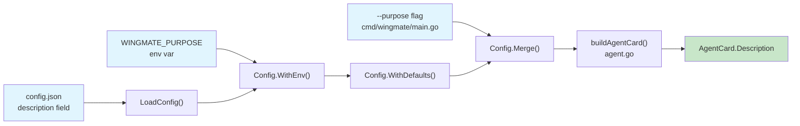

# Phase 1: Config, Types & Purpose Plumbing — Task Dossier

**Plan**: [005 - Peer Delegation](../../peer-delegation-plan.md)
**Phase**: 1 of 5
**Status**: COMPLETE
**Prior Phase**: N/A (foundational phase)
**Created**: 2026-01-28

---

## Executive Briefing

Phase 1 introduces the `Description` field to agent configuration and wires it through to the A2A Agent Card. This is the foundational layer that enables agent specialization — without it, all agents advertise the same hardcoded description ("Wingmate A2A agent") and peers cannot differentiate them by purpose.

The phase is narrow in scope (3 files modified, ~40 lines of production code) but touches every layer of the config pipeline: struct definition, environment variable, CLI flag, JSON serialization, Merge/Clone/WithDefaults, and the AgentCard builder. Full TDD ensures each layer is verified before implementation.

**Key Risk**: `Config.Merge()` zero-value handling. An empty string `Description` from CLI flags must not overwrite a description set via config file or env var. Mitigated by following the existing `Name` field pattern.

---

## Objectives & Scope

### Objectives

1. Add `Config.Description` field with full config pipeline support (env, defaults, merge, clone, JSON)
2. Add `--purpose` CLI flag that sets `Config.Description`
3. Add `WINGMATE_PURPOSE` environment variable support
4. Update `buildAgentCard()` to use `Config.Description` instead of hardcoded string
5. Maintain backward compatibility — missing purpose falls back to "Wingmate A2A agent"

### Out of Scope

- PeerProvider interface changes (Phase 2)
- Peer probing or discovery enrichment (Phase 2)
- New MCP tools (Phase 3)
- System prompt wiring for A2A (Phase 4)

---

## Architecture Map



---

## Tasks

| ID | Status | Task | CS | File(s) | Depends | Success Criteria |
|----|--------|------|----|---------|---------|------------------|
| T001 | [x] | Write tests for Config.Description field | 2 | `internal/agent/config_test.go` | — | Tests cover: WithEnv reads WINGMATE_PURPOSE, WithDefaults sets fallback, Merge only overwrites non-empty, Clone copies Description, JSON round-trip |
| T002 | [x] | Add Description to Config struct and pipeline | 1 | `internal/agent/config.go` | T001 | All T001 tests pass (RED→GREEN) |
| T003 | [x] | Write tests for buildAgentCard with description | 1 | `internal/agent/agent_test.go` | T002 | Tests verify: config description used when set, default "Wingmate A2A agent" when empty |
| T004 | [x] | Update buildAgentCard to use Config.Description | 1 | `internal/agent/agent.go` | T003 | All T003 tests pass; hardcoded "Wingmate A2A agent" replaced with config lookup |
| T005 | [x] | Add --purpose CLI flag | 1 | `cmd/wingmate/main.go` | T002 | Flag parsed and mapped to Config.Description via Merge; usage text updated |
| T006 | [x] | Run full test suite (regression) | 1 | — | T004, T005 | `go test ./... -race` passes with zero failures |

### Task Details

#### T001: Write tests for Config.Description field

**Purpose**: Prove the Description field participates correctly in every config pipeline stage.

**Test cases to write** (in `internal/agent/config_test.go`):

1. **TestConfig_Description_WithEnv**: Set `WINGMATE_PURPOSE` env var, call `WithEnv()`, assert `Description` populated. Clear env var, assert original value preserved.
2. **TestConfig_Description_WithDefaults**: Config with empty Description, call `WithDefaults()`, assert Description set to `"Wingmate A2A agent"`.
3. **TestConfig_Description_WithDefaults_PreservesExisting**: Config with Description already set, call `WithDefaults()`, assert not overwritten.
4. **TestConfig_Description_Merge_NonEmpty**: Merge with non-empty Description flag, assert overwrites.
5. **TestConfig_Description_Merge_Empty**: Merge with empty Description flag, assert does NOT overwrite.
6. **TestConfig_Description_Clone**: Clone config with Description, assert deep copied.
7. **TestConfig_Description_JSON**: Marshal config with Description to JSON and unmarshal, assert round-trips.

**Quality Contribution**: Prevents Merge zero-value bug (Finding 08) and ensures env var precedence chain works.

#### T002: Add Description to Config struct and pipeline

**Changes to `internal/agent/config.go`**:

1. Add `DefaultDescription = "Wingmate A2A agent"` constant
2. Add `EnvPurpose = "WINGMATE_PURPOSE"` constant
3. Add `Description string` field to `Config` struct with `json:"description,omitempty"` tag
4. In `WithEnv()`: read `WINGMATE_PURPOSE` env var into `Description`
5. In `WithDefaults()`: set `Description` to `DefaultDescription` if empty
6. In `Merge()`: overwrite `Description` only if `flags.Description != ""`
7. In `Clone()`: copy `Description` field

**Acceptance**: All T001 tests pass.

#### T003: Write tests for buildAgentCard with description

**Test cases to write** (in `internal/agent/agent_test.go`):

1. **TestBuildAgentCard_UsesConfigDescription**: Config with Description="Build iOS apps", assert card.Description == "Build iOS apps".
2. **TestBuildAgentCard_DefaultDescription**: Config with empty Description (after WithDefaults), assert card.Description == "Wingmate A2A agent".

**Quality Contribution**: Ensures the hardcoded string is gone and config flows through to AgentCard.

#### T004: Update buildAgentCard to use Config.Description

**Change in `internal/agent/agent.go`** at line ~154:

Replace `Description: "Wingmate A2A agent"` with `Description: cfg.Description`.

Since `WithDefaults()` guarantees `Description` is never empty, no fallback logic needed in `buildAgentCard()`.

**Acceptance**: T003 tests pass. Hardcoded string no longer exists in `buildAgentCard()`.

#### T005: Add --purpose CLI flag

**Changes to `cmd/wingmate/main.go`**:

1. Add flag: `purpose = flag.String("purpose", "", "Agent purpose/description for specialization")`
2. In `loadConfig()`, add to flagCfg: `if *purpose != "" { flagCfg.Description = *purpose }`
3. Update `usage()` to include `--purpose` in options list

**Acceptance**: `wingmate --purpose "Build iOS apps" --name test --port 0` starts with that description in the Agent Card.

#### T006: Run full test suite

```bash
go test ./... -race
```

**Acceptance**: Zero failures. All pre-existing tests still pass.

---

## Alignment Brief

### Relevant Findings

| Finding | Summary | How This Phase Addresses It |
|---------|---------|---------------------------|
| 07 | Description hardcoded in buildAgentCard | T004 replaces hardcode with config value |
| 08 | Config.Merge() zero-value handling | T001 tests Merge behavior explicitly; T002 follows Name pattern |

### Constitution Alignment

| Principle | Compliance |
|-----------|-----------|
| P1 (Observability) | No new logging needed — config changes are internal |
| P3 (Engineer Autonomy) | Explicit `--purpose` flag, `WINGMATE_PURPOSE` env var, config file — user chooses |
| P4 (Protocol Compliance) | Reuses existing AgentCard.Description field (A2A spec compliant) |
| P5 (Themed but Tasteful) | `--purpose` is clear and intuitive |

### Doctrine Compliance

| Rule | Compliance |
|------|-----------|
| PL-06 | No interface changes in this phase (deferred to Phase 2) |
| ADR-003 | No mode flag; Description is per-agent, not per-role |
| TDD | Tests written first (T001, T003) before implementation (T002, T004) |

---

## Phase Footnote Stubs

| ID | Placeholder |
|----|-------------|
| FN-1.1 | FlowSpace node for T001 test implementation |
| FN-1.2 | FlowSpace node for T002 config changes |
| FN-1.3 | FlowSpace node for T003 agent card tests |
| FN-1.4 | FlowSpace node for T004 buildAgentCard update |
| FN-1.5 | FlowSpace node for T005 CLI flag |
| FN-1.6 | FlowSpace node for T006 regression run |

---

## Evidence Artifacts

Evidence will be collected during implementation:

- [x] T001: Test output showing RED — compile errors for undefined Description/DefaultDescription
- [x] T002: Test output showing GREEN — all 8 Description tests pass
- [x] T003: Test output showing RED — `card.Description = "Wingmate A2A agent", want "Build iOS apps"`
- [x] T004: Test output showing GREEN — both buildAgentCard tests pass
- [x] T006: Full `go test ./... -race` — all packages pass, zero failures, no races

---

## Verification Commands

```bash
# Build and verify --purpose flag end-to-end
go build -o wingmate ./cmd/wingmate
./wingmate --port 0 --name test-agent --purpose "Build iOS apps" &
AGENT_PID=$!
sleep 2
# Get the auto-assigned port from agent output, then:
# curl -s http://localhost:<port>/.well-known/agent.json | jq '.description'
# Expected: "Build iOS apps"
kill $AGENT_PID

# Verify env var
WINGMATE_PURPOSE="Data pipeline agent" ./wingmate --port 0 --name test-agent &
AGENT_PID=$!
sleep 2
# curl -s http://localhost:<port>/.well-known/agent.json | jq '.description'
# Expected: "Data pipeline agent"
kill $AGENT_PID

# Full regression
go test ./... -race
```

---

## Discoveries & Learnings

_To be populated during implementation._

| ID | Discovery | Impact | Action |
|----|-----------|--------|--------|
| — | — | — | — |
