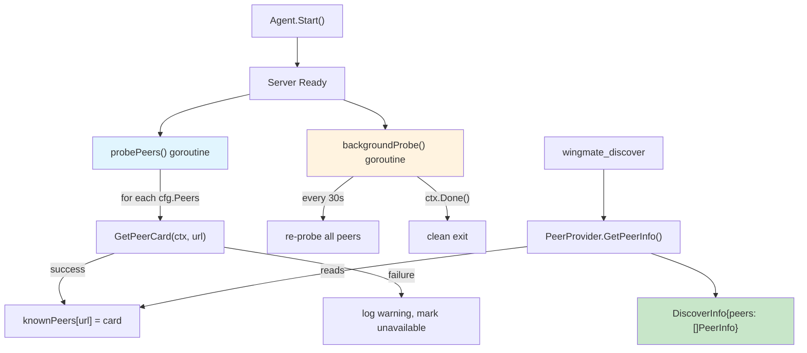

# Phase 2: Peer Bootstrap & Discovery Enrichment — Task Dossier

**Plan**: [005 - Peer Delegation](../../peer-delegation-plan.md)
**Phase**: 2 of 5
**Status**: COMPLETE
**Prior Phase**: Phase 1 (Config, Types & Purpose Plumbing) — COMPLETE
**Created**: 2026-01-28

---

## Executive Briefing

Phase 2 addresses the two most critical findings from the plan research: Finding 01 (knownPeers never populated — CRITICAL) and Finding 02 (PeerProvider returns URLs only — CRITICAL). Without this phase, `wingmate_discover` returns empty data and Claude has no information about peers to make delegation decisions.

The phase introduces `PeerInfo` as the rich peer data structure, extends `PeerProvider` to return `[]PeerInfo`, adds `probePeers()` to populate `knownPeers` on startup, enhances `wingmate_discover` to return name/description/skills/status, and adds background health re-probing so peer availability stays current.

**Key Risks**:
- `PeerProvider` interface change breaks the `mcp/` ↔ `agent/` boundary. Mitigated: single implementor (`Agent`), compile-time catch.
- Peer unavailable at startup. Mitigated: non-blocking goroutine, log warning, mark unavailable.
- Race conditions on `knownPeers` map. Mitigated: existing `peersMu` sync.RWMutex, race detector in tests.

---

## Objectives & Scope

### Objectives

1. Define `PeerInfo` struct in `mcp/` package with name, URL, description, skills, available status
2. Extend `PeerProvider` interface to add `GetPeerInfo() []PeerInfo`
3. Implement `Agent.GetPeerInfo()` reading from `knownPeers`
4. Add `probePeers()` goroutine called after server ready in `Agent.Start()`
5. Enhance `NewDiscoverHandler` to return rich `DiscoverInfo` with `[]PeerInfo`
6. Add background health re-probe goroutine (default 30s, configurable via `WINGMATE_PEER_PROBE_INTERVAL`)
7. Maintain backward compatibility — existing `GetPeers()` still works

### Out of Scope

- `wingmate_ask` delegation tool (Phase 3)
- System prompt wiring (Phase 4)
- Multi-agent orchestration (Phase 5)
- Config file `probeInterval` field (env var only for now)

---

## Architecture Map



---

## Tasks

| ID | Status | Task | CS | File(s) | Depends | Success Criteria |
|----|--------|------|----|---------|---------|------------------|
| T001 | [x] | Write tests for PeerInfo struct and extended PeerProvider | 2 | `internal/mcp/handlers_test.go` | — | Tests cover: PeerInfo fields, mockPeerProvider implements GetPeerInfo, nil-safe |
| T002 | [x] | Define PeerInfo struct and add GetPeerInfo to PeerProvider | 2 | `internal/mcp/handlers.go` | T001 | Compile succeeds; PeerInfo has Name, URL, Description, Skills, Available fields |
| T003 | [x] | Write tests for Agent.GetPeerInfo() | 2 | `internal/agent/agent_test.go` | T002 | Tests cover: empty knownPeers, populated knownPeers, thread-safety |
| T004 | [x] | Implement Agent.GetPeerInfo() | 1 | `internal/agent/agent.go` | T003 | Reads from knownPeers, converts AgentCard to PeerInfo, passes T003 tests |
| T005 | [x] | Write tests for probePeers() | 3 | `internal/agent/agent_test.go` | T004 | Tests cover: all configured peers probed, unreachable peer logged, knownPeers populated |
| T006 | [x] | Implement probePeers() in Agent.Start() | 3 | `internal/agent/agent.go` | T005 | After server ready, probes all cfg.Peers, populates knownPeers |
| T007 | [x] | Write tests for enhanced DiscoverHandler | 2 | `internal/mcp/handlers_test.go` | T002 | Tests cover: rich response with PeerInfo, empty peers, peer without description |
| T008 | [x] | Update NewDiscoverHandler to use PeerInfo | 2 | `internal/mcp/handlers.go` | T007 | Returns DiscoverInfo with []PeerInfo instead of []string |
| T009 | [x] | Write tests for background health re-probe | 2 | `internal/agent/agent_test.go` | T006 | Tests cover: periodic re-probe fires, peer recovery detected, clean shutdown via ctx |
| T010 | [x] | Implement background health re-probe goroutine | 2 | `internal/agent/agent.go`, `internal/agent/config.go` | T009 | 30s default interval, WINGMATE_PEER_PROBE_INTERVAL env var, selects on ctx.Done() |
| T011 | [x] | Write integration test: two agents, discover returns peer | 3 | `tests/integration/discover_test.go` | T008, T006 | Agent1 with peers=[agent2 URL], wingmate_discover returns agent2 with description |
| T012 | [x] | Run full test suite | 1 | — | T011 | `go test ./... -race` passes with zero failures |

### Task Details

#### T001: Write tests for PeerInfo struct and extended PeerProvider

**Purpose**: Prove PeerInfo struct exists with correct fields and PeerProvider interface includes GetPeerInfo().

**Test cases** (in `internal/mcp/handlers_test.go`):

1. **TestPeerInfo_Fields**: Create PeerInfo with all fields, verify each field accessible.
2. **TestMockPeerProvider_GetPeerInfo**: mockPeerProvider returns []PeerInfo, handler receives them.
3. **TestPeerProvider_GetPeerInfo_NilSafe**: nil PeerProvider returns empty slice.

**Quality Contribution**: Validates interface contract before implementation.

#### T002: Define PeerInfo struct and add GetPeerInfo to PeerProvider

**Changes to `internal/mcp/handlers.go`**:

1. Add `PeerInfo` struct:
   ```go
   type PeerInfo struct {
       Name        string  `json:"name"`
       URL         string  `json:"url"`
       Description string  `json:"description,omitempty"`
       Skills      []Skill `json:"skills,omitempty"`
       Available   bool    `json:"available"`
   }

   type Skill struct {
       Name        string `json:"name"`
       Description string `json:"description,omitempty"`
   }
   ```
2. Add `GetPeerInfo() []PeerInfo` to `PeerProvider` interface
3. Keep existing `GetPeers() []string` for backward compatibility

**Acceptance**: T001 tests pass. Interface compiles.

#### T003: Write tests for Agent.GetPeerInfo()

**Test cases** (in `internal/agent/agent_test.go`):

1. **TestAgent_GetPeerInfo_Empty**: No knownPeers, returns empty []mcp.PeerInfo.
2. **TestAgent_GetPeerInfo_Populated**: Manually populate knownPeers with AgentCards, verify PeerInfo fields match.
3. **TestAgent_GetPeerInfo_ThreadSafe**: Concurrent reads/writes don't race (run with -race).

**Quality Contribution**: Ensures correct AgentCard → PeerInfo conversion.

#### T004: Implement Agent.GetPeerInfo()

**Changes to `internal/agent/agent.go`**:

Add `GetPeerInfo() []mcp.PeerInfo` method that:
1. Locks `peersMu.RLock()`
2. Iterates `knownPeers` map
3. Converts each `*types.AgentCard` to `mcp.PeerInfo` (name, URL, description, skills, available=true)
4. Returns the slice

**Acceptance**: T003 tests pass. `var _ mcp.PeerProvider = (*Agent)(nil)` still compiles.

#### T005: Write tests for probePeers()

**Test cases** (in `internal/agent/agent_test.go`):

1. **TestAgent_ProbePeers_PopulatesKnownPeers**: Start two agents, agent1 has agent2 in peers config. After Start(), agent1.knownPeers contains agent2's card.
2. **TestAgent_ProbePeers_UnreachablePeer**: Agent with unreachable peer URL. After Start(), knownPeers does not contain the bad URL. No panic, no crash.
3. **TestAgent_ProbePeers_NoPeers**: Agent with empty peers list. Start completes normally, knownPeers empty.

**Quality Contribution**: Covers Finding 01 — validates knownPeers actually populated on startup.

#### T006: Implement probePeers() in Agent.Start()

**Changes to `internal/agent/agent.go`**:

1. Add `probePeers(ctx context.Context)` method:
   - Iterates `a.config.Peers`
   - For each URL, calls `a.GetPeerCard(ctx, url)` (already caches in knownPeers)
   - On error: log warning via flight log, continue to next peer
2. Call `go a.probePeers(ctx)` after `close(a.ready)` in `Start()`

**Acceptance**: T005 tests pass. Agent starts, probes peers, populates knownPeers.

#### T007: Write tests for enhanced DiscoverHandler

**Test cases** (in `internal/mcp/handlers_test.go`):

1. **TestWingmateDiscoverReturnsPeerInfo**: Provider returns 2 PeerInfo entries. Verify JSON has name, URL, description, available fields.
2. **TestWingmateDiscoverEmptyPeerInfo**: Provider returns empty []PeerInfo. Verify peers is empty array, not null.
3. **TestWingmateDiscoverPeerWithoutDescription**: Provider returns PeerInfo with empty Description. Verify omitted from JSON (omitempty).

**Quality Contribution**: Validates the enriched discover response format.

#### T008: Update NewDiscoverHandler to use PeerInfo

**Changes to `internal/mcp/handlers.go`**:

1. Update `DiscoverInfo` struct:
   ```go
   type DiscoverInfo struct {
       AgentID string     `json:"agent_id"`
       Peers   []PeerInfo `json:"peers"`
   }
   ```
2. Update `NewDiscoverHandler` to call `peers.GetPeerInfo()` instead of `peers.GetPeers()`
3. Nil-safe: if PeerProvider is nil, return empty `[]PeerInfo{}`

**Acceptance**: T007 tests pass. Existing discover tests updated.

#### T009: Write tests for background health re-probe

**Test cases** (in `internal/agent/agent_test.go`):

1. **TestAgent_BackgroundProbe_Fires**: Start agent with peer, set short probe interval (100ms). Verify re-probe happens (peer card refreshed).
2. **TestAgent_BackgroundProbe_CleanShutdown**: Start agent, cancel context, verify no goroutine leak (no panic, clean exit).
3. **TestAgent_BackgroundProbe_PeerRecovery**: Start agent with initially unreachable peer. Make peer available. Verify next probe picks it up.

**Quality Contribution**: Covers Finding 11 — background health keeps peer status current.

#### T010: Implement background health re-probe goroutine

**Changes**:

1. `internal/agent/config.go`:
   - Add `EnvPeerProbeInterval = "WINGMATE_PEER_PROBE_INTERVAL"` constant
   - Add `DefaultPeerProbeInterval = 30 * time.Second` constant
   - Add `PeerProbeInterval time.Duration` field to Config
   - Update `WithEnv()`: parse `WINGMATE_PEER_PROBE_INTERVAL` as duration
   - Update `WithDefaults()`: set default 30s
   - Update `Clone()`: copy field

2. `internal/agent/agent.go`:
   - Add `backgroundProbe(ctx context.Context)` method:
     - `ticker := time.NewTicker(a.config.PeerProbeInterval)`
     - Select on ticker.C or ctx.Done()
     - On tick: call `a.probePeers(ctx)` to refresh all peers
   - Call `go a.backgroundProbe(ctx)` after `probePeers` in `Start()`

**Acceptance**: T009 tests pass. Background probe runs, shuts down cleanly.

#### T011: Write integration test

**New file**: `tests/integration/discover_test.go`

Test: Start agent1 (port 0, name="alpha", purpose="iOS dev", peers=[agent2.URL()]) and agent2 (port 0, name="bravo", purpose="Backend dev"). Wait for agent1 ready. Give time for probe. Call `GET agent1.URL()/mcp` with discover tool. Response includes bravo with description "Backend dev".

**Note**: Since MCP is HTTP-based, the integration test sends JSON-RPC over HTTP to the /mcp endpoint.

**Acceptance**: Integration test passes with `-race`.

#### T012: Run full test suite

```bash
go test ./... -race
```

**Acceptance**: Zero failures. All pre-existing tests still pass.

---

## Alignment Brief

### Relevant Findings

| Finding | Summary | How This Phase Addresses It |
|---------|---------|---------------------------|
| 01 (CRITICAL) | knownPeers never populated | T006 adds probePeers() at startup |
| 02 (CRITICAL) | PeerProvider returns URLs only | T002 adds PeerInfo, T008 enriches discover |
| 11 (MEDIUM) | No background health checks | T010 adds background re-probe goroutine |

### Constitution Alignment

| Principle | Compliance |
|-----------|-----------|
| P1 (Observability) | probePeers logs warnings for unreachable peers to Flight Log |
| P3 (Engineer Autonomy) | WINGMATE_PEER_PROBE_INTERVAL env var for configuration |
| P4 (Protocol Compliance) | PeerInfo maps directly from A2A AgentCard fields |
| P6 (Security by Design) | No new network endpoints; reuses existing GetPeerCard HTTP client |

### Doctrine Compliance

| Rule | Compliance |
|------|-----------|
| PL-06 | PeerProvider interface in mcp/ extended; Agent implements in agent/ — no circular imports |
| ADR-003 | No mode changes; all agents are full peers |
| ADR-004 | MCP discover tool enhanced, not replaced |
| TDD | Tests written first (T001, T003, T005, T007, T009) before implementation |

---

## Phase Footnote Stubs

| ID | Placeholder |
|----|-------------|
| FN-2.1 | FlowSpace node for T001-T002 PeerInfo/PeerProvider |
| FN-2.2 | FlowSpace node for T003-T004 Agent.GetPeerInfo |
| FN-2.3 | FlowSpace node for T005-T006 probePeers |
| FN-2.4 | FlowSpace node for T007-T008 DiscoverHandler enrichment |
| FN-2.5 | FlowSpace node for T009-T010 background probe |
| FN-2.6 | FlowSpace node for T011 integration test |
| FN-2.7 | FlowSpace node for T012 regression |

---

## Evidence Artifacts

Evidence will be collected during implementation:

- [x] T001: Test output showing RED — compile errors for undefined PeerInfo/GetPeerInfo
- [x] T002: Test output showing GREEN — PeerInfo tests pass
- [x] T003: Test output showing RED — GetPeerInfo undefined on Agent
- [x] T004: Test output showing GREEN — Agent.GetPeerInfo tests pass
- [x] T005: Test output showing RED — probePeers not called, knownPeers empty
- [x] T006: Test output showing GREEN — peers probed, knownPeers populated
- [x] T007: Test output showing RED — DiscoverInfo.Peers still []string
- [x] T008: Test output showing GREEN — DiscoverInfo.Peers is []PeerInfo
- [x] T009: Test output showing RED — no background probe
- [x] T010: Test output showing GREEN — background probe fires
- [x] T012: Full `go test ./... -race` — all packages pass

---

## Verification Commands

```bash
# Unit tests for Phase 2
go test ./internal/agent/ -run "TestAgent_(GetPeerInfo|ProbePeers|BackgroundProbe)" -v
go test ./internal/mcp/ -run "TestWingmateDiscover.*PeerInfo|TestPeerInfo" -v

# Integration test
go test ./tests/integration/ -run "TestIntegration_Discover" -v -race

# Full regression
go test ./... -race
```

---

## Discoveries & Learnings

_To be populated during implementation._

| ID | Discovery | Impact | Action |
|----|-----------|--------|--------|
| — | — | — | — |
