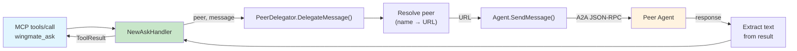

# Phase 3: Delegation Tool (wingmate_ask) — Task Dossier

**Plan**: [005 - Peer Delegation](../../peer-delegation-plan.md)
**Phase**: 3 of 5
**Status**: COMPLETE
**Prior Phase**: Phase 2 (Peer Bootstrap & Discovery Enrichment) — COMPLETE
**Created**: 2026-01-28

---

## Executive Briefing

Phase 3 is the centerpiece of Plan 005: it adds the `wingmate_ask` MCP tool that enables Claude to delegate messages to named peer agents via the A2A protocol. This closes the loop from discovery (Phase 2) to action — Claude can discover peers, see their capabilities, and send them work.

The phase introduces `PeerDelegator` as a new interface in `mcp/` (separate from PeerProvider), implements it on Agent using existing `SendMessage` infrastructure, and builds the `wingmate_ask` handler with peer resolution (by name or URL), session continuity, and Flight Log trace correlation.

**Key Risks**:
- **Untrusted peer response**: Parse only `result.message`; validate structure before returning to MCP caller.
- **HandleMessage regression**: Phase 3 does NOT touch `HandleMessage()`. The ask handler is self-contained.
- **Peer resolution ambiguity**: When multiple peers have the same name, return first match (documented behavior).

---

## Objectives & Scope

### Objectives

1. Define `PeerDelegator` interface in `mcp/` with `DelegateMessage(ctx, peer, message, sessionID) (string, error)`
2. Implement `Agent.DelegateMessage()` — resolves peer by name or URL, sends via A2A, extracts response text
3. Add `wingmate_ask` tool definition with peer (required), message (required), session_id (optional)
4. Add `NewAskHandler` that delegates via PeerDelegator and returns response text
5. Register `wingmate_ask` in `Agent.New()` tool setup
6. Ensure Flight Log entries for MCP + A2A share same trace ID

### Out of Scope

- System prompt wiring (Phase 4)
- Multi-agent orchestration patterns (Phase 5)
- Retry/fallback logic for failed delegations
- Parallel delegation to multiple peers

---

## Architecture Map



---

## Tasks

| ID | Status | Task | CS | File(s) | Depends | Success Criteria |
|----|--------|------|----|---------|---------|------------------|
| T001 | [x] | Write tests for PeerDelegator interface | 2 | `internal/mcp/handlers_test.go` | — | Tests cover: delegate by name, by URL, unknown peer error, unavailable peer error |
| T002 | [x] | Define PeerDelegator interface in mcp/ | 1 | `internal/mcp/handlers.go` | T001 | Interface compiles, separate from PeerProvider |
| T003 | [x] | Write tests for Agent.DelegateMessage | 3 | `internal/agent/agent_test.go` | T002 | Tests cover: resolve by name, resolve by URL, unknown peer, send+extract response |
| T004 | [x] | Implement Agent.DelegateMessage | 3 | `internal/agent/client.go` | T003 | Resolves peer name→URL via knownPeers, calls SendMessage, extracts text from response |
| T005 | [x] | Write tests for wingmate_ask tool definition | 1 | `internal/mcp/tools_test.go` | — | Schema has peer (required), message (required), session_id (optional) |
| T006 | [x] | Add wingmate_ask tool definition | 1 | `internal/mcp/tools.go` | T005 | Tool in DefaultTools(), schema correct |
| T007 | [x] | Write tests for NewAskHandler | 3 | `internal/mcp/handlers_test.go` | T002 | Tests: success, unknown peer, empty message, session_id passthrough |
| T008 | [x] | Implement NewAskHandler | 2 | `internal/mcp/handlers.go` | T007 | Handler validates inputs, delegates via PeerDelegator, returns response text |
| T009 | [x] | Register wingmate_ask in Agent.New() | 1 | `internal/agent/agent.go` | T006, T008 | Tool appears in tools/list, handler registered |
| T010 | [x] | Write integration test: full delegation round-trip | 3 | `tests/integration/delegation_test.go` | T009 | alpha asks bravo via MCP, gets bravo's ping response |
| T011 | [x] | Run full test suite | 1 | — | T010 | `go test ./... -race` passes |

### Task Details

#### T001: Write tests for PeerDelegator interface

**Test cases** (in `internal/mcp/handlers_test.go`):

1. **TestMockPeerDelegator_DelegateByName**: Mock returns response text for peer name.
2. **TestMockPeerDelegator_DelegateByURL**: Mock returns response text for peer URL.
3. **TestMockPeerDelegator_UnknownPeer**: Mock returns error for unknown peer.

#### T002: Define PeerDelegator interface

**Changes to `internal/mcp/handlers.go`**:

```go
type PeerDelegator interface {
    DelegateMessage(ctx context.Context, peer string, message string, sessionID string) (string, error)
}
```

Add error codes for delegation:
- `ErrCodePeerNotFound = 3030` — peer not found by name or URL
- `ErrCodePeerUnavailable = 3031` — peer known but unreachable
- `ErrCodeDelegationFailed = 3032` — delegation attempt failed

#### T003: Write tests for Agent.DelegateMessage

**Test cases** (in `internal/agent/agent_test.go`):

1. **TestAgent_DelegateMessage_ByName**: Populate knownPeers with "bravo", delegate by name "bravo", verify SendMessage called with bravo's URL.
2. **TestAgent_DelegateMessage_ByURL**: Delegate by full URL, verify SendMessage called with that URL.
3. **TestAgent_DelegateMessage_UnknownPeer**: Delegate to "unknown", verify error with code 3030.
4. **TestAgent_DelegateMessage_ExtractsResponse**: Verify response text extracted from A2A response.

#### T004: Implement Agent.DelegateMessage

**Changes to `internal/agent/client.go`**:

1. Add `DelegateMessage(ctx, peer, message, sessionID)` method
2. Peer resolution: first check if `peer` is a URL (starts with "http"), otherwise search knownPeers by name
3. Build `types.Message` with text part
4. Call `a.SendMessage(ctx, peerURL, msg)`
5. Extract text from response result
6. Return extracted text

#### T005-T006: wingmate_ask tool definition

Add to `tools.go`:
```go
const ToolNameAsk = "wingmate_ask"

func NewAskTool() *ToolDefinition {
    // peer (required), message (required), session_id (optional)
}
```

Add to `DefaultTools()`.

#### T007-T008: NewAskHandler

Handler logic:
1. Extract and validate `peer` (required string)
2. Extract and validate `message` (required string)
3. Extract optional `session_id`
4. Call `delegator.DelegateMessage(ctx, peer, message, sessionID)`
5. On error: return ToolResult with IsError=true and error message
6. On success: return ToolResult with response text

#### T009: Register in Agent.New()

Add after existing handler registrations:
```go
mcpHandler.RegisterHandler(mcp.ToolNameAsk, mcp.NewAskHandler(agent, nil))
```

Agent implements both PeerProvider and PeerDelegator.

#### T010: Integration test

Start alpha (peers=[bravo URL]) and bravo (responds to ping). Send MCP `tools/call wingmate_ask(peer="bravo", message="ping")` to alpha. Verify response contains "pong".

#### T011: Full regression

```bash
go test ./... -race
```

---

## Alignment Brief

### Relevant Findings

| Finding | Summary | How This Phase Addresses It |
|---------|---------|---------------------------|
| 03 (HIGH) | No delegation mechanism | T004/T008 implement full delegation via PeerDelegator |
| 04 (HIGH) | No name-based peer resolution | T004 resolves by name via knownPeers lookup |
| 05 (MEDIUM) | No session continuity for delegation | T008 passes session_id through to DelegateMessage |

### Constitution Alignment

| Principle | Compliance |
|-----------|-----------|
| P1 (Observability) | SendMessage already logs Flight Log entries; trace ID flows from MCP context |
| P4 (Protocol Compliance) | Uses existing A2A message/send; new MCP tool follows tool schema conventions |
| P5 (Themed but Tasteful) | `wingmate_ask` is clear and action-oriented |

### Doctrine Compliance

| Rule | Compliance |
|------|-----------|
| PL-06 | PeerDelegator interface in mcp/; Agent implements in agent/ — no circular imports |
| ADR-003 | Agent acts as pilot when delegating; no mode change |
| ADR-004 | New MCP tool registered via existing mcpHandler pattern |
| TDD | Tests written first (T001, T003, T005, T007) before implementation |

---

## Evidence Artifacts

- [x] T001: RED — undefined PeerDelegator/DelegateMessage
- [x] T002: GREEN — PeerDelegator interface compiles, mock tests pass
- [x] T003: RED — Agent has no DelegateMessage method
- [x] T004: GREEN — DelegateMessage resolves and delegates
- [x] T005: RED — ToolNameAsk undefined
- [x] T006: GREEN — tool definition compiles
- [x] T007: RED — NewAskHandler undefined
- [x] T008: GREEN — handler tests pass
- [x] T010: GREEN — integration delegation round-trip works
- [x] T011: Full regression passes

---

## Verification Commands

```bash
# Unit tests
go test ./internal/mcp/ -run "TestPeerDelegator|TestWingmateAsk" -v
go test ./internal/agent/ -run "TestAgent_DelegateMessage" -v

# Integration test
go test ./tests/integration/ -run "TestIntegration_Delegation" -v -race

# Full regression
go test ./... -race
```
